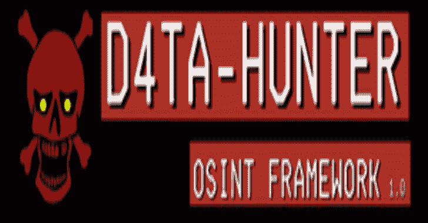
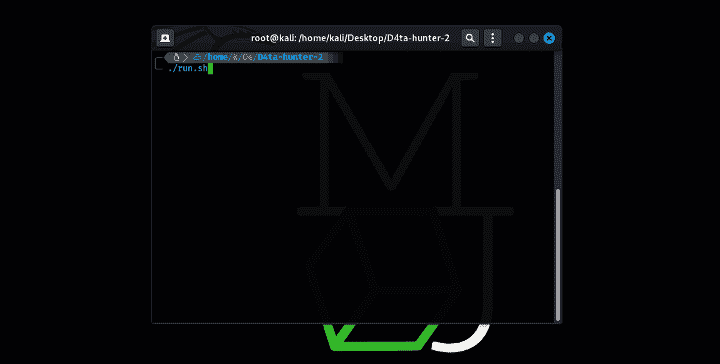
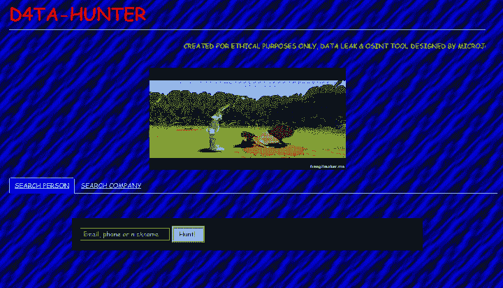

# D4TA-HUNTER:带有 Kali Linux 的 GUI OSINT 框架

> 原文：<https://kalilinuxtutorials.com/d4ta-hunter/>

**D4TA-HUNTER** 是一款工具，用于自动收集将要接受道德黑客审计的公司员工的信息。

此外，在这个工具中，我们可以通过插入公司的域、员工的电子邮件、子域和服务器的 IP 来在“搜索公司”部分中进行查找。

## 获取 API 密钥

在[https://rapidapi.com/rohan-patra/api/breachdirectory](https://rapidapi.com/rohan-patra/api/breachdirectory)上注册

## 安装

git 克隆 https://github.com/micro-joan/D4TA-HUNTER
CD D4TA-HUNTER/
chmod+x run . sh
。/run.sh

在执行应用程序启动程序后，您需要安装所有组件，启动程序将逐个检查，如果没有安装任何组件，它将向您显示安装组件时必须输入的语句:

## 使用

首先，你必须有一个来自 BreachDirectory.org 的免费或付费的 API 密匙，如果你没有的话，搜索一下 D4TA-HUNTER 会为你提供一个如何获得的指南。

一旦你有了 API 密匙，你将能够搜索电子邮件，优势是向你显示所有密码散列的列表，供你复制并粘贴到 D4TA-HUNTER 提供的在线资源之一，以 100 %免费破解密码。

您还可以插入一个公司的域名，D4TA-HUNTER 将搜索员工电子邮件、可能感兴趣的子域以及找到的机器的 IP 地址:

## API 和工具

| 服务 | 功能 | 状态 |
| --- | --- | --- |
| BreachDirectory.org | 电子邮件、电话或尼克泄密 | ✅ 🔑 (free plan) |
| 主持人 | 公司的域名和电子邮件 | ✅ Free |
| [碱化](https://github.com/brainfucksec/kalitorify) | Tor 搜索 | ✅ Free |

[Click Here To Download](https://github.com/micro-joan/D4TA-HUNTER)