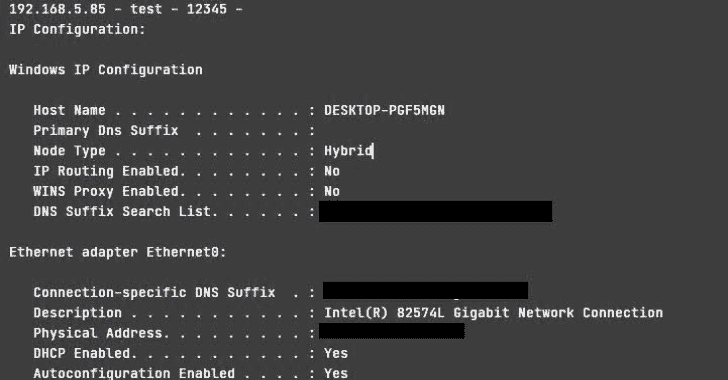
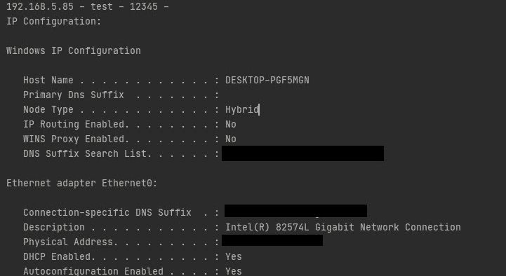

# Pywirt : Python Windows 事件响应工具包

> [https://kallinuxxtauthorities . com/pywirt/](https://kalilinuxtutorials.com/pywirt/)

Pywirt 应用程序，旨在通过 winrm 收集 windows 操作系统中的信息来加速事件响应流程。

## 特征

信息收集在以下内容中。

*   IP 配置
*   用户
*   组
*   任务
*   服务
*   任务调度程序
*   注册表控制
*   活动的 TCP 和 UDP 端口
*   文件共享
*   文件
*   防火墙配置
*   与其他系统的会话
*   开放会话
*   日志条目

## 安装

git 克隆[https://github.com/anil-yelken/pywirt](https://github.com/anil-yelken/pywirt)CD py wirt
pip 3 安装 pywinrm

## 用法

应在 cred_list.txt 文件中指定以下信息:

IP |用户名|密码

[Click Here To Download](https://github.com/anil-yelken/pywirt)