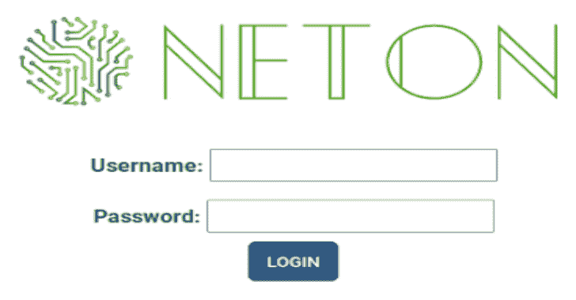
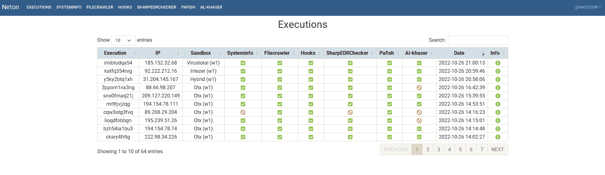
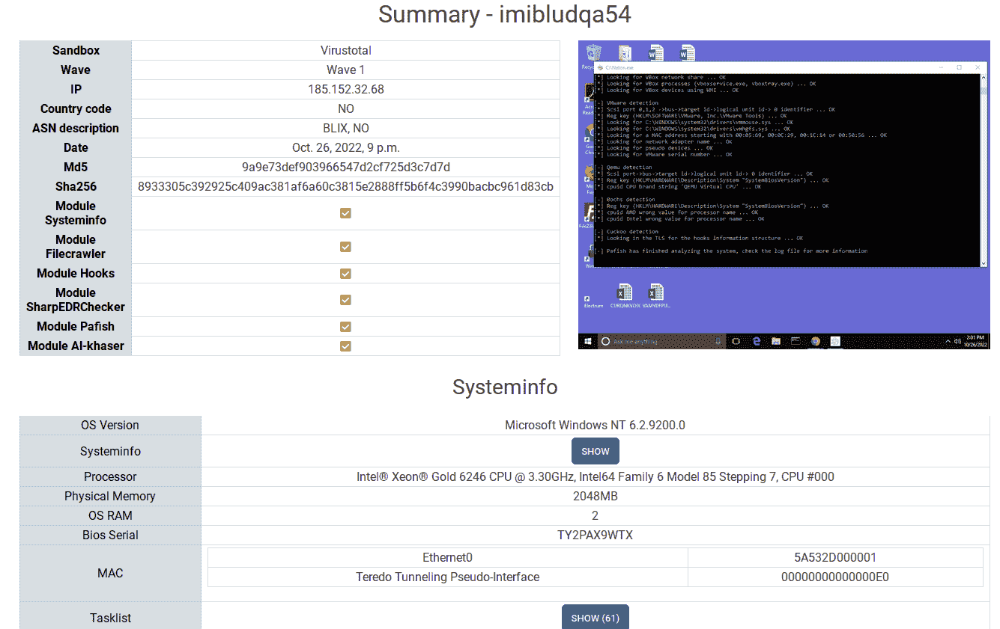
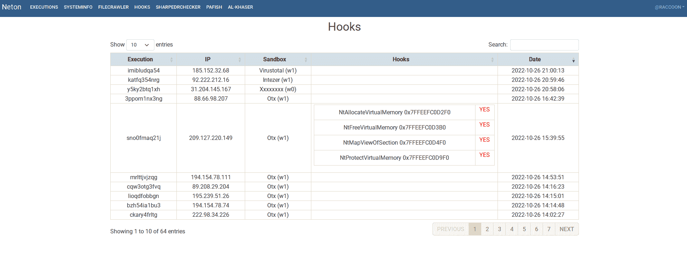
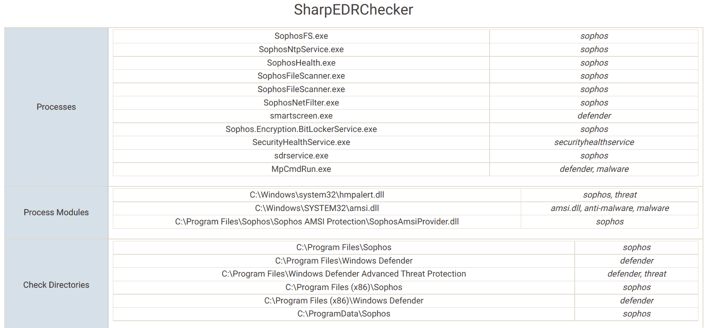
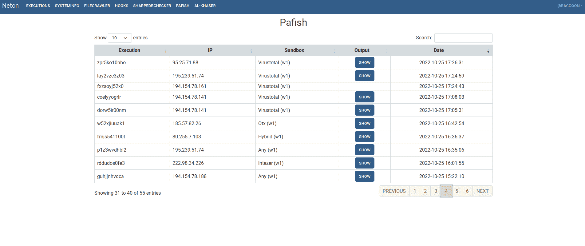
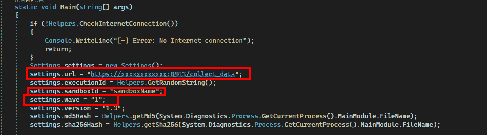

# Neton:一个沙盒信息收集工具

> 原文：<https://kalilinuxtutorials.com/neton/>

**Neton** 是**从互联网连接的沙箱**中获取信息的工具。它由一个代理和一个显示所收集信息的 web 界面组成。
Neton 代理从它运行的系统中获取信息，并通过 HTTPS 将其过滤到 web 服务器。

它收集的一些信息:

*   操作系统和硬件信息
*   在装载的驱动器上查找文件
*   列出未签名的 microsoft 驱动程序
*   运行 SharpEDRChecker
*   跑鲷鱼
*   运行 Al-Khaser
*   检测挂钩
*   对桌面进行截图

所有这些信息都可以用来改进红队工件，或者学习沙箱如何工作并改进它们。

## 图片

## 部署

### 网上

1.  安装(使用 virtualenv):

python3 -m venv venv
源 venv/bin/activate
pip 3 install-r requirements . txt

2.  配置数据库:

python 3 manage . py migrate
python 3 manage . py make migrations core
python 3 manage . py 迁移 core

*   创建用户:

python3 manage.py 创建超级用户

# 发射(测试)

python3 manage.py runserver

# 启动(生产)

*   生成证书并存储在 *certs 文件夹*中:

OpenSSL req-new key RSA:2048-new-nodes-x509-days 3650-key out server . key-out server . CRT

发射*古尼康*:

。/launch_prod.sh

# 代理

使用 Visual Studio 构建解决方案。代理配置可以从 **Program.cs** 类完成。

*   *url* 变量:信息将被过滤的 Url(NetonWeb 的)。
*   *sandboxId* 变量:上传样本的沙箱的标识符。
*   *wave* 变量:组织样本发送不同时间的方式。缪斯特拉斯。

## 抽样资料

在**样本数据**文件夹中有一个 [sqlite 数据库](https://github.com/Aetsu/Neton/blob/main/Sample%20data/db.sqlite3)，其中有从以下服务中收集的几个样本:

*   Virustotal
*   Tria.ge
*   Metadefender
*   混合分析
*   任何。运行
*   整数分析
*   平克林
*   艾伦沃·OTX
*   威胁。地区

要访问样本信息*，将 sqlite 文件复制到 NetonWeb 文件夹*并运行应用程序。

凭据:

*   **用户:** `raccoon`
*   **密码:** `jAmb.Abj3.j11pmMa`

[Click Here To Download](https://github.com/Aetsu/Neton)