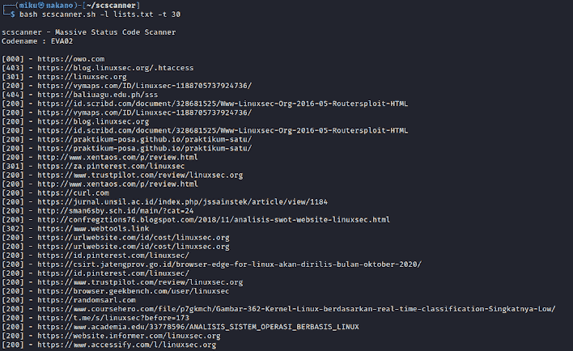
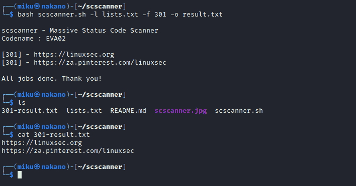

# Scscanner:从列表中读取网站状态代码响应的工具

> 原文：<https://kalilinuxtutorials.com/scscanner/>

**Scscanner** 是从列表中读取网站状态码响应的工具。这个工具能够过滤特定的状态代码，并将结果保存到一个文件中。

# 功能

*   轻微依赖。该工具只需**卷曲**即可安装
*   多处理。多重处理将使扫描速度更快
*   过滤器状态代码。如果您只想从列表中获得特定的状态代码(例如:200 ),这个工具将会帮助您

# 用法

┌──(miku㉿nakano)-[~/scscanner]
└─$ bash scscanner . sh

scscanner–海量状态
代码扫描器代号:EVA02

示例:bash scscanner . sh-l domain . txt-t 30 选项:
-l 文件包含域列表。
-t 调整多进程。默认为 15
-f 过滤器状态代码。
-o 保存到文件。
-h 打印本帮助。

调整多进程

bash scscanner . sh-l domain . txt-t 30

使用状态代码过滤器

bash scscanner . sh-l domain . txt-f 200

使用状态代码过滤器并保存到文件。

bash scscanner . sh-l domain . txt-f 200-o result . txt

# 截图

# 待办事项

*   添加多重处理
*   添加过滤器状态代码选项
*   添加保存到文件选项
*   从页面获取标题

如果你想改进这个工具，请随意投稿。

[Click Here To Download](https://github.com/yuyudhn/scscanner)