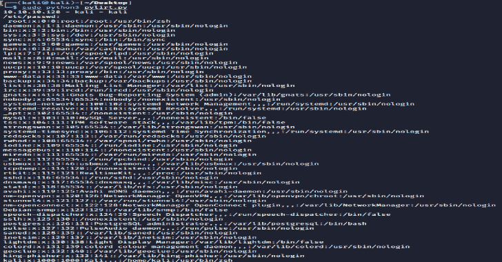
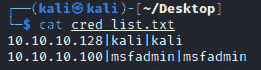

# py lrit:Python Linux 事件响应工具包

> 原文：<https://kalilinuxtutorials.com/pylirt/>

**py lit**应用程序，旨在通过在 Linux 操作系统中收集信息来加速事件响应过程。

## 特征

信息收集在以下内容中。

*   /etc/密码
*   卡特彼勒/etc/集团
*   卡特彼勒/etc/sudoers
*   货物日志
*   cat /var/log/auth.log
*   逾时/proc/meminfo
*   ps 到
*   /etc/resolv.conf
*   /etc/hosts
*   iptables -L -v -n 系列
*   find/-type f-size+512k-exec ls-LH { }/；
*   查找/ -mtime -1 -ls
*   ip a
*   netstat -nap
*   arp -a
*   echo $PATH

# 装置

git clone[https://github . com/Anil-yelken/pyirt](https://github.com/anil-yelken/pylirt)
CD pyirt
sudo pip 3 install param iko

## 用法

应在 cred_list.txt 文件中指定以下信息:

IP |用户名|密码

sudo python3 plirt.py

[Click Here To Download](https://github.com/anil-yelken/pylirt)