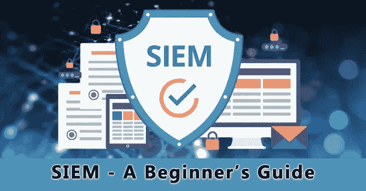
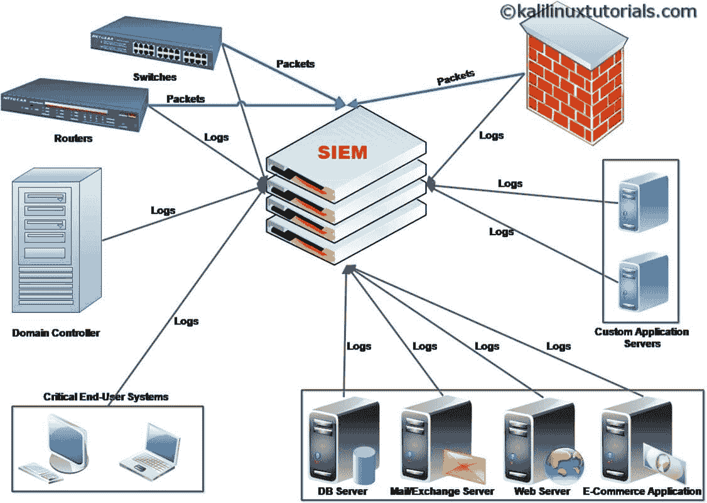
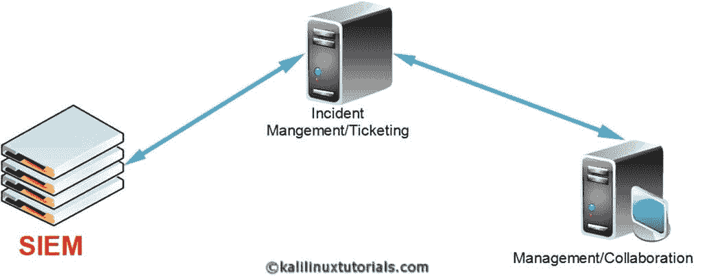

# SIEM–安全信息和事件管理工具–初学者指南

> 原文：<https://kalilinuxtutorials.com/a-beginners-guide-to-siem/>

## 什么是 SIEM？

SIEM 扩展后成为安全信息事件管理。顾名思义，SIEM 的主要功能是事件管理。

SIEM 解决方案一旦完全有效地实施，将对组织的网络有全面的了解。

这有助于管理员、SIEM 运营商监控其基础设施中的网络活动。

但有趣的是，人们可以对各种资产(网络设备和服务)进行分类，以便在很大程度上调整 SIEM 的监控能力。

SIEM 工具可以根据特定的关联规则生成警报和事件。例如:如果对系统启动端口扫描，SIEM 会生成一个[端口扫描](https://kalilinuxtutorials.com/divideandscan-divide-full-port-scan-results-and-use-it-for-targeted-nmap-runs/)警报，其中包含所有详细信息，如来源&目的地、端口号等。

这有助于组织近乎实时地发现事件或黑客攻击企图。

## SIEM 是如何工作的？

你可能已经注意到了上一段中的“共同关系”这个词。是的，对于 SIEM 如何工作的问题，一站式的答案是相互关系。当然不仅仅是这样。

基本上，SIEM 工具从组织基础架构中的设备收集日志。一些解决方案还收集网络流，甚至原始数据包。

通过收集的数据(主要是日志和数据包)，该工具提供了对网络事件的洞察。它提供网络中发生的每个事件的数据，从而充当完整的集中式安全监控系统。

除此之外，SIEM 工具还可以配置为检测特定事件。例如，用户试图登录广告服务器。前 3 次认证失败，第 4 次认证成功。

这是一个值得关注的事件。有很多种可能。

也许一个人试图猜测另一个用户的密码，并且猜对了，这就是一个漏洞。或者，如果用户忘记了他的密码，但最后得到了正确的密码。这就是相互关系发挥作用的地方。

对于这种情况，可以以这样的方式制定关联规则，即如果在特定时间段内认证失败事件连续发生 3 次，随后成功，则弹出警报。

这可以通过分析来自各个机器的日志来进一步研究。因此，我对关联的定义是:“它是将事件聚合成由特定应用程序或场景定义的事件的规则。”

## **原木如何到达 SIEM？**

日志以两种不同的方式获取到 SIEM。基于代理和基于非代理。在基于代理的方法中，日志推送代理安装在从中收集日志的客户机上。

然后，该代理被配置为将日志转发到解决方案中。在后一种类型中，客户端系统使用 Syslog 或 [Windows 事件](https://kalilinuxtutorials.com/epagneul/)收集器服务等服务自行发送日志。

还有一些特定的应用和设备可以通过一系列特定于供应商的程序进行集成。

## SIEM 究竟会如何发出警报？

现在，您知道来自不同设备的日志被转发到 SIEM。举个例子:针对特定机器启动端口扫描。在这种情况下，机器会生成大量不寻常的日志。

通过分析日志，可以清楚地看到，在不同的端口上定期发生了大量的连接故障。

如果可能的话，查看数据包信息，我们可以检测到从同一个 IP 发送到同一个 IP 但以固定间隔发送到不同端口的 SYN 请求。结论是有人对我们的资产启动了同步扫描。

SIEM 会自动执行这一过程并发出警报。不同的解决方案以不同的方式做到这一点，但产生相同的结果。

## **SIEM 解决方案的业务影响**

这是一个进行了长期讨论的话题&至今还没有一个完整清晰的解决方案。

问题是“为什么要花一大笔钱在没有回报的东西上？”嗯，你觉得怎么样？SIEM 解决方案能给你带来什么吗？是的。如今，SIEM 解决方案正在不断发展，不仅要保护 IT 基础架构，还要识别 IT 基础架构带来的业务风险。

甚至有一个单独的策略称为 GRC，即 IT 治理风险和法规遵从性。

这将使用 SIEM 解决方案的 IT 安全的技术方面(如 DOS 攻击)与业务方面(受攻击的资产和大致损失，向资产经理报告)集成并关联起来。

这种战略将不同的部门和专业人员(如 SOC 运营人员/经理、CISO、财务顾问、cxo 等)集中在一个仪表板下。

这是通过将不同的解决方案集成在一起实现的。例如:来自 SIEM 的警报和事件由 CISO 转发给 BPM(业务流程管理)解决方案，以识别和关联技术和业务影响。

考虑一个简单的场景，让我们对一个电子银行网站(web 服务器)进行同样的 DDOs 攻击。

该解决方案首先识别攻击，然后操作员/分析师将其报告给他们的经理/ciso。经理和 CISOs 挖掘更多关于攻击性质的技术信息(如来源国家、会话数量等)。

在此基础上，他们确定如果 web 服务器停机一段时间(比如 30 分钟)会造成多大的损失。

现在，他们向防火墙/IDS-IPS 和 web 服务器团队报告技术细节、建议和启动步骤。然后，他们向高级管理层和财务经理报告如果不采取行动他们将遭受的损失。

如果管理层感到满意，他们会做出决定并批准防火墙/IDS-IPS 和 web 服务器团队采取行动。

他们将采取行动，网络服务器将有大约 5 分钟的停机时间。因此节省了 web 服务器资源，但最终也节省了资金&保持了客户满意度。

要了解更多关于 DDoS 攻击的信息，请查看 101domain 关于防御 DDoS 攻击的最佳实践的有用文章。

现在的重点是，SIEM 解决方案可以按照您想要的方式进行调整。所描述的整个过程可以通过集成不同的解决方案来实现自动化。

上面的场景只是一个简单的例子，但是方法在所有情况下都是一样的。归根结底，钱很重要，但遗憾的是，没有人认识到 IT 的财务影响——安全性。

## **暹罗&合规**

除了警报和事件响应之外， [SIEM](https://gbhackers.com/security-information-and-event-management-siem-a-detailed-explanation/) 还帮助组织遵守&法规事项。对于像 ISO 27001、HIPAA、[、PCI](https://gbhackers.com/pci-compliance-checklist/) 这样的主要法规遵从性，日志保留是一个重要的标准。

例如，在 ISO27001，有一个针对记录和监控的控制(A–12.4)，它建议所有事件日志、用户活动和安全事件都应该记录下来，并使用适当的时间戳进行归档

日志还应受到保护，以防未经授权的访问、篡改等。有一系列控制措施需要到位，以便正确合规。在这方面，SIEM 可以提供帮助。如前所述，siem 工具从不同的设备收集日志，并将它们保存在它的储备中。

因此它可以充当集中式日志收集服务器。此外，该工具保留了所有带有适当时间戳的日志，并将它们归档到大容量存储中，不会丢失完整性。这有助于各种标准中的控制。

## **结论**

总而言之，在企业中实施 SIEM 解决方案有很多好处。但遗憾的是，许多组织认为 SIEM 是浪费金钱。

但是，这是因为他们没有意识到 SIEM 不仅可以保护您的网络和资产，还可以保护您的业务。

此外，如今，您几乎可以将任何东西集成到 SIEM 工具中，如服务器、定制应用程序、网络设备、最终用户设备、智能手机、管理和协作解决方案等。

这使相关人员能够清楚地了解他们自己组织的洞察力。

他们可以对自己的系统有一个总体的了解，并不断地改变它以获得更好的结果。甚至一些站点具有恶意软件分析能力和漏洞评估功能，这使得它成为同时提供多种功能的集中式安全服务器。

## **同样，阅读**

[攻击指标(IoA 的)和活动–SOC/SIEM–详细说明](https://gbhackers.com/soc-indicator/)