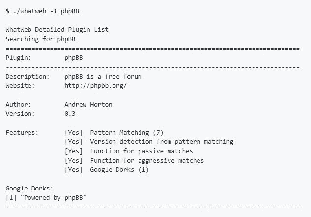

# WhatWeb:下一代网络扫描仪

> 原文：<https://kalilinuxtutorials.com/whatweb-next-generation-web-scanner/>

WhatWeb 识别网站。它的目标是回答这个问题，“那个网站是什么？”。WhatWeb 认可的网络技术包括内容管理系统(CMS)、博客平台、统计/分析包、JavaScript 库、网络服务器和嵌入式设备。

WhatWeb 有超过 1800 个插件，每个插件都能识别不同的东西。WhatWeb 还识别版本号、电子邮件地址、帐户 id、Web 框架模块、SQL 错误等等。

WhatWeb 可以是隐秘而快速的，也可以是彻底而缓慢的。WhatWeb 支持侵略性级别来控制速度和可靠性之间的权衡。

当你在你的浏览器中访问一个网站时，交易包括了许多关于什么样的网络技术驱动着这个网站的提示。有时，单次网页访问包含足够的信息来识别网站，但如果没有，WhatWeb 可以进一步询问网站。

默认级别的攻击称为“隐身”，是最快的，只需要一个网站的 HTTP 请求。这个适合扫描公共网站。更积极的模式被开发用于渗透测试。

大多数 WhatWeb 插件是彻底的，可以识别从细微到明显的一系列线索。例如，大多数 WordPress 网站可以通过 meta HTML 标签来识别，例如“但是少数 WordPress 网站移除了这个识别标签，但是这并没有阻碍 WhatWeb。

WordPress WhatWeb 插件有超过 15 个测试，包括检查 favicon，默认安装文件，登录页面，检查相关链接中的“/wp-content/”。

**也读作-[RIPVT:Canari](https://kalilinuxtutorials.com/ripvt/)T3 的病毒总 API Maltego 转换集**

**特色**

*   超过 1800 个插件
*   控制速度/隐蔽性和可靠性之间的权衡
*   性能调整。控制同时扫描多少网站。
*   多种日志格式:Brief (greppable)、Verbose(人类可读)、XML、JSON、MagicTree、RubyObject、MongoDB、ElasticSearch、SQL。
*   代理支持，包括 TOR
*   自定义 HTTP 标头
*   基本 HTTP 身份验证
*   对网页重定向的控制
*   ip 地址范围
*   模糊匹配
*   结果确定性意识
*   命令行上定义的自定义插件
*   IDN(国际域名)支持

**例句用法**

用 WhatWeb 扫描 reddit.com。

**。/what web reddit.com
http://reddit.com[301 永久移动]国家[美国][US]，HTTPServer[snooserv]，IP[151.101.65.140]，redirect location[https://www . Reddit . com/]，UncommonHeaders[retry-after，x-served-by，x-cache-hits，x-timer]，Via-Proxy[1.1 varnish]
200 OK]Cookies[edge bucket，eu_cookie_v2，loid，rabt，rseor 包括子域；preload]，Title[reddit:互联网的首页]，un common headers[fast ly-restarts，x-served-by，x-cache-hits，x-timer]，Via-Proxy[1.1 varnish]，X-Frame-Options[SAMEORIGIN]**

**用途**

**WhatWeb – Next generation web scanner version 0.5.0.
Developed by Andrew Horton (urbanadventurer) and Brendan Coles (bcoles)
Homepage: https://www.morningstarsecurity.com/research/whatweb**

**Usage: whatweb [options]**

**TARGET SELECTION:** Enter URLs, hostnames, IP adddresses, filenames or
IP ranges in CIDR, x.x.x-x, or x.x.x.x-x.x.x.x
format.
–input-file=FILE, -i Read targets from a file. You can pipe
hostnames or URLs directly with -i /dev/stdin.

**TARGET MODIFICATION:** –url-prefix Add a prefix to target URLs.
–url-suffix Add a suffix to target URLs.
–url-pattern Insert the targets into a URL. Requires –input-file,
eg. www.example.com/%insert%/robots.txt
**AGGRESSION:**
The aggression level controls the trade-off between speed/stealth and
reliability.
–aggression, -a=LEVEL Set the aggression level. Default: 1.
**Aggression levels are:**
– Stealthy Makes one HTTP request per target. Also follows redirects.
– Aggressive If a level 1 plugin is matched, additional requests will be
made.
– Heavy Makes a lot of HTTP requests per target. Aggressive tests from all plugins are used for all URLs.

**HTTP OPTIONS:** –user-agent, -U=AGENT Identify as AGENT instead of WhatWeb/0.5.0.
–header, -H Add an HTTP header. eg “Foo:Bar”. Specifying a default
header will replace it. Specifying an empty value, eg.
“User-Agent:” will remove the header.
–follow-redirect=WHEN Control when to follow redirects. WHEN may be `never',` http-only’, `meta-only',`same-site’, or `always’.
Default: always.
–max-redirects=NUM Maximum number of contiguous redirects. Default: 10.

**AUTHENTICATION:** –user, -u= HTTP basic authentication.
–cookie, -c=COOKIES Provide cookies, e.g. ‘name=value; name2=value2’.
–cookiejar=FILE Read cookies from a file.
PROXY:
–proxy Set proxy hostname and port.
Default: 8080.
–proxy-user Set proxy user and password.

**PLUGINS:** –list-plugins, -l List all plugins.
–info-plugins, -I=[SEARCH] List all plugins with detailed information.
Optionally search with keywords in a comma
delimited list.
–search-plugins=STRING Search plugins for a keyword.
–plugins, -p=LIST Select plugins. LIST is a comma delimited set of
selected plugins. Default is all.
Each element can be a directory, file or plugin name and
can optionally have a modifier, eg. + or –
Examples: +/tmp/moo.rb,+/tmp/foo.rb
title,md5,+./plugins-disabled/
./plugins-disabled,-md5
-p + is a shortcut for -p +plugins-disabled.
–grep, -g=STRING|REGEXP Search for STRING or a Regular Expression. Shows
only the results that match.
Examples: –grep “hello”
–grep “/he[l]*o/”
–custom-plugin=DEFINITION\tDefine a custom plugin named Custom-Plugin,
–custom-plugin=DEFINITION Define a custom plugin named Custom-Plugin,
Examples: “:text=>’powered by abc'”
“:version=>/powered[ ]?by ab[0-9]/”
“:ghdb=>’intitle:abc \”powered by abc\”‘”
“:md5=>’8666257030b94d3bdb46e05945f60b42′”
–dorks=PLUGIN List Google dorks for the selected plugin.

**OUTPUT:** –verbose, -v Verbose output includes plugin descriptions. Use twice
for debugging.
–colour,–color=WHEN control whether colour is used. WHEN may be `never',` always’, or `auto’.
–quiet, -q Do not display brief logging to STDOUT.
–no-errors Suppress error messages.
LOGGING:
–log-brief=FILE Log brief, one-line output.
–log-verbose=FILE Log verbose output.
–log-errors=FILE Log errors.
–log-xml=FILE Log XML format.
–log-json=FILE Log JSON format.
–log-sql=FILE Log SQL INSERT statements.
–log-sql-create=FILE Create SQL database tables.
–log-json-verbose=FILE Log JSON Verbose format.
–log-magictree=FILE Log MagicTree XML format.
–log-object=FILE Log Ruby object inspection format.
–log-mongo-database Name of the MongoDB database.
–log-mongo-collection Name of the MongoDB collection. Default: whatweb.
–log-mongo-host MongoDB hostname or IP address. Default: 0.0.0.0.
–log-mongo-username MongoDB username. Default: nil.
–log-mongo-password MongoDB password. Default: nil.
–log-elastic-index Name of the index to store results. Default: whatweb
–log-elastic-host Host:port of the elastic http interface. Default: 127.0.0.1:9200

**PERFORMANCE & STABILITY:** –max-threads, -t Number of simultaneous threads. Default: 25.
–open-timeout Time in seconds. Default: 15.
–read-timeout Time in seconds. Default: 30.
–wait=SECONDS Wait SECONDS between connections.
This is useful when using a single thread.

**HELP & MISCELLANEOUS:** –short-help Short usage help.
–help, -h Complete usage help.
–debug Raise errors in plugins.
–version Display version information. (WhatWeb 0.5.0).

**EXAMPLE USAGE:**

Scan example.com.
./whatweb example.com

Scan reddit.com slashdot.org with verbose plugin descriptions.
./whatweb -v reddit.com slashdot.org

An aggressive scan of wired.com detects the exact version of WordPress.
./whatweb -a 3 www.wired.com

Scan the local network quickly and suppress errors.
whatweb –no-errors 192.168.0.0/24

Scan the local network for https websites.
whatweb –no-errors –url-prefix https:// 192.168.0.0/24

Scan for crossdomain policies in the Alexa Top 1000.
./whatweb -i plugin-development/alexa-top-100.txt \
–url-suffix /crossdomain.xml -p crossdomain_xml

**测井&输出**

支持以下类型的日志记录:

*   –log-Brief =文件简介，单行，可 greppable 格式
*   –log-Verbose =文件详细信息
*   –log-xml =文件 XML 格式。提供了 XSL 样式表
*   –log-json =文件 JSON 格式
*   –log-json-verbose =文件 JSON 详细格式
*   –log-magic tree = FILE magic tree XML 格式
*   –log-object = FILE Ruby 对象检查格式
*   –log-mongo-MongoDB 数据库的数据库名称
*   –log-mongo-MongoDB 集合的集合名称。默认:whatweb
*   –log-mongo-host MongoDB 主机名或 IP 地址。默认值:0.0.0.0
*   –log-mongo-username MongoDB 用户名。默认值:零
*   –log-mongo-password MongoDB 密码。默认值:零
*   –log-elastic-index 用于存储结果的索引的名称。默认:whatweb
*   –log-elastic-Host 主机:弹性 http 接口的端口。默认值:127.0.0.1:9200
*   –Log-errors =文件日志错误。这通常以红色打印到屏幕上。

通过指定多个命令行日志记录选项，可以同时输出到多个日志。想要 SQL 输出的高级用户应该阅读源代码以查看不支持的特性。

**外挂**

火柴由以下材料制成:

*   文本字符串(区分大小写)
*   正则表达式
*   Google Hack 数据库查询(有限的一组关键字)
*   MD5 哈希
*   URL 识别
*   HTML 标记模式
*   用于被动和主动操作的自定义 ruby 代码

要列出支持的插件:

**$。/whatweb -l**

**WhatWeb 插件列表**

**插件名称–描述
————————————————————————————————————
1024-CMS–1024 是为数不多率先实现…
360-Web-Manager–360-Web-Manager
3COM-NBX–3COM NBX 电话系统的 CMS 之一。NBX NetSet 实用程序是一个 web 界面 I…
3d Cart–3d Cart–3d Cart 购物车软件是一个完整的电子商务 s…
4D–4D web 应用程序部署服务器
4 images–4 images 是一个功能强大的基于 web 的图片库管理系统。Fe……(截断)**

**搜索插件**

要查看有关插件的更多详细信息，或使用关键词搜索插件:

**插件选择**

默认情况下会加载所有插件。

可以使用-p 或–plugin 命令行选项，通过目录、文件或插件名称作为逗号分隔列表来选择插件。

每个列表项都可以有一个修饰符:+添加到全集中，–从全集中删除，并且没有修饰符覆盖默认值。

**例子**

*   –插件+插件-禁用，-foobar
*   –插件+/tmp/moo.rb
*   –插件 foobar(仅选择 foobar)
*   -p title，md5，+/插件-已禁用/
*   -p ./plugins-disabled，-md5

–dorks 命令行选项返回所选插件的 google dorks。例如,–dorks wordpress 返回“由 WordPress 提供动力，这是我们的骄傲”

–grep，-g 命令行选项在目标页面中搜索所选字符串，如果找到匹配项，则在名为 Grep 的插件中返回匹配项。

**攻击性**

WhatWeb 有几个攻击层次。默认情况下，攻击级别设置为 1(秘密)，它发送一个 HTTP GET 请求，并跟随重定向。

*   隐身对每个目标发出一个 HTTP 请求。也跟随重定向。
*   **未使用的**
*   **Aggressive 可以对每个目标发出少量 HTTP 请求。只有当这些插件首先被识别为 1 级请求时，才会触发针对目标的攻击性插件。**
*   每个目标都有大量的 HTTP 请求。来自所有插件的积极测试用于所有 URL。

3 级攻击性插件会猜测更多的 URL，并在未经许可的情况下执行潜在不合适的操作。WhatWeb 目前不支持插件中的任何入侵/利用级别测试。

**一级和三级不同结果的例子:**

一级秘密扫描发现 smartor.is-root.com/forum/使用 phpBB 版本 2:

**$。/what web smartor.is-root.com/forum/
http://smartor.is-root.com/forum/[200]password field[password]，HTTPServer[Apache/2.2.15]，PoweredBy[phpBB]，Apache[2.2.15]，IP[88.198.177.36]，phpBB[2]，PHP[5.2.13]，X-Powered-By[PHP/5.2.13]，Cookies[phpbb2mysql_data，phpbb2mysql_sid]，Title[Smartors Mods**

3 级积极扫描会触发 phpBB 插件中的额外测试，确定网站使用 phpBB 版本 2.0.20 或更高版本:

**$。/what web-p plugins/phpBB . r b-a 3 smartor.is-root.com/forum/
http://smartor.is-root.com/forum/【200】phpBB【2，>2 . 0 . 20】**

请注意-p 参数的使用，它只选择 phpBB 插件。在主动模式下尝试对软件版本进行指纹识别时，建议选择特定的插件，但这不是强制性的。这种方法更加隐蔽，因为它将限制请求的数量。

WhatWeb 没有缓存，所以如果你在重定向 URL 时使用激进的插件，你可能会多次获取相同的文件。

**性能&稳定性**

WhatWeb 提供了几个选项来提高性能和稳定性。

*   –max-threads，-t 并发线程数。默认值:25。
*   –打开超时时间，单位为秒。默认值:15
*   –读取超时时间，单位为秒。默认值:30
*   –Wait = SECONDS 连接之间的等待秒数这在使用单线程时非常有用。

–wait 和–max-threads 命令可用于帮助规避 IDS。

使用-U 或–user-agent 命令行选项更改用户代理将避免 WhatWeb 的 Snort IDS 规则。

如果您正在扫描 IP 地址范围，那么在使用 WhatWeb 进行扫描之前，使用像 massscan 这样的端口扫描器来发现哪些端口 80 是打开的会更有效。

字符集检测，使用 Charset 插件，由于需要更多的 CPU 而大大降低了性能。这是 JSON 和 MongoDB 日志记录所需要的。

**可选依赖关系**

要启用 MongoDB 日志记录，请安装 mongo gem。宝石安装 mongo

要启用字符集检测和 MongoDB 日志记录，请安装 rchardet gem。gem 安装 rchardet cp 插件-禁用/charset.rb my-plugins/

**编写插件**

插件很容易写。从浏览 *my-plugins/* 文件夹中的插件教程开始。

*   [外挂教程](https://github.com/urbanadventurer/WhatWeb/tree/master/my-plugins)。

插件教程的概述在这里。[插件-教程. txt](https://github.com/urbanadventurer/WhatWeb/tree/master/plugin-development/plugin-tutorials.txt)

学习完教程后，通读 [wiki](https://github.com/urbanadventurer/WhatWeb/wiki/) 的开发部分。

*   [插件编写的来源](https://github.com/urbanadventurer/WhatWeb/wiki/Sources-for-Plugin-Writing)
*   [如何开发 WhatWeb 插件(非最新)](https://github.com/urbanadventurer/WhatWeb/wiki/How-to-develop-WhatWeb-plugins)

**更新&附加信息**

WhatWeb 开发构建的特点是定期更新。

*   检查开发分支是否有未发布的更新。

浏览 wiki 获取更多文档和高级使用技巧。

*   维基:[https://github.com/urbanadventurer/WhatWeb/wiki/](https://github.com/urbanadventurer/WhatWeb/wiki/)

**发布历史**

*   版本 0.5.0 于 2019 年 6 月 9 日发布
*   2017 年 11 月 23 日发布的版本 0.4.9
*   版本 0 . 4 . 8-开发(从 2012 年到 2017 年持续发布)
*   版本 0.4.7 于 2011 年 4 月 5 日发布
*   版本 0.4.6 于 2011 年 3 月 25 日发布
*   版本 0.4.5 发布于 2010 年 8 月 17 日
*   版本 0.4.4 于 2010 年 6 月 29 日发布
*   版本 0.4.3 发布于 2010 年 5 月 24 日
*   版本 0.4.2 发布于 2010 年 4 月 30 日
*   版本 0.4.1 发布于 2010 年 4 月 28 日
*   版本 0.4 发布于 2010 年 3 月 14 日
*   0.3 版发布于 2009 年 11 月 2 日的 Kiwicon III (kiwicon.org)

**学分**

**开发商**

*   安德鲁·霍顿(@ urbanadventurer)
*   布伦丹·科尔斯

[**Download**](https://github.com/urbanadventurer/WhatWeb)