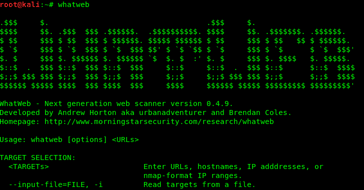
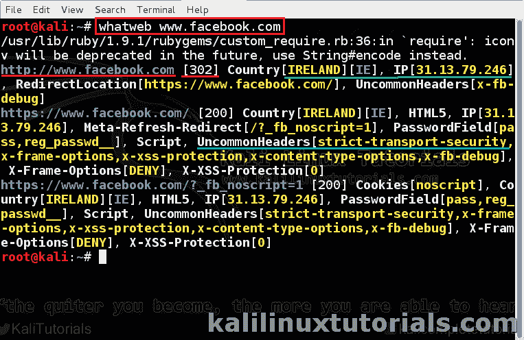
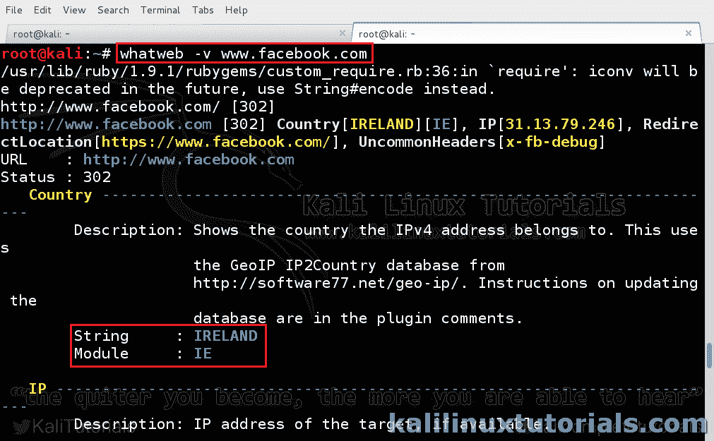
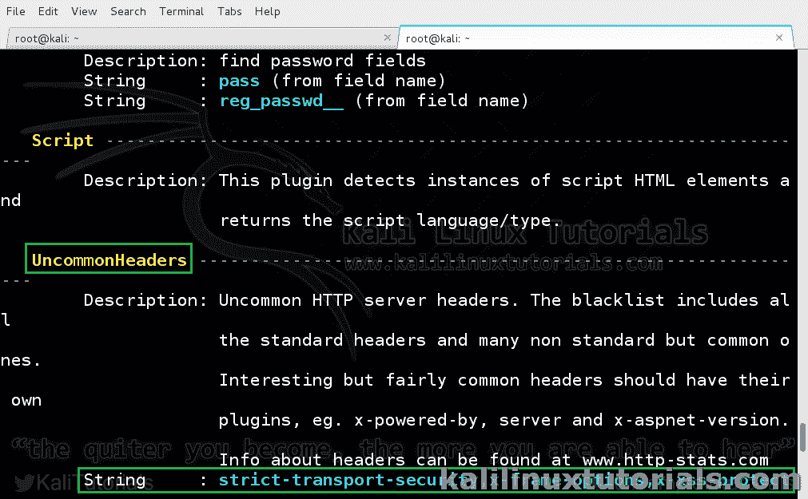
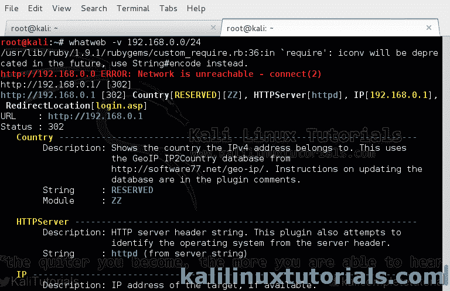
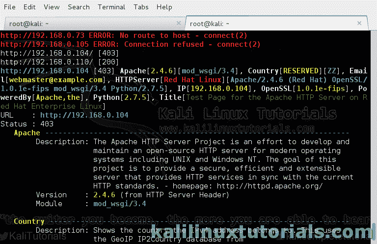
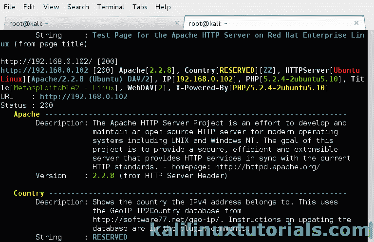
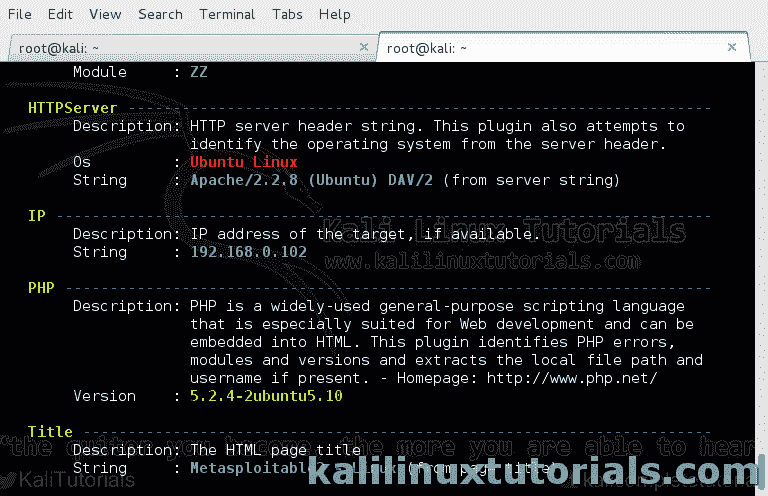

# what web——一个扫描工具，用于查找 Web 应用中的安全漏洞

> 原文：<https://kalilinuxtutorials.com/whatweb/>

[](https://blogger.googleusercontent.com/img/b/R29vZ2xl/AVvXsEjp2CaE_9XajgnRTmvdPAKbuXsSKBr5oKK2Pmf1rD0B1tjS0i7VqD_uOWgWzQbnZzTA-A55GVAagGwDWkcKSWsK-lAAn75Iqa54Ywu02fiU80ClCM106cv4qGiy2wY6avNaYTFaOKTHIWFKhdoae467qtNv1FQ_rGtArTDDx8yFH7mmofG_J81ig10Y/s728/whatweb.webp)

Whatweb 是这个工具的完美名字。简单地说，它回答了这个问题，“那个网站是什么？”Whatweb 可以识别实时网站的各种信息，例如:

*   平台
*   CMS 平台
*   脚本类型
*   谷歌分析
*   网络服务器平台
*   IP 地址，国家
*   使用了 900 多个插件及其库
*   服务器头，Cookies 和更多。

Whatweb 提供被动扫描和主动测试。被动扫描只是从模拟正常访问的 HTTP 报头中提取数据。积极的选项通过递归和各种类型的查询变得更深入，就像一个[漏洞扫描器](https://gbhackers.com/best-vulnerability-scanner/)一样识别所有技术。

所以一个 [pentester](https://cybersecuritynews.com/retesting/) 可以把这个工具作为侦察工具&漏洞扫描器。还有各种其他功能，如代理支持，扫描调整，扫描一系列的 IP，蜘蛛等。

## **Whatweb** 选项

```
Syntax: whatweb [options] <URLs>
```

选项已被否决。仅列出主要选项或。请访问 whatweb 工具主页了解完整选项

```
TARGET SELECTION:
<URLs>                Enter URLs, filenames or nmap-format IP ranges.
--input-file=FILE, -i Identify URLs found in FILE, eg. -i /dev/stdin

TARGET MODIFICATION:
--url-prefix          Add a prefix to target URLs
--url-suffix          Add a suffix to target URLs
--url-pattern         Insert the targets into a URL. Requires --input-file,

AGGRESSION:
The aggression level controls the trade-off between speed/stealth and reliability.
--aggression, -a=LEVEL Set the aggression level. Default: 1
Aggression levels are: 1,2,3 & 4

HTTP OPTIONS:
--user-agent, -U=AGENT Identify as AGENT instead of WhatWeb/0.4.8-dev.
--follow-redirect=WHEN Control when to follow redirects.Default: always
--max-redirects=NUM   Maximum number of contiguous redirects. Default: 10

AUTHENTICATION:
--user, -u=<user:password> HTTP basic authentication
Add session cookies with --header, e.g. --header "Cookie: SESSID=1a2b3c;"

PROXY:
--proxy               <hostname[:port]> Set proxy hostname and port Default: 8080
--proxy-user          <username:password> Set proxy user and password

PLUGINS:
--list-plugins, -l    List all plugins

OUTPUT:
--verbose, -v         Verbose output includes plugin descriptions. Use twice for debugging.
--colour,--color=WHEN control whether colour is used. WHEN='always', 'never' or 'auto'
--quiet, -q           Do not display brief logging to STDOUT
--no-errors           Suppress error messages

LOGGING:
--log-brief=FILE      Log brief, one-line output
--log-verbose=FILE    Log verbose output
--log-xml=FILE        Log XML format

PERFORMANCE & STABILITY:
--max-threads, -t     Number of simultaneous threads. Default: 25.
--open-timeout        Time in seconds. Default: 15
--read-timeout        Time in seconds. Default: 30
--wait=SECONDS        Wait SECONDS between connections

HELP & MISCELLANEOUS:
--help, -h            This help
--debug               Raise errors in plugins
--version             Display version information. (WhatWeb 0.4.8-dev)

```

## **Whatweb 实验室 1:对互联网上的网站进行简单的列举。**

在本实验中，我们将简单列举网站。这样做的结果是，我们可以了解网站使用的技术&网络服务器。

注意:未经事先许可，请不要将此用于反对政府或军事网站。本文作者或工具本身不对误用造成的任何后果负责。

## **场景:**

攻击者:Kali Linux VM

目标:www.facebook.com

```
Command: whatweb www.facebook.com
```

[](http://kalilinuxtutorials.com/wa/whatweb/attachment/whatweb1/#main)

Basic Details

给出更详细的输出

```
Command: whatweb -v www.facebook.com
```

[](http://kalilinuxtutorials.com/wa/whatweb/attachment/whatweb2/#main)

Displaying Details about modules

[](http://kalilinuxtutorials.com/wa/whatweb/attachment/whatweb3/#main)

Displaying Details about modules

实际上，我们如何使用这些信息进行漏洞分析，有时您可能会发现 web 服务器是 Apache 或 IIS 的过时版本。或者有时候，网站运行的是旧的 WordPress 版本，容易出现很多问题。就像这样，你可以找到网站中使用的不同版本技术的漏洞和利用。

## **Whatweb 实验室 2:列举一系列网站**

whatweb 允许你测试一系列的 IP 地址。在本实验中，我们在本地网络上测试了一系列 IP。这在生产网络内部进行 Pentests 时非常有用，或者有时像查找一系列 IP 上的 Web-ui 或 cpanels 列表。

场景:

内部网络:192.168.0.0/24

攻击者:Kali Linux

```
command: whatweb -v 192.168.0.1/24
```

有趣的是，详细输出给出了有趣信息的彩色字符串。查看下图中的所有颜色，并识别所有模块。

[](http://kalilinuxtutorials.com/wa/whatweb/attachment/whatweb4/#main)[](http://kalilinuxtutorials.com/wa/whatweb/attachment/whatweb5/#main)[](http://kalilinuxtutorials.com/wa/whatweb/attachment/whatweb6/#main)[](http://kalilinuxtutorials.com/wa/whatweb/attachment/whatweb7/#main)

**自己试试**:记住 whatweb 可以扫描局域网以外的范围，也可以扫描广域网。找出谷歌的 IP 地址，并对其范围进行扫描。

点击阅读更多信息[探索 **whatweb 工具。**](http://www.morningstarsecurity.com/research/whatweb)