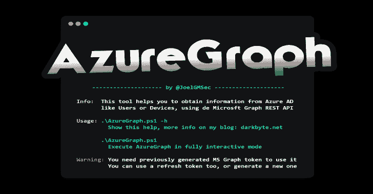

# Azure Graph:MS 图形上的 Azure AD 枚举

> 原文：<https://kalilinuxtutorials.com/azuregraph/>

.png)

AzureGraph 是微软 Graph 上的 Azure 广告信息收集工具。

得益于微软 Graph 技术，可以从 Azure AD 获取各种信息，比如用户、设备、应用、域等等。

这个应用程序允许您通过 PowerShell 控制台以一种简单易行的方式通过 API 查询这些数据。此外，你可以从云中下载所有信息，并完全离线使用。

## 要求

*   PowerShell 4.0 或更高版本

## [计] 下载

建议克隆完整的存储库或下载 zip 文件。您可以通过运行以下命令来实现这一点:

**git 克隆 https://github.com/JoelGMSec/AzureGraph**

## 使用

。\AzureGraph.ps1 -h

Info:该工具帮助您从 Azure AD
获取信息，如用户或设备，使用 de Microsoft Graph REST API

用法:。\AzureGraph.ps1 -h
显示这个帮助，更多信息在我的博客:darkbyte.net
T5。\AzureGraph.ps1
在完全交互模式下执行 azure Graph

警告:您需要先前生成的 MS Graph 令牌才能使用它
您也可以使用刷新令牌，或者生成一个新的令牌

### 详细的使用指南可在以下链接中找到:

[https://dark byte . net/azure graph-enumerando-azure-ad-desde-Microsoft-graph](https://darkbyte.net/azuregraph-enumerando-azure-ad-desde-microsoft-graph)

[Click Here To Download](https://github.com/JoelGMSec/AzureGraph)