# Burp 套件教程——Web 应用渗透测试工具——初学者指南

> 原文：<https://kalilinuxtutorials.com/burpsuite/>

在本 Burp Suite 教程中，我们将详细描述 Burp Suite 工具及其功能，这些功能捆绑在一个套件中，用于 Web 应用程序安全评估和渗透测试。

它是一个 java 可执行文件，因此是跨平台的。Kali Linux 附带安装了 Burp Suite 免费版。也有专业版可用。

Burp 套件的主要特点是它可以作为一个拦截代理。Burp Suite 拦截 web 浏览器和 web 服务器之间的流量。

本 Burp 套件教程帮助您了解与 Burp 套件相关的工具，以及它在 web 渗透测试行业中的基本用途。

## **打嗝套件的其他功能:**

*   **应用感知** **蜘蛛:**用于爬行/抓取给定范围的页面。
*   **扫描程序:**像其他自动扫描程序一样自动扫描漏洞
*   **入侵者:**用于以高度可定制的方式对页面进行攻击&暴力攻击。
*   **中继器:**用于操纵和重新发送单个请求。
*   **Sequencer:** 主要用于测试/fuzzing 会话令牌。
*   可扩展性，允许您轻松编写自己的插件，在 Burp 中执行复杂和高度定制的任务。
*   **比较器** & **解码器**用于进行网络安全测试时可能出现的各种用途

## **打嗝套件教程——搜索网站**

网络爬虫是一个机器人程序，它系统地浏览一个网站的页面，以便建立索引。确切地说，网络爬虫通过浏览网站的所有内页来绘制网站的结构。爬虫也被称为蜘蛛或自动索引器。

打嗝套件有自己的蜘蛛叫打嗝。打嗝蜘蛛是一个程序，它爬进在作用域中指定的目标的所有页面。在启动 burp spider 之前，必须配置 burp 套件来拦截 HTTP 流量。

## **打嗝套件界面&选项**

像任何其他 GUI/Windows 工具一样，Burp Suite 包含一个标准菜单栏、2 行选项卡和不同的面板集，如下所示。

[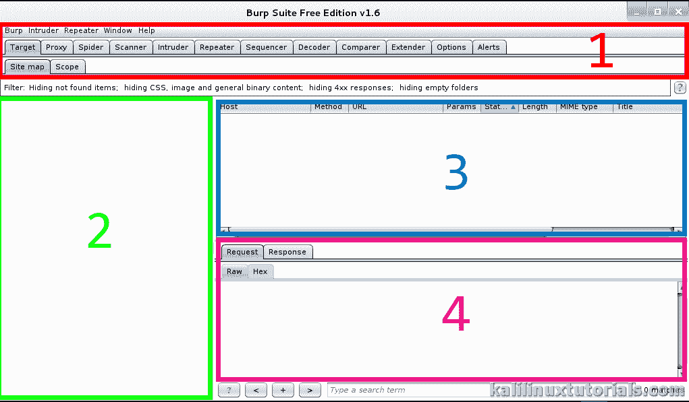](http://kalilinuxtutorials.com/wa/burpsuite/attachment/burp1-copy/#main)

Burp suite Window

上图显示了关于目标的选项和细节。在上图中，主要有 4 个部分。它们相对于相应的数字描述如下:

1.  工具和选项选择器标签–在 Burp Suite 的各种工具和设置之间进行选择
2.  站点地图视图–一旦蜘蛛启动就显示站点地图
3.  请求队列–显示正在进行的请求
4.  请求/响应细节——发出的 HTTP 请求和来自服务器的响应。

## **打嗝套件教程实验 1:搜索网站**

在执行网络安全测试时，爬行是 recon 的主要部分。它帮助测试者确定 web 应用程序的范围和架构。如前所述，打嗝套件有自己的蜘蛛，称为打嗝蜘蛛，可以爬进一个网站。

场景:攻击者–Kali Linux 虚拟机，IP = 192.168.0.105

目标–OWASP 中断的 Web 应用程序虚拟机，IP = 192.168.0.160

点击此处下载 OWASPBWA

## **打嗝套件教程**–**第一步:设置代理**

首先，这个**打嗝套件教程**有助于检查选项子选项卡中代理选项卡下的详细信息。确保 IP 是本地主机 IP &端口是 8080。

[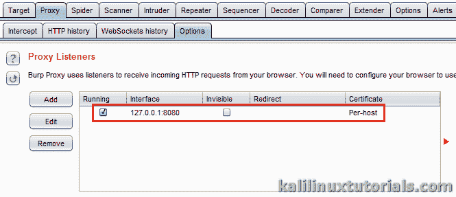](http://kalilinuxtutorials.com/wa/burpsuite/attachment/burp4c/#main)

Proxy Options & Information

此外，确保“截取”子选项卡中的“截取”处于打开状态

[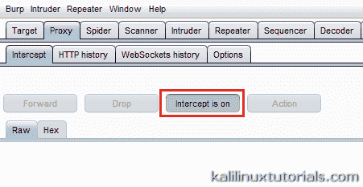](http://kalilinuxtutorials.com/wa/burpsuite/attachment/burp4b/#main)

Turning ON intercept

然后在 IceWeasel/Firefox 上，进入选项>偏好设置>网络>连接设置。

选择手动代理配置

[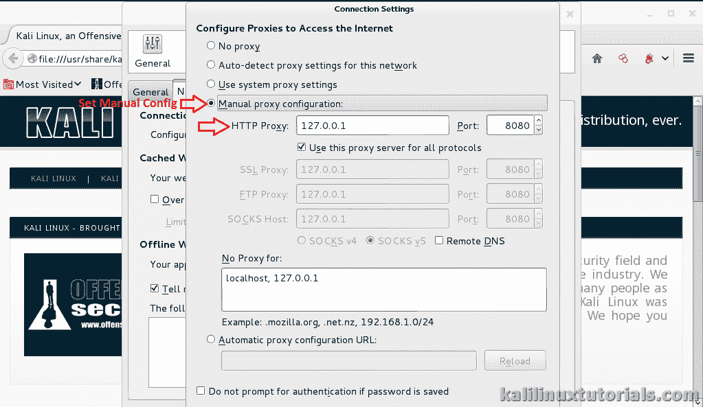](http://kalilinuxtutorials.com/wa/burpsuite/attachment/burp2/#main)

Setting Proxy in IceWeasel

如果您愿意，可以尝试安装代理加载项。这里有一个这样的例子。

从附加组件页面安装代理选择器，然后转到首选项

Setting Up Addons

转到管理代理&添加一个新的代理，填写相关信息。很简单。

[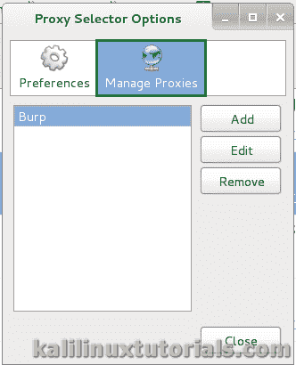](http://kalilinuxtutorials.com/wa/burpsuite/attachment/burp4/#main)

Configuring Addon Proxy

单击右上角的代理选择器按钮，选择您刚刚创建的代理。

[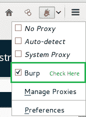](http://kalilinuxtutorials.com/wa/burpsuite/attachment/burp4a/#main)

Setting Up Addons

## **打嗝套件教程–步骤 2:将内容放入打嗝套件**

设置好代理后，通过在地址栏中输入 URL 正常地转到目标。您会注意到页面无法加载。这是因为 Burp Suite 正在拦截连接。

[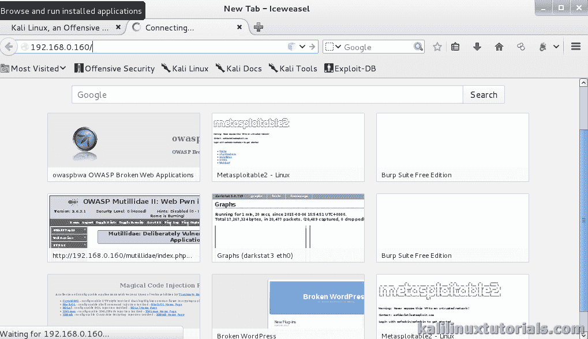](http://kalilinuxtutorials.com/wa/burpsuite/attachment/burp5/#main)

Page Loading

同时，在 Burp Suite 中，您可以看到请求的详细信息。单击转发以转发连接。然后，您可以看到页面已经在浏览器中加载。

[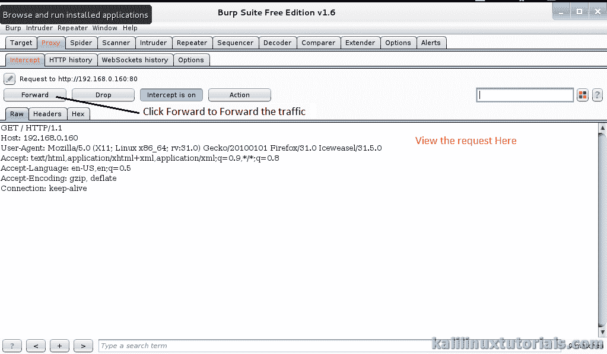](http://kalilinuxtutorials.com/wa/burpsuite/attachment/burp6/#main)

burp intercepting

[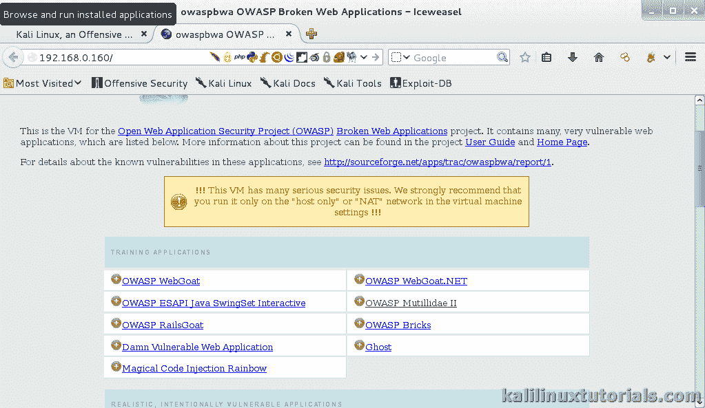](http://kalilinuxtutorials.com/wa/burpsuite/attachment/burp7/#main)

Page Loaded

回到 Burp Suite，您可以看到所有部分都已填充。

[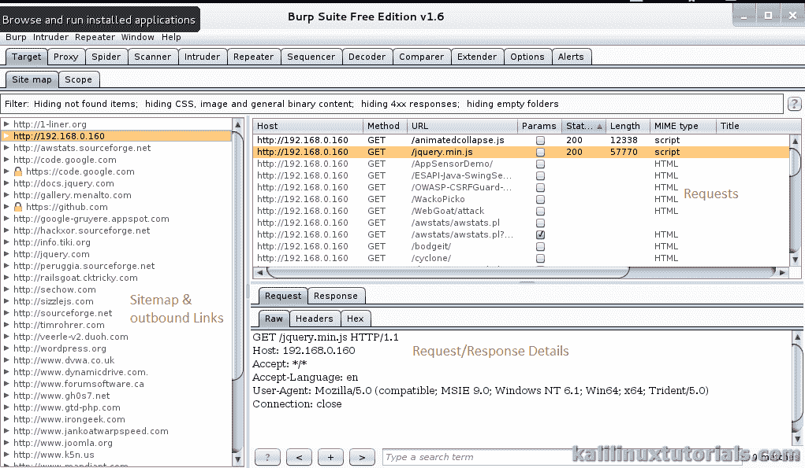](http://kalilinuxtutorials.com/wa/burpsuite/attachment/burp8/#main)

Sitemap, Requests & Request/Response Details

## **第三步:范围选择&启动蜘蛛**

在这个 Burp 套件教程中，现在根据需要缩小目标范围。这里选择了目标/章鱼。右键点击网站地图上的蜘蛛，从这里选择蜘蛛

[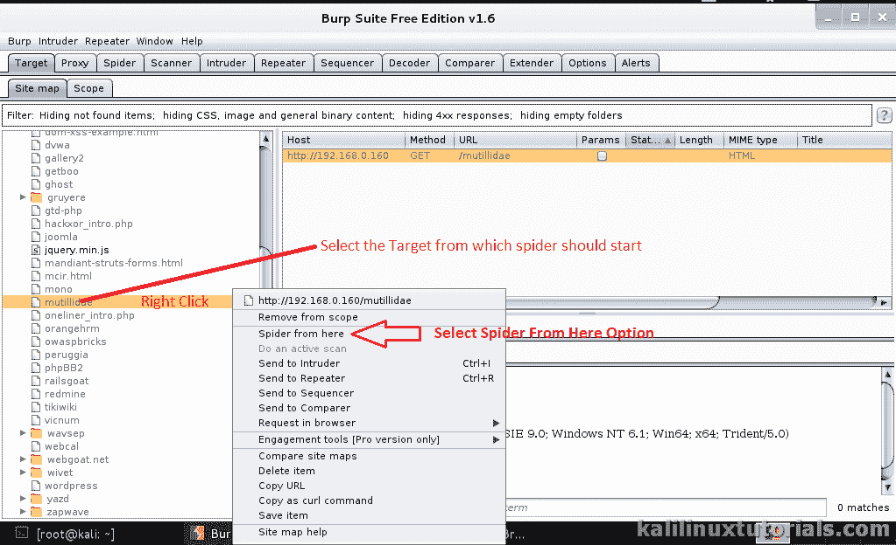](http://kalilinuxtutorials.com/wa/burpsuite/attachment/burp9/#main)

Selecting the target

蜘蛛启动后，您会得到如下图所示的提示。这是一个登录表格。如果你知道细节，根据需要填写&这样蜘蛛也能从里面爬出来。您可以按“忽略表单”按钮跳过这一步。

[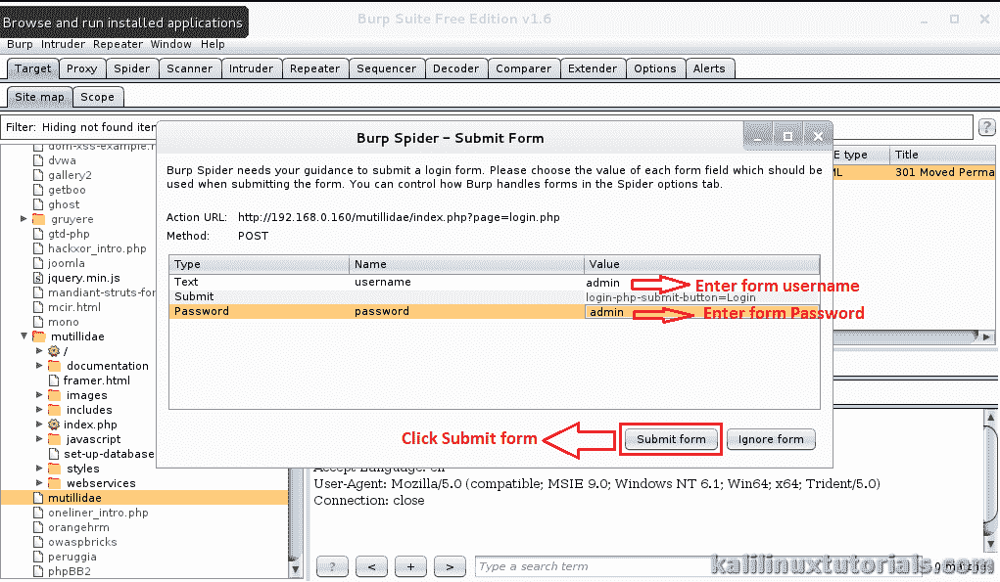](http://kalilinuxtutorials.com/wa/burpsuite/attachment/burp10/#main)

Submitting a Login form

## **第四步:操作细节**

现在你可以看到，当蜘蛛运行时，Mutillidae 分支内的树开始增加。此外，发出的请求显示在队列中，详细信息显示在 Request 选项卡中。

[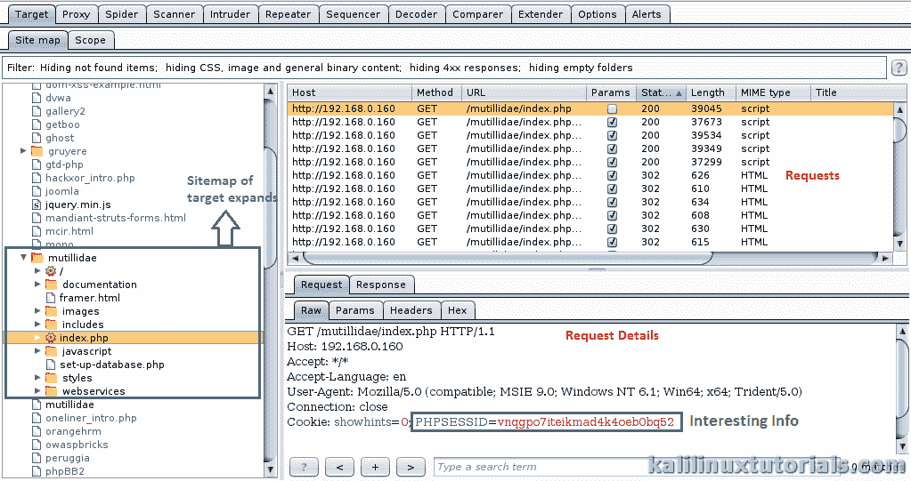](http://kalilinuxtutorials.com/wa/burpsuite/attachment/burp11/#main)

More details get Populated

移动到不同的选项卡，查看所有的基本信息。

[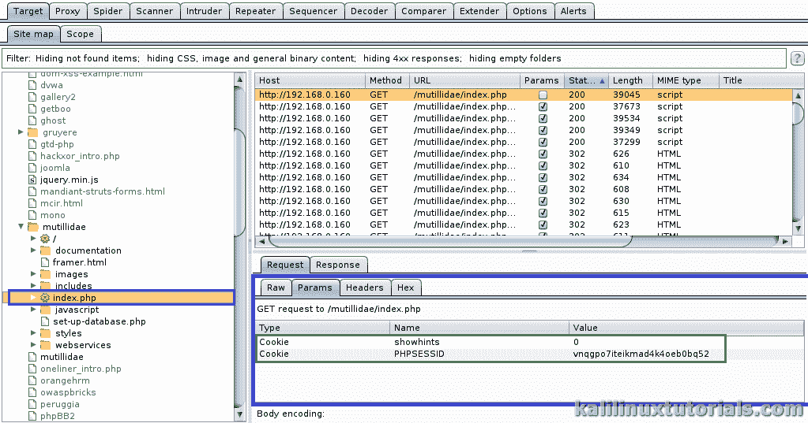](http://kalilinuxtutorials.com/wa/burpsuite/attachment/burp12/#main)

Interesting Cookie information

[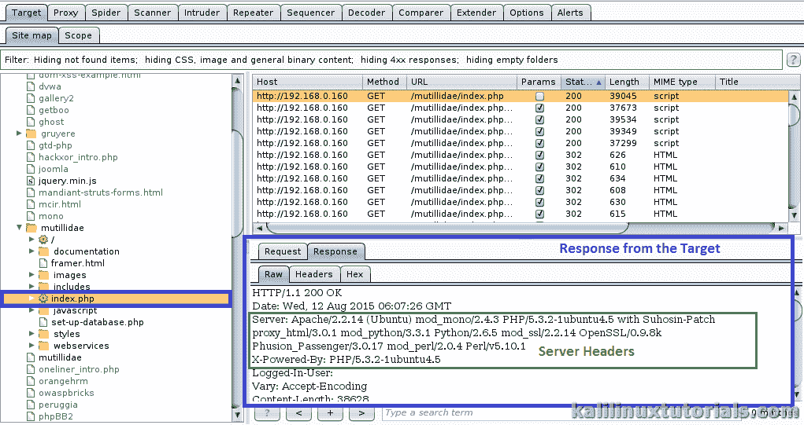](http://kalilinuxtutorials.com/wa/burpsuite/attachment/burp14/#main)

Response Details from the target

[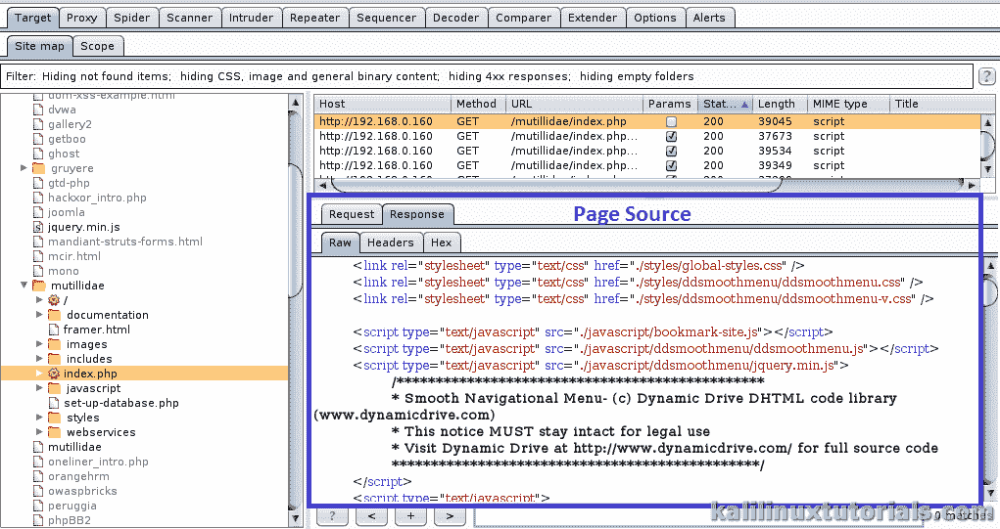](http://kalilinuxtutorials.com/wa/burpsuite/attachment/burp15/#main)

The page source

最后，通过查看 spider 选项卡检查 Spider 是否完成。

[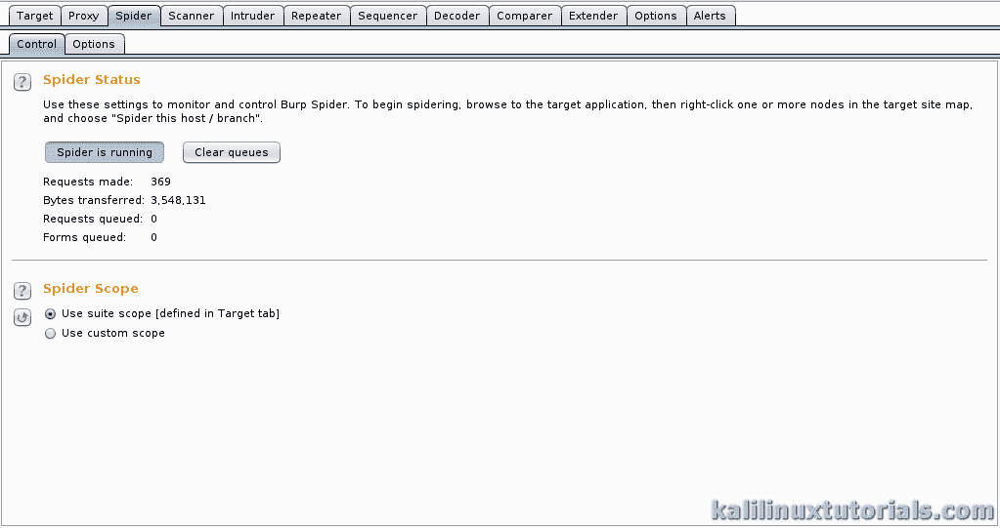](http://kalilinuxtutorials.com/wa/burpsuite/attachment/burp16/#main)

Spider Status

这个 Burp 套件教程是一个非常基础的& web 安全测试的起点。蜘蛛搜索是测试期间侦察的重要部分，通过清楚地执行它，我们可以理解目标站点的架构。