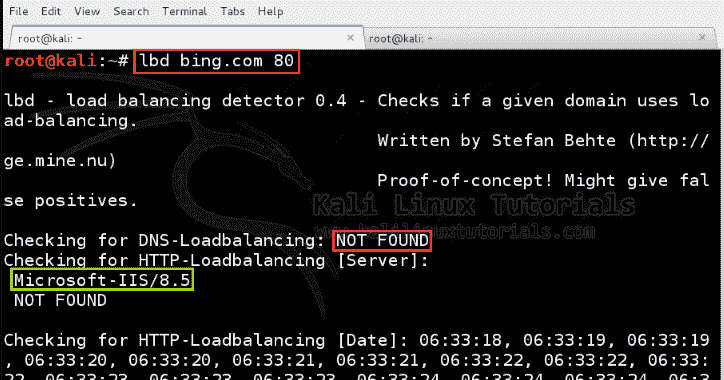
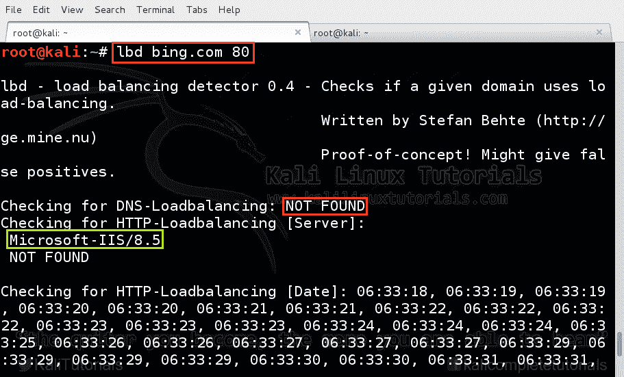
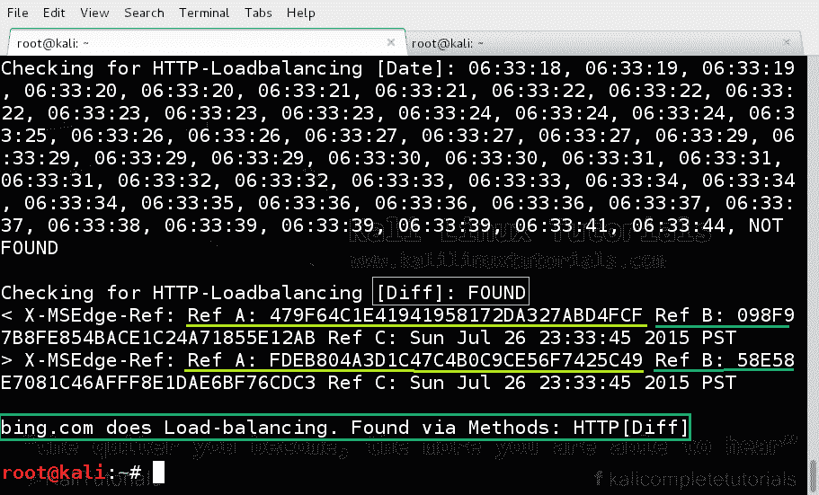

# lbd–检测域是否启用了负载平衡的工具

> 原文：<https://kalilinuxtutorials.com/lbd/>

[](https://blogger.googleusercontent.com/img/b/R29vZ2xl/AVvXsEi-hAu_jkn7LuqGikZN6lUuKRZ7GFRylGBFA6RVbdB3wkUCh1Yhmxgb7EWv9jtnS6LLbyXKKidjo985lS3tfcG-pb45oX_-BgoRnZ7CviVGcuKOEaw6Sw0UHo6yiAFa7JfL9uCFU7kX_VfgzQB_aIGJNPKukdwPSzGqvsFedtnbL7Fc-UnCVAmeogbR/s16000/ibd.webp)

负载平衡(lbd)是在不同服务中使用的技术，用于平衡不同服务器或网卡之间的负载。它可以是任何形式。负载平衡可以通过一系列计算机集群来平均分配工作负载。

或者可以在单个系统中使用它来平衡一组网络接口卡或磁盘之间的连接。在计算机集群中，所有系统内的所有数据都将同步。当发出传入请求时，管理器资源选择集群中的特定节点。

如果任何一个节点的工作负载很高，管理器会有效地将连接转移到另一个节点。因此，负载平衡可以最小化响应时间，最大化吞吐量。负载平衡可以在软件和硬件级别实现。

[](http://kalilinuxtutorials.com/ig/lbd/attachment/loadbalance/#main)

Typical Load Balancing

通常情况下，当一个网站有大量的传入流量时，如电子商务网站或最好的例子是脸书或谷歌本身，HTTP & DNS 负载平衡就会完成。

这些网站每分钟收到至少 1000 万次请求。因此，显然一台主机无法满足所有这些请求。因此，他们的请求将分布在一系列计算资源集群上，以保持它们的运行。

从安全角度来看，实现 HTTP 负载平衡有以下主要优势:

**DDos & Synflood 防护**

负载平衡启用 SYN-Cookies，这有助于防止 DDoS 攻击。& SYN flood 攻击。

**SSL 卸载&加速**

在启用了 TLS 的站点中，web 服务器的负载要高得多，因为一系列连续的不对称加密正在进行。这会降低吞吐量，但负载平衡会在集群内的不同节点之间平衡负载，并分配 TLS 导致的额外负载。

**隐藏错误页面**

一些 HTTP 负载平衡器可以隐藏 HTTP 错误页面，不让外界看到。

**防火墙& IPS**

实现负载平衡会在客户端和服务器之间创建一个层。所以客户端和服务器之间的直接连接是不可能的。因此，在这一层中，可以实施防火墙和入侵防御系统。此外，晶圆也可能成为障碍。

**优先排队**

负载平衡器可以对流量进行优先级排序，并智能地为传入的请求提供服务。

**参考**:[https://en . Wikipedia . org/wiki/Load _ balancing _(计算)](https://en.wikipedia.org/wiki/Load_balancing_(computing))

https://www.citrix.com/glossary/load-balancing.html

对于这个工具来说，lbd 是负载平衡检测的简称。它只是一个 shell 脚本，自动执行一系列测试来验证一个域是否有负载平衡。

## **Pentester 的实际应用–lbd**

有人可能会问，为什么要在测试期间检测负载平衡。答案是它消除了结果的不一致性。原因是，侦察是每次测试的主要部分。因此，确定应该包含在测试范围内的 IP 地址范围非常重要。

在处理具有负载平衡的服务器时，由于负载平衡器在工作，常规测试的结果可能会有所不同。有时，当我们在测试过程中的不同时间 ping 主机时，可能会得到不同的 IP 地址。这是因为 DNS 负载平衡器可能已经就位。

忽略这一事实可能是致命的。此外，在确定目标的基础设施时，我们可能会忽略这一关键事实，正如前面所说，我们可能会忽略 IDS/IPS 或外部世界与目标服务器之间的防火墙。

简单地说，它可以配置为允许所有 HTTP 流量，这样我们就无法检测到它。

**参考**:[http://www . sans . org/reading-room/whites/testing/identifying-load-balancers-penetration-testing-33313](http://www.sans.org/reading-room/whitepapers/testing/identifying-load-balancers-penetration-testing-33313)

### 选择

```
Syntax: lbd targetdomain port(defaults to 53 & 80) <options>

```

如果你有兴趣深入了解，请尝试以下方法

```
cat /usr/bin/lbd
```

### 实验:枚举一个域并检测它是否启用了负载平衡

这是简单的检测。这次让我们的目标成为微软的必应。

```
command: lbd bing.com 80
```

[](http://kalilinuxtutorials.com/ig/lbd/attachment/lbd1/#main)

Load Balancing Detection

[](http://kalilinuxtutorials.com/ig/lbd/attachment/lbd2/#main)

Load Balancing Detection

你自己试试。检测电子商务公司 Amazon 的 web 服务器上是否有负载平衡。记住不要伤害他们，否则你可能会面临后果。