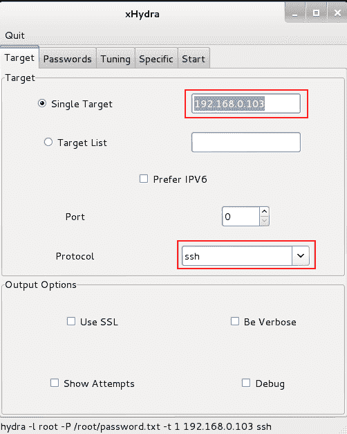
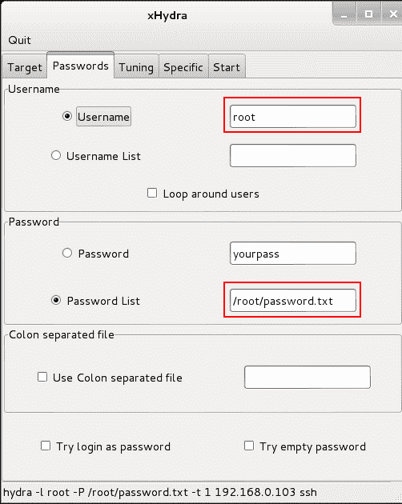
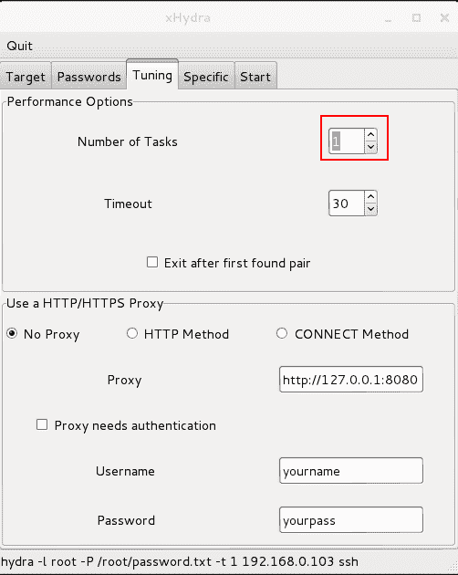
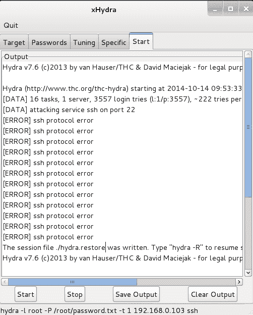
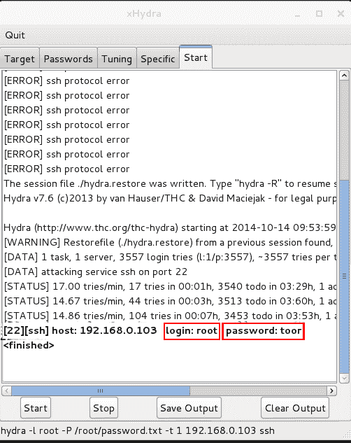

# 在线密码暴力与九头蛇 GTK

> 原文：<https://kalilinuxtutorials.com/hydraonline/>

Hydra(更好的说法是“thc-hydra”)是一个在线密码攻击工具。它强力地在诸如 telnet、ssh、http、https、smb、snmp、smtp 等实时服务上进行各种组合。Hydra 支持 30 多种协议，包括支持 SSL 的协议。它强力攻击我们通过使用用户列表和单词列表指定的服务。Hydra 有四种工作模式:

*   一个用户名和一个密码
*   用户列表和一个密码
*   一个用户名和密码列表
*   用户列表和密码列表

Pentesters 使用该工具测试/审计实时服务的密码复杂性，主要是在无法直接嗅探的情况下。我们将在下面的教程中讨论这个工具的 gui。以后，将讨论命令行模式。

九头蛇主页:[https://www.thc.org/thc-hydra/](https://www.thc.org/thc-hydra/)

### 选择

您可以从 Kali linux 菜单或终端打开 xHydra。

[](http://kalilinuxtutorials.com/wp-content/uploads/2015/05/hydra-gtk_1.png)

Target Settings

目标-各种目标操作的设置

密码–指定密码选项和单词表

调整——指定 hydra 的工作速度。还提供了其他计时选项。

特定–针对特定目标进行测试，如域、https 代理等。

Start–启动/停止&显示输出。

## **实验室** 1: **用单词表攻击破解 ssh 九头蛇**

在本实验中，我们尝试在 IP 地址为 192.168.0.103 的远程 has 上破坏 ssh 身份验证。在这里，我们通过使用包含最常见密码的单词列表来侵入 root 帐户，从而进行单词列表攻击。

第一步:打开 thc-hydra

步骤 2:在目标选项卡中设置目标和协议。

[](http://kalilinuxtutorials.com/wp-content/uploads/2015/05/hydra-gtk_2.png)

Setting the Target

步骤 3:将用户名设置为 root，并在密码选项卡中指定单词列表的位置。

注意:Kali Linux 带有内置的单词表。使用命令搜索它们:locate *。第一站在终点。

```
command: locate *.lst
```

其它大范围的单词表，范围高达 3GB 或更大，在互联网上也可以找到。只需谷歌 5 分钟。

[](http://kalilinuxtutorials.com/wp-content/uploads/2015/05/hydra-gtk_3.png)

Setting Password Options

步骤 4:在 tuning 选项卡中将任务数设置为 1，因为这将减少拥塞和检测机会。但是需要更长的时间来完成。这对于减少帐户锁定持续时间也是必要的。

[](http://kalilinuxtutorials.com/wp-content/uploads/2015/05/hydra-gtk_4.png)

Tuning Options

第 5 步:从开始选项卡启动 thc-hydra。

[](http://kalilinuxtutorials.com/wp-content/uploads/2015/05/hydra-gtk_5.png)

Starting the Attack

第六步:向下滚动，直到密码被破解

[](http://kalilinuxtutorials.com/wp-content/uploads/2015/05/hydra-gtk_6.png)

Password Logged in UI of Hydra