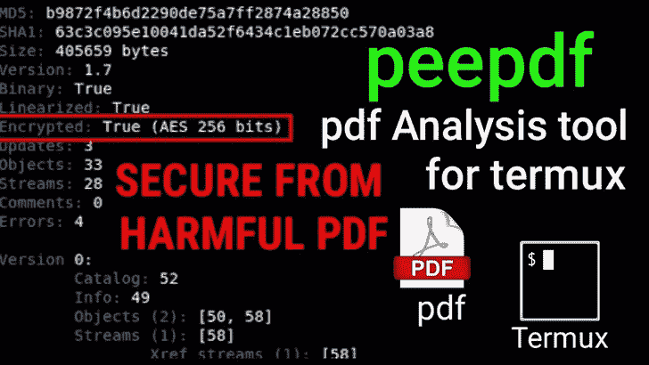
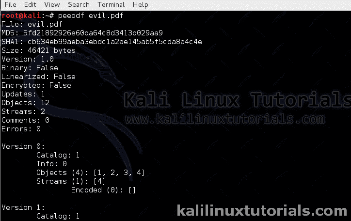

# PEEPDF:PDF 文档取证分析的一站式工具

> 原文：<https://kalilinuxtutorials.com/peepdf/>

[](https://blogger.googleusercontent.com/img/b/R29vZ2xl/AVvXsEicZEeA-sqO_S3pRKVYMaKXgMcU7zLKVuyMD1SPbZD9cH2r-Om3J0PVPm1WjOsmWhaPu1W45x8QQd6q1VG2HR5MDpawbJe2j8dcwvQcAQKS50KgYJrn0ahsuAXckbDMQJLw3fjVbaKQ9gKqkOqBm0ZkfmHKtV2sazUiMPqHxyfq0N-d2attHPm3vPUX/s16000/PEEPDF.webp)

**Peepdf** 是一款用于 pdf 文档取证分析的工具。大多数社会工程攻击使用嵌入 java 脚本&外壳代码的恶意 PDF 文档。

它可以分析 PDF 文档中的可疑对象和数据流。安装了一些扩展后，安全研究员可以详细分析 java 脚本和外壳代码。peepdf 的一些顶级特性是:

1.  分析 PDF 文档
2.  提取数据对象和流
3.  提取元数据
4.  也从编码和加密的文件中提取数据
5.  提供的 XML 输出
6.  交互式控制台

安全研究人员可以使用该工具来检查隐藏的外壳代码或 java 脚本，甚至是标准漏洞，如 CVE-2013-2729 等。另一个用途显然是用于网络取证。

它可以[提取](http://eternal-todo.com/tools/peepdf-pdf-analysis-tool)文档内的所有元数据&数据流，以便取证调查人员可以使用它来进行模式匹配，或者分析外壳代码，或者只是提取元数据&来检测恶意代码的存在并将其用作证据。

## **选项–Peepdf**

```
Syntax: peepdf <options> PDF-FILE
```

```
-h, --help show this help message and exit
-i, --interactive Sets console mode.
-s SCRIPTFILE, --load-script=SCRIPTFILE  Loads the commands stored in the specified file and execute them.
-f, --force-mode Sets force parsing mode to ignore errors.
-l, --loose-mode Sets loose parsing mode to catch malformed objects.
-u, --update Updates peepdf with the latest files from the repository.
-g, --grinch-mode Avoids colorized output in the interactive console.
-v, --version Shows program's version number.
-x, --xml Shows the document information in XML format.
```

### 实验室 1:安装蜘蛛猴&皮里贝姆

在本实验中，我们将安装 3 个额外的包，以便能够分析 javascript 和外壳代码。这些软件包是:

1.  libe mu–基本 x86 仿真和外壳代码检测
2.  pylibemu——libe mu 库的 Python 包装器
3.  蜘蛛猴——Javascript 引擎

**步骤 1** :安装 Libemu

首先，我们必须安装所需的依赖项& python 文件。

```
apt-get install autoconf libemu python-dev python-lxml python-pyrex
```

从 Git 克隆这个包。确保安装了 git-core。Kali 预装了 git。

```
git clone git://git.carnivore.it/libemu.git
```

从 git 配置和安装 libemu。

```
cd libemu/
autoreconf -v -i
./configure --enable-python-bindings --prefix=/opt/libemu
make -j4
make install
ldconf -n /opt/libemu/lib
```

**第二步**:安装皮里贝姆

再次从 git 克隆

```
git clone https://github.com/buffer/pylibemu.git
```

安装 pylibemu

```
echo "/opt/libemu/lib" > /etc/ld.so.conf.d/pylibemu.conf
python setup.py build
python setup.py install
```

**第三步**:安装蜘蛛猴

```
apt-get install python-pyrex
svn checkout http://python-spidermonkey.googlecode.com/svn/trunk/ python-spidermonkey
cd python-spidermonkey
python setup.py build
python setup.py install
ldconfig
```

执行 peepdf 并查看软件包是否正确安装。只是尝试任何 PDF 文件对它。

```
peepdf evil.pdf <replace with yous>
```

[](http://kalilinuxtutorials.com/peepdf/peepdf1/)

Peepdf basic Usage

如果没有正确安装附加组件，那么在执行 peepdf 时，首先会出现一条消息，提示没有安装软件包。

在接下来的实验中，我们将深入了解 peepdf 的用法。

**参考文献**

Libemu 安装参考资料
http://blog . xanda . org/2012/05/16/Installation-of-libe mu-and-pylibemu-on-Ubuntu/
http://www . makethenmakeinstall . com/2013/03/install-thug-on-kali-Linux/

皮里贝姆安装参考
https://forums.kali.org/archive/index.php/t-2658.html

蜘蛛猴装置参考资料
https://forums.kali.org/archive/index.php/t-2658.html