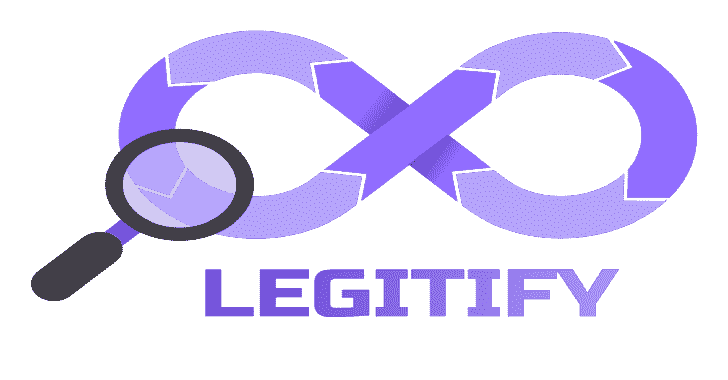

# 合法化:检测和补救所有 GitHub 资产的错误配置和安全风险

> 原文：<https://kalilinuxtutorials.com/legitify/>

[](https://blogger.googleusercontent.com/img/b/R29vZ2xl/AVvXsEho7ETouxQjg6CjQBUQFpD-kqGAhLbnURSmh5hclgvP8xMhU0oo9kofS25ZfbqnF-xwcFp_G4gMKzCzvNzy4Dis9T8Cdhx9qSG6XdyDeYVci9BysgRtM6Ro2u0fBkEJZAY1E9IYEr6hXj5hsdurjnY-unMq8QEDW8JRP12oUAuXBblKC_kRYDzDaHSq/s728/Legitify(1).png)

**legify**是一个加强你的 GitHub 组织的安全态势的工具。轻松检测和修复所有 GitHub 资产的错误配置、安全性和合规性问题。

## 装置

1.  你可以从[https://github.com/Legit-Labs/legitify/releases](https://github.com/Legit-Labs/legitify/releases)下载最新的合法化版本，每个档案包含:

*   为所需平台验证二进制文件
*   合法安全性提供的内置策略

2.  通过以下步骤从源:

```
git clone git@github.com:Legit-Labs/legitify.git
go run main.go analyze ...
```

## 出处

为了增强 legitify 用户的软件供应链安全性，从 v0.1.6 开始，每个 legitify 版本都包含一个[SLSA 3 级出处](https://github.com/slsa-framework/slsa-github-generator/blob/main/internal/builders/generic/README.md)文档。
出处文档指的是发布中的所有工件，以及生成的 docker 映像。
您可以使用 [SLSA 框架的官方验证器](https://github.com/slsa-framework/slsa-verifier)来验证出处。
0 . 1 . 6 版 darwin_arm64 架构的使用示例:

```
VERSION=0.1.6
ARCH=darwin_arm64
./slsa-verifier verify-artifact --source-branch main --builder-id 'https://github.com/slsa-framework/slsa-github-generator/.github/workflows/generator_generic_slsa3.yml@refs/tags/v1.2.2' --source-uri "git+https://github.com/Legit-Labs/legitify" --provenance-path multiple.intoto.jsonl ./legitify_${VERSION}_${ARCH}.tar.gz 
```

## 要求

1.  为了充分利用 legitify，你需要成为至少一个 GitHub 组织的所有者。否则，如果您是组织内至少一个存储库的管理员，您仍然可以使用该工具，在这种情况下，您将只能看到与存储库相关的策略结果。
2.  legitify 需要一个 GitHub 个人访问令牌(PAT)来成功地分析您的资源，它可以作为一个参数(`-t`)或一个环境变量(`$GITHUB_ENV`)提供。PAT 需要以下范围进行全面分析:

```
admin:org, read:enterprise, admin:org_hook, read:org, repo, read:repo_hook 
```

更多信息请参见[创建个人访问令牌](https://docs.github.com/en/authentication/keeping-your-account-and-data-secure/creating-a-personal-access-token)。
目前不支持细粒度个人访问令牌，因为它们不支持 GitHub 的 graph QL([https://GitHub . blog/2022-10-18-introducing-Fine-grained-personal-access-tokens-for-GitHub/](https://github.blog/2022-10-18-introducing-fine-grained-personal-access-tokens-for-github/))

## 用法

```
LEGITIFY_TOKEN=<your_token> legitify analyze 
```

默认情况下，legitify 将根据您的所有资源(组织、存储库、成员、操作)检查策略。

您可以使用命令行标志 namespace 和 org 来控制将分析哪些资源:

*   `--namespace (-n)`:将分析与指定资源相关的策略
*   `--org`:将分析限定在指定的组织

```
LEGITIFY_TOKEN=<your_token> legitify analyze --org org1,org2 --namespace organization,member 
```

上述命令将针对 org1 和 org2 测试组织和成员策略。

## GitHub 企业支持

如果在环境变量`SERVER_URL`中设置了端点 URL，就可以对 GitHub 企业实例运行 legitify:

```
export SERVER_URL="https://github.example.com/"
LEGITIFY_TOKEN=<your_token> legitify analyze --org org1,org2 --namespace organization,member
```

## GitLab 云/服务器支持

要针对 GitLab Cloud 运行 legitify，请将 scm 标志设置为 gitlab `--scm gitlab`，要针对 GitLab 服务器运行，您还需要提供 SERVER_URL:

```
export SERVER_URL="https://gitlab.example.com/"
LEGITIFY_TOKEN=<your_token> legitify analyze --namespace organization --scm gitlab
```

## 名称空间

legitify 中的名称空间是根据策略收集和运行的资源。目前，支持以下命名空间:

1.  `organization`–组织级别的策略(例如，“不对组织实施双因素身份认证”)
2.  `actions`–组织 GitHub 操作策略(例如，“GitHub 操作运行不限于验证的操作”)
3.  `member`–组织成员策略(例如，“发现过时的管理员”)
4.  `repository`–存储库级别的策略(例如，“不强制由至少两个评审者进行代码评审”)
5.  `runner_group`–runner 组策略(例如，“公共存储库可以使用 runner”)

默认情况下，legitify 将分析所有名称空间。您可以使用`--namespace`标志将名称空间限制为选定的名称空间，然后使用逗号分隔选定名称空间的列表。

## 输出选项

默认情况下，legitify 将以人类可读的格式输出结果。这包括按严重性列出的策略违规列表，以及按名称空间排序的摘要表。

### **输出格式**

使用`--output-format (-f)`标志，legitify 支持以下列格式输出结果:

1.  `human-readable`–人类可读文本(默认)。
2.  `json`–标准 JSON。

### **输出方案**

使用`--output-scheme`标志，legitify 支持以不同的分组方案输出结果。注意:必须指定`--output-format=json`才能输出非默认方案。

1.  `flattened`–无分组；策略的平面列表，每个策略都有违规(默认)。
2.  `group-by-namespace`–按名称空间对策略进行分组。
3.  `group-by-resource`–根据资源对策略进行分组，例如特定的组织/存储库。
4.  `group-by-severity`–根据策略的严重性对其进行分组。

### **输出目的地**

*   `--output-file`–输出文件的完整路径(默认:无输出文件，打印到 stdout)。
*   `--error-file`–错误日志的完整路径(默认:。/error.log)。

### **着色**

当以人类可读的格式输出时，合法化支持传统的`--color[=when]`标志，它有以下选项:

*   `auto`–如果 stdout 是端子，则为彩色输出，否则为无色输出(默认)。
*   `always`–彩色输出，不考虑输出目的地。
*   `none`–不考虑输出目的地的无色输出。

### **杂项**

*   使用`--failed-only`标志从结果中过滤出通过/跳过的检查。

## 记分卡支持

[记分卡](https://github.com/ossf/scorecard)是 OSSF 的开源项目:

记分卡是一种自动化工具，它评估许多与软件安全相关的重要启发式检查(“检查”)，并为每项检查分配 0-10 分。您可以使用这些分数来了解要改进的特定领域，以便加强项目的安全状况。您还可以评估依赖关系引入的风险，并做出关于接受这些风险、评估替代解决方案或与维护人员合作进行改进的明智决策。

legitify 支持为组织的所有存储库运行记分卡，执行评分策略并使用`--scorecard`标志显示结果:

*   `no`–不运行记分卡(默认)。
*   `yes`–运行记分卡并采用一项政策，对低于 7.0 的每个回购分数发出警报。
*   `verbose`–运行记分卡，采用一项政策，在每个回购分数低于 7.0 时发出警报，并将其输出嵌入到合法化的输出中。

legitify 运行以下记分卡检查:

| 支票 | 公共知识库 | 私有存储库 |
| --- | --- | --- |
| 安全政策 | V |  |
| CII 最佳实践 | V |  |
| 起毛 | V |  |
| 许可证 | V |  |
| 签名发布 | V |  |
| 分支保护 | V | V |
| 代码审查 | V | V |
| 贡献者 | V | V |
| 危险工作流程 | V | V |
| 依赖关系更新工具 | V | V |
| 维护 | V | V |
| 固定依赖关系 | V | V |
| SAST | V | V |
| 令牌-权限 | V | V |
| 脆弱点 | V | V |
| Webhooks | V | V |

## 政策

legitify 在`policies/github`目录中附带了一组策略。这些政策被记录在[这里](https://legitify.dev/policies.html)。

此外，您可以使用`--policies-path (-p)`标志为 OPA 策略指定一个定制目录。

[Click Here To Download](https://github.com/Legit-Labs/legitify)