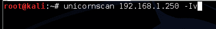
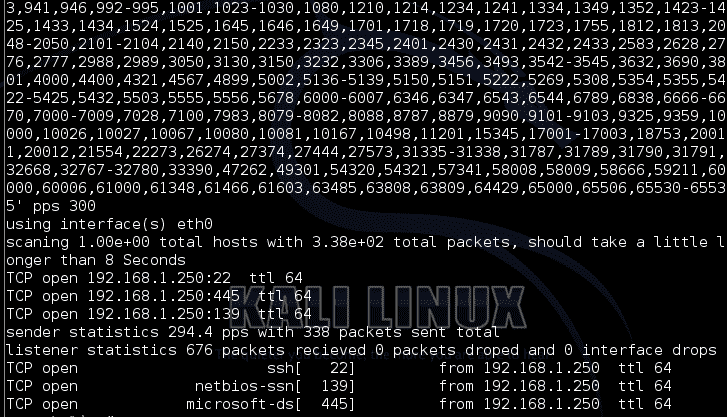
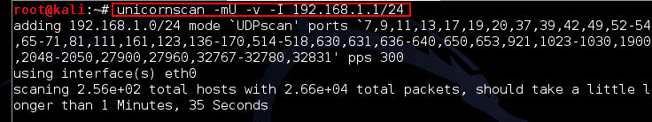

# unicornscan–用于查找开放端口的网络扫描工具

> 原文：<https://kalilinuxtutorials.com/unicornscan/>

Unicornscan 是一个异步网络刺激传递/响应记录工具。这意味着它向主机发送破碎/无组织/碎片化的数据包(不像其他端口扫描工具那样没有规则的模式),并等待目标的响应。

得到响应后，计算每个端口的 TTL 值，从而识别操作系统。举个例子，如果 ttl=128，操作系统就是 Windows 等等。

当常规端口扫描不起作用时，Pentesters 使用此工具，因为目标可能已启用端口扫描检测或已启用 IDS/IPS 或蜜罐。unicornscan 的一个很酷的特性是，它使用不同的线程来发送和接收数据包，这与其他端口扫描器不同。

注意:该工具在卡利萨那默认不可用

## 选择

```
Syntax: Unicornscan <options> <target>
```

```
-b, --broken-crc     *set broken crc sums on [T]ransport layer, [N]etwork layer, or both[TN]
-B, --source-port    *set source port? or whatever the scan module expects as a number-c, --proc-duplicates process duplicate replies
-d, --delay-type     *set delay type (numeric value, valid options are `1:tsc 2:gtod 3:sleep')
-D, --no-defpayload   no default Payload, only probe known protocols
-e, --enable-module  *enable modules listed as arguments (output and report currently)
-E, --proc-errors     for processing `non-open' responses (icmp errors, tcp rsts...)
-F, --try-frags
-G, --payload-group        *payload group (numeric) for tcp/udp type payload selection (default all)
-h, --help            help
-H, --do-dns          resolve hostnames during the reporting phase
-i, --interface      *interface name, like eth0 or fxp1, not normally required
-I, --immediate       immediate mode, display things as we find them
-j, --ignore-seq     *ignore `A'll, 'R'eset sequence numbers for tcp header validation
-l, --logfile        *write to this file not my terminal
-L, --packet-timeout *wait this long for packets to come back (default 7 secs)
-m, --mode           *scan mode, tcp (syn) scan is default, U for udp T for tcp `sf' for tcp connect scan and A for arp for -mT you can also specify tcp flags following the T like -mTsFpU for example that would send tcp syn packets with (NO Syn|FIN|NO Push|URG)
-M, --module-dir     *directory modules are found at (defaults to /usr/lib/unicornscan/modules)
-o, --format         *format of what to display for replies, see man page for format specification
-p, --ports           global ports to scan, if not specified in target options
-P, --pcap-filter    *extra pcap filter string for reciever
-q, --covertness     *covertness value from 0 to 255
-Q, --quiet           dont use output to screen, its going somewhere else (a database say...)
-r, --pps            *packets per second (total, not per host, and as you go higher it gets less accurate)
-R, --repeats        *repeat packet scan N times
-s, --source-addr    *source address for packets `r' for random
-S, --no-shuffle      do not shuffle ports
-t, --ip-ttl         *set TTL on sent packets as in 62 or 6-16 or r64-128
-T, --ip-tos         *set TOS on sent packets
-u, --debug                         *debug mask
-U, --no-openclosed       dont say open or closed
-w, --safefile       *write pcap file of recieved packets
-W, --fingerprint    *OS fingerprint 0=cisco(def) 1=openbsd 2=WindowsXP 3=p0fsendsyn 4=FreeBSD 5=nmap 6=linux 7:strangetcp
-v, --verbose         verbose (each time more verbose so -vvvvv is really verbose)
-V, --version         display version
-z, --sniff           sniff alike
-Z, --drone-str      *drone String
*:            options with `*' require an argument following them
```

## 实验 1:扫描主机的服务和操作系统(TTL)

在本实验中，我们扫描 IP 地址为 192.168.1.250 的主机，查找开放端口。同样，通过这样做，我们可以获得相应端口的 TTL 值，从而可以识别操作系统

```
Command: unicornscan 192.168.1.250 –Iv
```

[](http://kalilinuxtutorials.com/ig/unicornscan/attachment/unicornscan1/#main)

Basic Scan

[](http://kalilinuxtutorials.com/ig/unicornscan/attachment/unicornscan2/#main)

Results

## 实验 2:在整个网络上执行 TCP SYN 扫描

在本实验中，我们对整个网络范围 192.168.1.1/24 执行 TCP syn 扫描。这样做我们有多重好处。所有活动主机以及服务/端口打开和 TTL 值对我们都是可见的。

隐形 syn 扫描是一种将带有 syn 标志的数据包发送到目标主机端口的方法。如果端口打开，来自目标的回复将是带有 SYN/ACK 标志的数据包，否则是带有 RST 标志的数据包。因此，攻击者可以识别目标主机上运行的所有服务。

```
Command : unicornscan -msf -v -I 192.168.1.1/24
```

[](http://kalilinuxtutorials.com/ig/unicornscan/attachment/unicornscan3/#main)

## 实验 3:对整个网络执行 UDP 扫描

在本实验中，我们对整个网络范围 192.168.1.1/24 执行 UDP 扫描。通过这样做，我们可以了解网络上运行的所有 UDP 服务。

```
Command: unicornscan –mU –v –I 192.168.1.1/24
```

[](http://kalilinuxtutorials.com/ig/unicornscan/attachment/unicornscan4/#main)

UDP Scan

使用 unicornscan 执行扫描时，也打开 Wireshark 来查看发出的数据包。你可以看到独角兽号发出的模式。试试吧&分享这个教程。