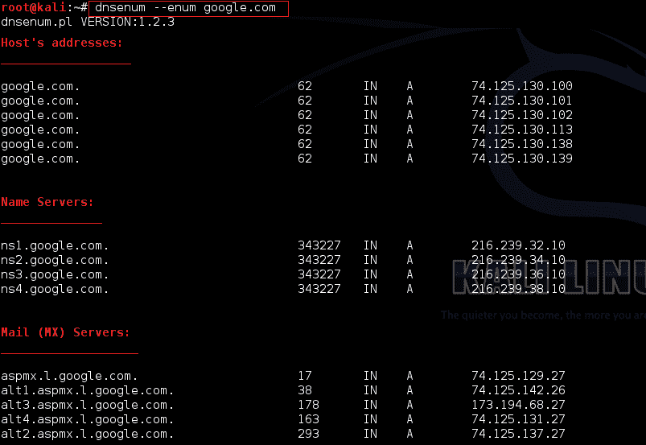
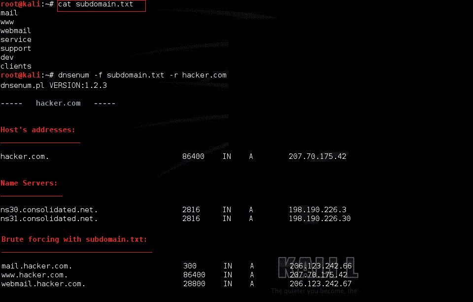

# DNS enum–DNS 枚举工具，用于查找 DNS 服务器

> -= the last fantasy =-荣誉出品本字幕仅供学习交流，严禁用于商业途径

**Dnsenum** 是一个用于 DNS 枚举的工具，它是为一个组织定位所有 DNS 服务器和 DNS 条目的过程。

DNS 枚举将允许我们收集关于组织的关键信息，如用户名、计算机名、IP 地址等。

## **域名选项**

```
--dnsserver     <server> Use this DNS server for A, NS and MX queries.

--enum          Shortcut option equivalent to --threads 5 -s 15 -w.

-h, --help      Print this help message.

--noreverse          Skip the reverse lookup operations.

--nocolor       Disable ANSIColor output.

--private       Show and save private ips at the end of the file domain_ips.txt.

--subfile <file>     Write all valid subdomains to this file.

-t, --timeout <value> The tcp and udp timeout values in seconds (default: 10s).

--threads <value>    The number of threads that will perform different queries.

-v, --verbose        Be verbose: show all the progress and all the error messages.

GOOGLE SCRAPING OPTIONS:

-p, --pages <value>  The number of google search pages to process when scraping names, the default is 5 pages, the -s switch must be specified.

-s, --scrap <value>  The maximum number of subdomains that will be scraped from Google (default 15).

BRUTE FORCE OPTIONS:

-f, --file <file>    Read subdomains from this file to perform brute force.

-u, --update    <a|g|r|z> Update the file specified with the -f switch with valid subdomains.

a (all)    Update using all results.
g          Update using only google scraping results.
r          Update using only reverse lookup results.
z          Update using only zonetransfer results.

-r, --recursion Recursion on subdomains, brute force all discovred subdomains that have an NS record.

WHOIS NETRANGE OPTIONS:

-d, --delay <value>  The maximum value of seconds to wait between whois queries, the value is defined randomly, default: 3s. 
-w, --whois          Perform the whois queries on c class network ranges.

REVERSE LOOKUP OPTIONS:

-e, --exclude   <regexp> Exclude PTR records that match the regexp expression from reverse lookup results, useful on invalid hostnames.

OUTPUT OPTIONS:

-o --output <file>   Output in XML format. Can be imported in MagicTree

```

DNSENUM 主页:[https://github.com/fwaeytens/dnsenum](https://github.com/fwaeytens/dnsenum)

## **实验 1:使用默认设置的枚举**

当您使用选项运行此命令时，它会自动采用默认值–threads 5–s 15–w

```
Syntax : dnsenum -enum <url>
```

```
Command : dnsenum -enum google.com
```

[](http://kalilinuxtutorials.com/wp-content/uploads/2015/04/dnsenum_1.png)

Enumerated DNS Information from google.com

## **实验 2:使用文件中的暴力枚举子域**

当您运行此命令时，它会对子域以及作为属性传递的自定义文件执行强力搜索。

```
Syntax : dnsenum –f <file> -r <url>
```

```
Command : dnsenum –f subdomain.txt –r hacker.com
```

[](http://kalilinuxtutorials.com/wp-content/uploads/2015/04/dnsenum_2.png)

Finding Subdomains using a text file