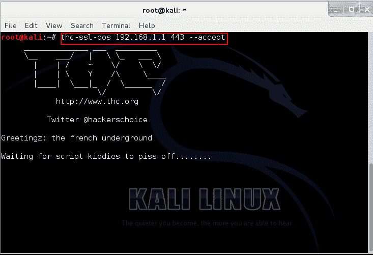
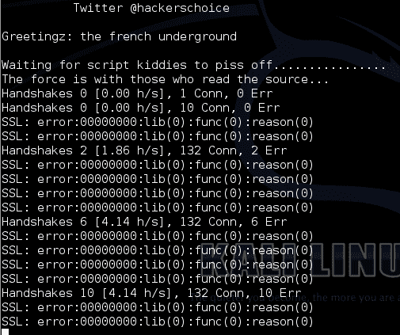
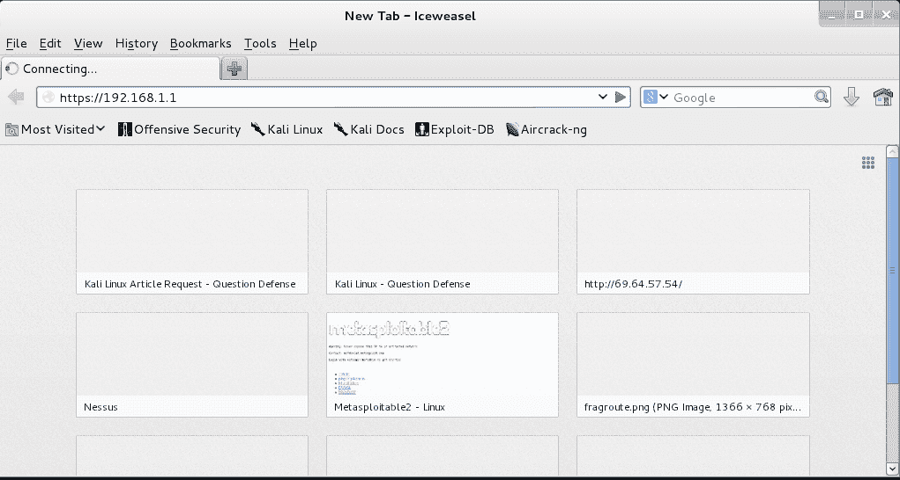

# THC-SSL-DOS–针对安全网络服务器和测试 SSL 重新协商的 DOS 工具

> 原文：<https://kalilinuxtutorials.com/thc-ssl-dos/>

THC 是黑客的选择。他们是一群来自德国的黑客。Thc-SSL-dos 用于检查网站或服务器是否启用了 SSL 重新协商，从而检查重新协商漏洞(CVE-2009-3555)。

SSL 重新协商是在身份验证时重新协商客户端的过程。该工具向 web 服务器发送 SSL 请求(客户机 Hello ),然后多次拒绝来自服务器的回复(服务器 Hello)。

因此，最终当服务器试图在身份验证期间重新协商时，客户端会拒绝它，从而使服务器崩溃，使其成为拒绝服务攻击。

这也证明了服务器容易受到 SSL 重新协商漏洞的攻击。

首页:[http://www.thc.org/thc-ssl-dos](http://www.thc.org/thc-ssl-dos)

### 选择

```
Syntax: thc-ssl-dos <options> ip port
-h -Help
-l <n> Limit parallel connections [default: 400]
```

### 实验:在路由器 HTTPS 登录页面上执行 SSL 压力测试

**注意** : *这个实验室会引起 DOS 攻击，它可能会暂时使你的目标瘫痪。请明智地使用这个工具。未经同意，不要在公司网络上使用它。*

在本实验中，我们在路由器基于 web 的控制面板的 https 登录页面上执行 dos 攻击。SSL-dos 向 SSL/HTTPS 服务器发送请求。

当收到确认时，它会在握手之前拒绝。因此，如果启用了 SSL 重新协商，服务器会一次又一次地尝试。这里，路由器 ip 是 192.168.1.1，HTTPS 登录页面运行在端口 443 上

```
Command: thc-ssl-dos 192.168.1.1 443 –accept
```

[](http://kalilinuxtutorials.com/st/thc-ssl-dos/attachment/thc-ssl-dos_1/)

Starting THC-SSL-DOS

[](http://kalilinuxtutorials.com/st/thc-ssl-dos/attachment/thc-ssl-dos_2/)

Verbose Operation

现在尝试登录页面 https://192.168.1.1<replace with="" yours=""></replace>

[](http://kalilinuxtutorials.com/st/thc-ssl-dos/attachment/thc-ssl-dos_3/)

Router Login being denied

参考资料:

http://www.pierobon.org/ssl/ch2/detail.htm

http://www.pierobon.org/ssl/ch2/diagram.htm