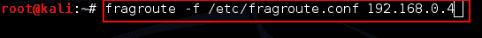
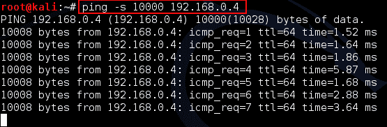
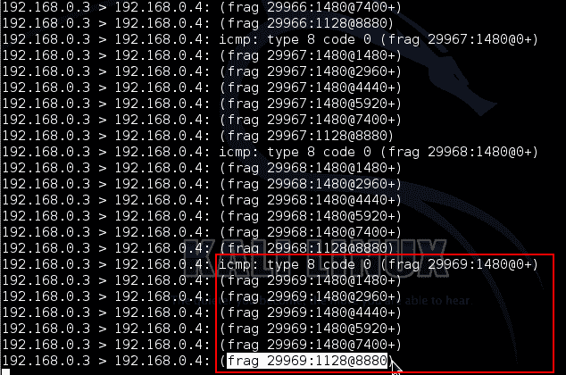
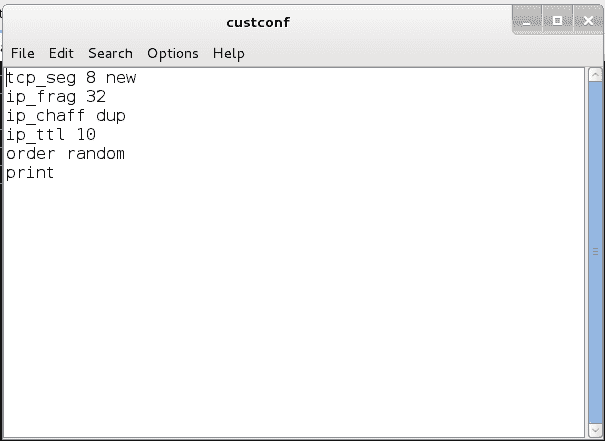
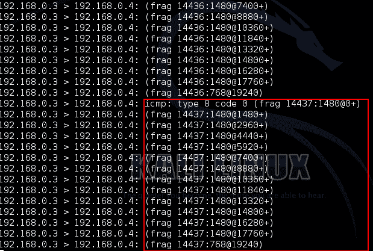
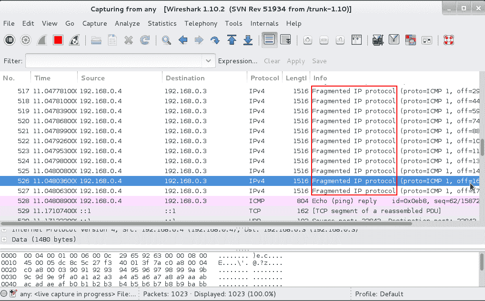

# frag route——一个网络数据包分段和防火墙测试工具

> 原文：<https://kalilinuxtutorials.com/fragroute/>

Fragroute 截获目的地为指定主机的修改和重写出口流量。简单地说，frag route 将来自我们(攻击者)系统的数据包片段发送到目标系统。它被安全人员或黑客用来规避防火墙，避免 IDS/IPS 检测和警报等。此外，pentesters 使用它从高度安全的远程主机收集信息。

## 选项–碎片路线

```
fragroute –f <lconfigfile> dst<destination>
```

-f–关于 frag 路由应该如何工作的配置文件。

默认配置文件位于/etc/fragroute.conf。用户可以使用该默认文件，也可以编写新的配置文件。自定义文件要求编写以下规则。

```
delay first|last|random <ms>
drop first|last|random <prob-%>
dup first|last|random <prob-%>
echo <string> ...
ip_chaff dup|opt|<ttl>
ip_frag <size> [old|new]
ip_opt lsrr|ssrr <ptr> <ip-addr> ...
ip_ttl <ttl>
ip_tos <tos>
order random|reverse
print
tcp_chaff cksum|null|paws|rexmit|seq|syn|<ttl>
tcp_opt mss|wscale <size>
tcp_seg <size> [old|new]
```

Fragroute 主页:[http://www.monkey.org/~dugsong/fragroute/](http://www.monkey.org/~dugsong/fragroute/)

### 实验:1 分割大型 ping 数据包

这演示了大型 ping 数据包在两台主机(攻击者和目标)之间被分段。攻击者的 IP 地址是 192.168.0.3，而目标的 IP 地址是 192.168.0.4

1.在攻击机器中打开碎片路线

命令:frag route–f/etc/frag route . conf 192 . 168 . 0 . 4<replace with="" your="" destination=""></replace>

[](http://kalilinuxtutorials.com/wp-content/uploads/2015/05/fragroute_1.png)

Executing with command with default configuration.

2.打开另一个终端& ping 大数据包

命令:ping–s 10000 192 . 168 . 0 . 4<replace with="" your="" destination=""></replace>

[](http://kalilinuxtutorials.com/wp-content/uploads/2015/05/fragroute_2.png)

Ping output

3.检查运行分段路由的终端

[](http://kalilinuxtutorials.com/wp-content/uploads/2015/05/fragroute_3.png)

Fragmented Packets Sent, shown in the fragroute terminal

### 实验 2:自定义配置

假设我们必须增加 TTL 值& TCP 段的数量，以避开防火墙。

1.创建一个新文件。

```
Command: leafpad custconf <yourname here>
```

2.在该文件中，键入

```
tcp_seg 8 new   -    No of tcp segments(default is 4)

ip_frag 32      -    No of ip fragments(default is 24)

ip_chaff dup    -

ip_ttl 10       -    ttl 10

order random

print

```

现在，该文件看起来如下图所示。请记住，不要包括我对上述字段中参数的描述。

[](http://kalilinuxtutorials.com/wp-content/uploads/2015/05/fragroute_4.png)

File containing the Custom configuration

3.从这个文件和目标开始

```
Command: fragroute –f custconf <replace "custconf" with your filename> 192.168.0.4
```

4.现在使用另一个终端 ping 数据包较大的目的地。

```
Commang : ping –s 20000 192.168.0.4
```

5.查看运行 frag 路由的终端。

[](http://kalilinuxtutorials.com/wp-content/uploads/2015/05/fragroute_5.png)

Fragroute Terminal showing output

或者，使用 Wireshark 或 tcpdump 等数据包分析器检查目标系统。

[](http://kalilinuxtutorials.com/wp-content/uploads/2015/05/fragroute_6.png)

Wireshark on Target machine showing fragmented packets received.

或者，如果您知道 Nmap 扫描，使用 Nmap 对目标执行 ping 扫描，并检查两台主机。

 更多阅读:[https://www.informit.com/guides/content.aspx?g=security&seqNum = 53](https://www.informit.com/guides/content.aspx?g=security&seqNum=53)