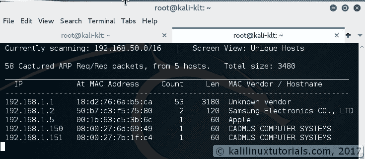
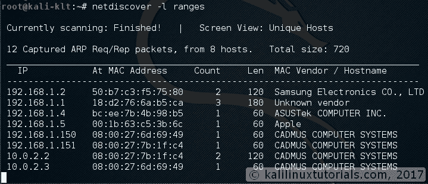
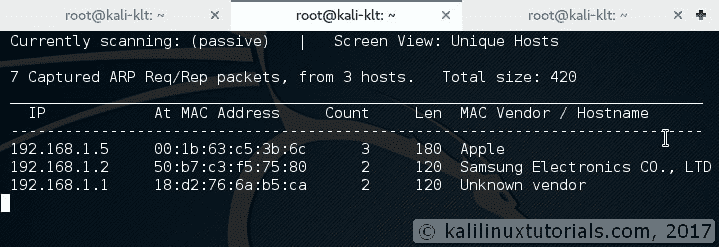
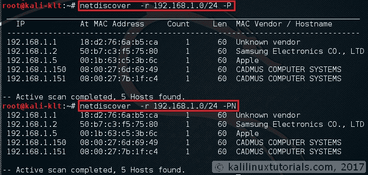

# net discover–实时主机识别

> 原文：<https://kalilinuxtutorials.com/netdiscover-scan-live-hosts-network/>

[](https://kalilinuxtutorials.com/wp-content/uploads/2017/03/netdiscover-1-auto.jpg)

# net discover——简单的 ARP 扫描器，用于扫描网络中的活动主机

Netdiscover 是一个简单的 ARP 扫描器，可用于扫描网络中的活动主机。它还可以扫描多个子网。它只是在实时显示中产生输出(ncurse)。这可用于 pentest 的第一阶段，在此阶段，您可以访问网络。Netdiscover 是一个简单的初始侦察工具，非常方便。

### 特点:

1.  简单的 Arp 扫描器
2.  在主动和被动模式下都能工作
3.  实时显示已识别的主机
4.  能够扫描多个子网
5.  计时选项

### 选项:

```
  -i device: your network device
  -r range: scan a given range instead of auto scan. 192.168.6.0/24,/16,/8
  -l file: scan the list of ranges contained into the given file
  -p passive mode: do not send anything, only sniff
  -m file: scan the list of known MACs and host names
  -F filter: Customize pcap filter expression (default: "arp")
  -s time: time to sleep between each arp request (miliseconds)
  -n node: last ip octet used for scanning (from 2 to 253)
  -c count: number of times to send each arp reques (for nets with packet loss)
  -f enable fastmode scan, saves a lot of time, recommended for auto
  -d ignore home config files for autoscan and fast mode
  -S enable sleep time supression betwen each request (hardcore mode)
  -P print results in a format suitable for parsing by another program
  -N Do not print header. Only valid when -P is enabled.
  -L in parsable output mode (-P), continue listening after the active scan is completed
```

## 实验:简单的主机发现和相关选项

Netdiscover 只需在自动模式下调用执行命令即可运行

```
Syntax: netdiscover <options>

```

[](http://kalilinuxtutorials.com/netdiscover-1-auto/)

Auto Mode

**指定范围**

我们可以用-r 选项扫描特定范围

```
Syntax: netdiscover -r <range>

Command: netdiscover -r 192.168.1.0/24
```

[](http://kalilinuxtutorials.com/wp-content/uploads/2017/03/netdiscover-1-range.jpg)

Specifying Range

**来自一个文件的多个范围**

我们也可以扫描多个范围。当您有一个包含多个子网和网络的大型网络时，这很有用。为此，我们只需在文件中逐行指定我们想要扫描的所有范围

```
Syntax: netdiscover -l <file containing ranges>

Command: netdiscover -l ranges
```

[](http://kalilinuxtutorials.com/netdiscover-2-rangesfile/)

File containing ranges to scan

[](http://kalilinuxtutorials.com/netdiscover-1-rangesfile/)

Multiple Ranges

**被动扫描**

有时候最好保持安静。-p 选项在这方面有所帮助，但要付出耐心的代价。

```
Syntax: netdiscover -p -r <range,optional> 
```

[](http://kalilinuxtutorials.com/netdiscover-2-passive/)

Passive Mode

可解析输出

还有一个可解析的输出选项，以防您希望通过管道将其输出到文件。

```
Syntax: netdiscover -P<parsable> -N<ommit headers>

Command: netdiscover-r 192.168.1.1/24 -PN

```

[](http://kalilinuxtutorials.com/netdiscover-1-parsable-output/)

Parsable Output

## 结论

Netdiscover 是一个简单的 arp 扫描器，可用于枚举主机。我想和你分享我的一个经历。出于好奇，我试着在公司网络中运行这个工具。网络有防火墙&我是监控团队的一员，需要寻找网络流量异常。因此，即使有人在内部主机之间执行 ping 操作，我和我的团队也可以获得信息。我们已经从我们的内部网络检测到 ping 扫描、nikto 的 web 服务器扫描等。所以我对我的目标网络有一个清晰的想法。所以我在被动模式下运行这个工具。它运行了大约 7 个小时&我获得了 100 多个 IP。我用我的监控工具反复检查了这个结果，结果是一样的。但是有趣的是，监控工具甚至没有生成一个警报。我还想知道为什么它没有检测到我的接口处于混杂模式。所以我从中得到两个主要的结果。一个是我得到了网络中所有的 IP，这些 IP 在一段时间内都是有效的。第二，我的监控工具不能够或者没有配置成检测网络中的混杂接口。以下是我的建议。

1.  在没有清楚了解您的网络之前，不要执行扫描活动。
2.  正如 Kali Linux 的口号所说“你越安静，你越能听到”
3.  以建设性的方式使用这些活动的结果

因此，如果你从本教程中学到了一些新的东西，请支持我，与那些将从中受益的人分享。