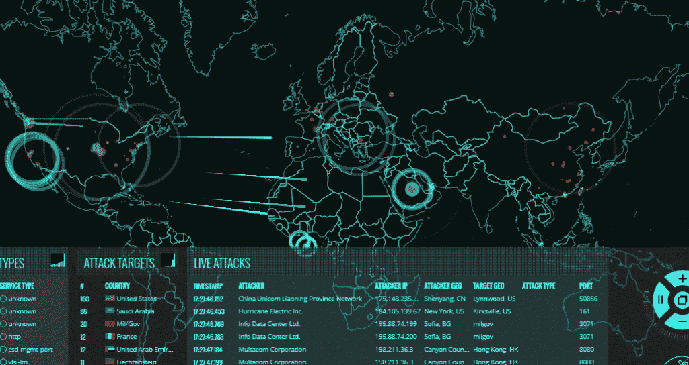

# 全球实时攻击地图和分析

> 原文：<https://kalilinuxtutorials.com/world-wide-live-attack-map-analytics/>

想看看全球各地的实时 DOS 攻击吗？一家安全公司的网站展示了来自全球各地的实时攻击，包括协议信息、IP 地址和国家。所有这些信息都放在一个奇妙的类似黑客的地图中。一旦启动实时视图，就会显示实时攻击和流量。该网站在地理地图上显示了来源和目标攻击，每一次攻击都是从来源开始，到目的地结束。

耐心用完了？在这里，但回到这里:

[北欧攻击地图](http://map.norsecorp.com/)

该网站由[挪威公司](http://norsecorp.com/)制作和维护。在这方面，该公司提供了一种产品称为北欧电器。他们声称他们有一个传感器网络，T2 IDSs 监控超过 10 亿个节点，包括 TOR T3 和其他匿名代理。来自所有这些&的数据，来自每一个 Norse 设备和常规 SIEMs，被集中到一个大数据平台。他们声称全世界有多达 7 Peta 字节的威胁情报数据。Norse 客户可以访问该数据库，并且可以将其集成到他们的常规安全架构中。Norse 所宣称的是由丁这样的客户公司可以解读和预测安全事件&的模式。这允许公司在攻击开始之前采取适当的对策。

对于使用地图的普通人来说，他们可以看到世界范围内出现的攻击模式。它让你对外面发生的事情有一个广阔的视野。非常有趣的信息，如协议攻击、攻击者和目标 IP、地理位置等，都以黑客的方式排列在网站上。您可以排序或筛选出特定的信息，改变界面和查看国家信息。

我认为最好的用途是，这个现场攻击地图可以用来获得正在进行的网络战的轮廓。通过看 5 分钟的地图，你可以了解不同时间的攻击模式。你甚至可以弄清楚你的国家是否被许多人以及谁作为目标。

这是一张 10 秒钟的 gif 图片:

使用该界面，您可以暂停实时预览，放大或缩小&在底部查看其他信息。还有另一个接口可用。您可以通过单击右下角控件按钮中的中间按钮来访问它。

所以不要等待，迅速分析谁是你的敌人&在你的社交账户上分享这篇文章。