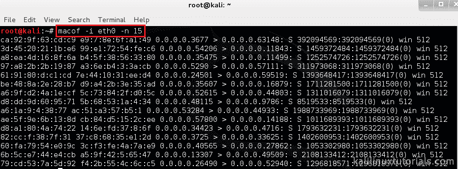
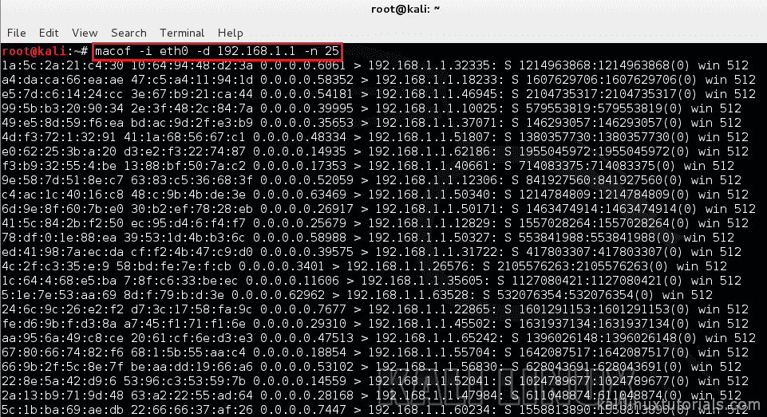

# 马克夫

> 原文：<https://kalilinuxtutorials.com/macof/>

# MAC 泛滥与 MACOF &几种主要对策

Macof 是 Dsniff suit 工具集的成员，主要用于用 MAC 地址淹没本地网络上的交换机。其原因是交换机调节其端口之间的数据流。它主动监视(缓存)每个端口上的 MAC 地址，这有助于它只将数据传递给预定的目标。这是交换机和无源集线器的主要区别。被动集线器没有映射，因此向设备上的每个端口广播线路数据。该数据通常会被所有网卡拒绝，除了该数据所针对的网卡。然而，在 hubbed 网络中，通过将网卡置于混杂模式，嗅探数据是非常容易实现的。这使得该设备可以简单地收集通过集线器网络的所有数据。虽然这对黑客来说是好事，但大多数网络使用交换机，这本身就限制了这种活动。Macof 可以用随机的 MAC 地址淹没交换机。这被称为 MAC 泛洪。这将填充交换机的 CAM 表，因此无法保存新的 MAC 地址，交换机开始向所有端口发送所有数据包，因此它开始充当集线器，因此我们可以监控通过它的所有流量。

[首页](http://www.monkey.org/~dugsong/dsniff/)

## 选择

```
Syntax: macof [-i interface] [-s src] [-d dst] [-e tha] [-x sport] [-y dport] [-n times]
```

```
-i   interface Specify the interface to send on.
-s   src Specify source IP address.
-d   dst Specify destination IP address.
-e   Specify target hardware address.
-x   sport Specify TCP source port.
-y   dport Specify TCP destination port.
-n   times Specify the number of packets to send.
```

## 实验 1:简单的淹没

Macof 可以用随机的 MAC 地址淹没交换机。这被称为 MAC 泛洪。这将填充交换机的 CAM 表，因此无法保存新的 MAC 地址，交换机开始向所有端口发送所有数据包，因此它开始充当集线器，因此我们可以监控通过它的所有流量。

```
command: macof -i eth1 -n 10
```

[](http://kalilinuxtutorials.com/st/macof/attachment/macof1/)

Random Flooding

## 实验 2:定向注水

Macof 可以向交换机发送目的地为 192.168.1.1 的随机 MAC 地址。

```
command: macof -i eth1 -d 192.168.1.1
```

[](http://kalilinuxtutorials.com/st/macof/attachment/macof2/)

Targeted Flooding

在进行 pentest 时，这个工具在嗅探时会派上用场。有些交换机不允许欺骗 arp 数据包。在这种情况下，可以使用该工具来检查开关是否过载。有些交换机就像集线器一样，将所有源数据包传输到所有目的地。那么嗅就很容易了。一些交换机也容易崩溃和重启。这种第二层压力测试可以用这个方便的工具来完成。

## 对策

针对 MAC 泛滥的一些主要对策是:

1.  **端口安全**:限制连接到交换机上单个端口的 MAC 地址数量。
2.  **802.1 x**的实现:基于客户端的动态学习，允许集中式 AAA 服务器发布包过滤规则。
3.  **MAC 过滤**:在一定程度上限制 MAC 地址的数量。