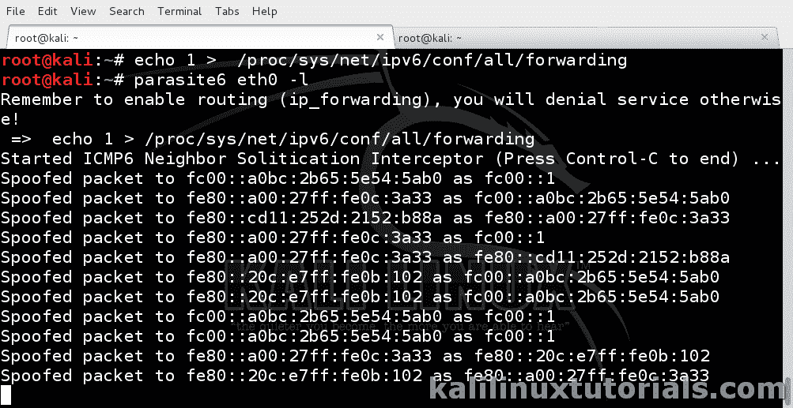

# parasite 6–通过您的攻击者机器重定向所有 IPv6 流量

> 原文：<https://kalilinuxtutorials.com/parasite6/>

[](https://blogger.googleusercontent.com/img/b/R29vZ2xl/AVvXsEiX70_HL20XKxOsF9uKJ7XdGgGFRBlyN7LhawWtMPjEWMeuuyb0ZcohTXpK6ZBcdTFljScW61Gsvo84yjmay46RCCpuSz1YkN3DcY7YtfRFOiYeKCAxl15OJa9aPytWzgRgD2tfjL7vRulicXUhRUsU8Zc2C7zcMsIimOSpKCFiscfITbWF8UdUJdQe/s16000/ipv6newip-100740801-large.webp)

## 使用 parasite6 重定向通过攻击者计算机的所有 IPv6 流量

Parasite6 是 IPv6 网络中的 arpspoof，也是 THC-IPv6 工具套件的一部分。一如既往，他们使它变得非常简单和有效。Parasite6 只是欺骗邻居广告和请求数据包。具体来说，它宣称攻击者机器是每个邻居请求数据包的路由器。因此，IPv6 网络中的几乎所有流量都会收到来自攻击者机器的虚假广告&将所有数据包发送到攻击者机器，认为它是路由器。我们可以指定一个 mac 地址，也可以不指定就运行。无论哪种方式，这就像 arpspoof 工具一样非常好。

### 选择

```
Syntax: parasite6 [-lRFHD] interface [fake-mac]
```

```
-l       loops and resends the packets per target every 5 seconds.
-R       try to inject the destination of the solicitation

NS security bypass:

-F       fragment, 
-H       hop-by-hop and 
-D       large destination header
```

首页:[https://www.thc.org/thc-ipv6/](https://www.thc.org/thc-ipv6/)

参考: [思科](http://www.cisco.com/c/en/us/td/docs/ios-xml/ios/ipv6/configuration/15-2mt/ip6-15-2mt-book/ip6-neighb-disc.html)

**注:本教程是 Kali 1.0.9 最新的时候写的。在较新的版本(卡利萨那&卡利滚动)的命令已经改为 atk6-工具。例如，**你正在使用 parasite6，在**更新的版本变成了 atk6-parasite6。**

### 实验:欺骗网络并通过您的系统路由所有数据包。

**场景**:我有一个 IPv6 网络&一些 IPv6 主机

IPv6 网络:fc00::01/64

攻击者:Kali Linux VM

这很简单。首先打开 IPv6 转发并运行寄生虫。

```
Command: echo 1 > /proc/sys/net/ipv6/conf/all/forwarding
```

```
Command: parasite6 eth0<replace with your interface> -l
```

[](http://kalilinuxtutorials.com/ss/parasite6/attachment/parasite6-1/#main)

Packets Being Spoofed

自己尝试不同的选项，包括在选项后用方括号给出一个假的 mac 地址。

要评估它是否正常工作，请使用被动发现 6 进行测试。点击 [此处](http://kalilinuxtutorials.com/ig/passive_discovery6/) 查看教程。你也可以用 urlsnarf 或 driftnet 或任何其他嗅探器来做。

别忘了评论和订阅。这是我们活下去的动力。