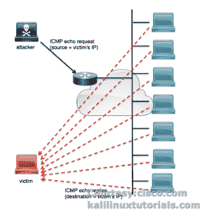

# smurf6

> 原文：<https://kalilinuxtutorials.com/smurf6/>

## 使用 smurf6 在整个 IPv6 网络上执行 Smurf 攻击和分布式拒绝服务(DDoS)攻击

Smurf6 是一个在 IPv6 网络上执行 Smurf 攻击的工具。smurf 攻击是一种 DOS 攻击，攻击者使用受害者的虚假地址来 pings 广播地址。最终，网络中的所有节点都会收到来自受害者 ip 地址的 ICMP ping 请求。结果，所有主机都回复受害者的 IP 地址，使其成为 DDoS 攻击。在 IPv4 中，这种攻击在大多数现代路由器和交换机中不会成功。但是 iPv6 仍然很脆弱。为了更好地理解这次攻击，请看下图。

[](http://kalilinuxtutorials.com/st/smurf6/attachment/smurf/#main)

Schematic Diagram of Smurf Attack

Smurf6 使用受害者的假冒 IP 地址向 IPv6 中的多播地址(而不是 IPv4 中的广播地址)发送大量 ICMP Ping 请求。最终，所有节点向受害主机发出回应回复，使其成为 DDoS。

参考:[http://searchsecurity.techtarget.com/definition/smurfing](http://searchsecurity.techtarget.com/definition/smurfing)

[http://www . Cisco . com/web/about/security/intelligence/guide _ DDOS _ defense . html](http://www.cisco.com/web/about/security/intelligence/guide_ddos_defense.html)

首页:[https://www.thc.org/thc-ipv6/](https://www.thc.org/thc-ipv6/)

**注:本教程是 Kali 1.0.9 最新的时候写的。在较新的版本(卡利萨那&卡利滚动)的命令已经改为 atk6-工具。例如，您使用的是 smurf6，在新版本中变成了 atk6-smurf6。**

### 选择

```
Syntax: smurf6 interface victim-ip [multicast-network-address]
```

```
Example: smurf6 eth0 8ea0::001a [8ea0::00/64]
```

### 实验:在 IPv6 网络上执行 Smurf 攻击。

这对于 smurf6 来说非常简单。你所要做的就是找出网络(IPv6)范围，和一些主机。即使您没有得到任何主机，smurf6 也能完美地用 ICMP6 请求淹没整个网络。查看关于被动发现的帖子，了解如何发现 IPv6 主机和网络。

http://kalilinuxtutorials.com/ig/passive_discovery6/

**注意**:这是一次蓄意破坏的 DDoS 攻击。如果误用，本文作者或工具本身对所面临的后果不负任何责任。仅在测试网络上使用，或者如果您想在真实环境中执行，则需要有适当的协议。

场景:坦白地说，这非常具有破坏性。这将使目标网络中的所有系统崩溃，而不仅仅是受害主机。对于这个简单的教程，我不得不准备很多，因为进行这种攻击会杀死网络中的一切。所以为了完成这个教程，我不得不搬到直播机上。让我们看看如何。

说到重点，我有 2 个虚拟机和一个支持 IPv4 和 IPv6 的网络

*   IPv4 网络范围:192.168.0.1/24
*   IPv4 网络范围:fc00::00/64
*   攻击者 Kali Linux(VM):IP:192 . 168 . 0 . 102/24，fc00::05/64
*   受害者 RHEL 7(越南):IP: 192.168.0.110/24，fc00::03/64
*   Windows 8.1 PRO(真实系统):IP: 192.168.0.100/24，fc00::04/64

我们继续吧。

```
command: smurf6 eth0<replace with yours>  fc00::03 [fc00::00/64] <replace with yours>
```

等 1 分钟，你就能看到办公室里的每个人都疯了……！

我只能拍一张截图。此外，我通过从 Kali box 获取 SSH 会话来执行攻击。否则每个虚拟机都会崩溃，包括我的真机，除了拔掉电源线，我什么也做不了。Et…瞧…

好好看看下面的截图，观察我在每个窗口上的符号。攻击发起后，您可以看到 CPU 峰值。

[](http://kalilinuxtutorials.com/st/smurf6/attachment/smurf6-1/#main)

CPUs of systems present in the network spiking up.

我不确定 Offsec 在压力测试中包括这一点的原因。也许，我们可以通过观察网络上每个节点崩溃所需的时间来检查网络和网络设备可以承受多少。或者，如果网络很大，并且包含大量的主机和服务，如 Windows AD 等，我们可以测试网关是否可以同时处理所有事情，或者是否采取了一些措施来防止 ping 到广播地址。目前，针对这种攻击最简单的对策是在内部网络上坚持使用 IPv4 并禁用 IPv6。

我们将尽情享受 IPv6 带来的乐趣，不要忘记订阅并关注我们。