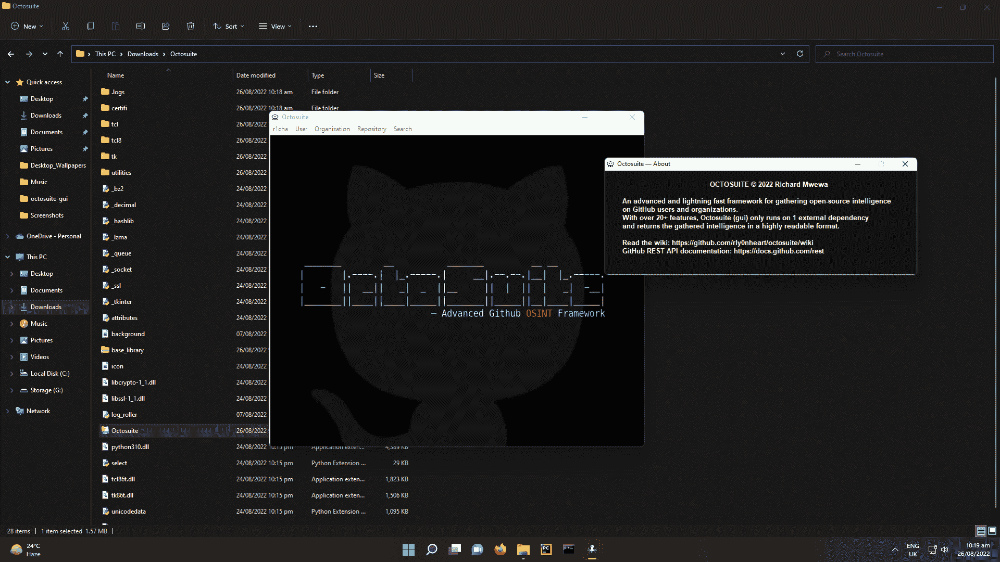
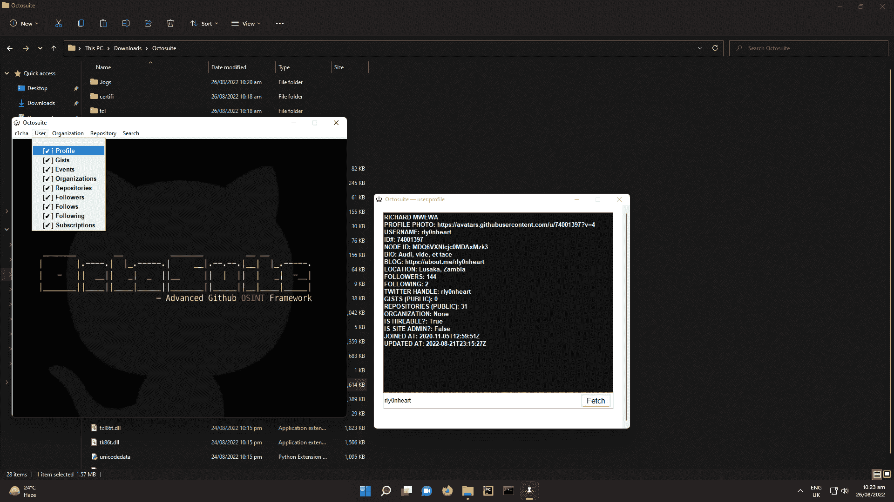

# Octosuite:高级 Github OSINT 框架

> 原文：<https://kalilinuxtutorials.com/octosuite/>

Octosuite 是一个收集 GitHub 用户、存储库和组织信息的框架。

## **特性**

获取组织的配置文件信息
获取组织的事件
返回组织的存储库
返回组织的公共成员
获取存储库的信息
返回存储库的贡献者
返回存储库的语言
获取存储库的观察器
获取存储库的分支
获取存储库的版本
返回存储库的指定路径中的文件列表
获取用户的配置文件信息
返回用户 拥有/属于
获取用户的事件
获取目标跟随的用户列表
获取用户的追随者
检查用户 A 是否跟随用户 B
检查用户是否是组织的公共成员
返回用户的订阅
获取用户的订阅
获取用户的事件
搜索用户
搜索存储库
搜索主题
搜索问题
搜索自动提交
日志文件夹)
用户可以查看、读取和删除日志
…等等

## **注**

Octosuite 自动记录每个会话的网络和用户活动，日志按日期和时间保存在。日志文件夹。

[Click Here To Download](https://github.com/bellingcat/octosuite)