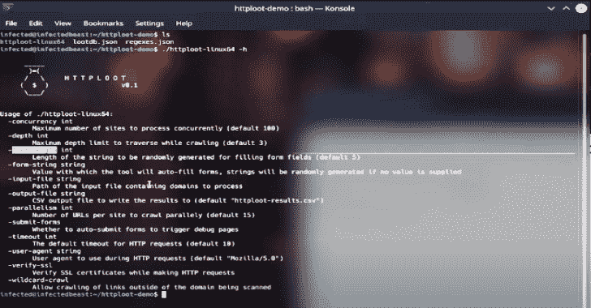

# 一个自动化工具，可以同时抓取、填充表单、触发错误/调试页面

> -= the last fantasy =-荣誉出品本字幕仅供学习交流，严禁用于商业途径

[](https://blogger.googleusercontent.com/img/b/R29vZ2xl/AVvXsEiFLBygf6lTRerfkLa5O5l4G7fXbZW1myxQ86i7hFvD5J-XiWBkSkLVBkxzupbI4SvxrXJvbPkDDrPqJ_3t_5wcXrUkzy6TEViY_D965ihkqbU9VOt2tAhD-7gv9dkVs9Po04Ib2Dwt9GQAN7FIRFRV0Rbu-p95bT28QkPzi54R3Bq1ZLASe14XEnna/s728/HTTPLoot(1).png)

HTTPLoot 是一个自动化工具，它可以同时抓取、填充表单、触发错误/调试页面，并从网站面向客户端的代码中“窃取”秘密。

## 使用

要使用该工具，您可以从存储库的[版本](https://github.com/redhuntlabs/HTTPLoot/releases)部分获取任何一个预构建的二进制文件。如果你想自己构建源代码，你将需要 Go > 1.16 来构建它。简单地运行`go build`将为您输出一个可用的二进制文件。

此外，您还需要两个 json 文件( [lootdb.json](https://github.com/redhuntlabs/HTTPLoot/blob/master/lootdb.json) 和 [regexes.json](https://github.com/redhuntlabs/HTTPLoot/blob/master/regexes.json) )以及可以从回购本身获得的二进制文件。一旦你把这三个文件放在同一个文件夹中，你就可以开始启动这个工具了。

## 视频演示

[https://www.youtube.com/embed/qc8Mm2O5t6Q?feature=oembed](https://www.youtube.com/embed/qc8Mm2O5t6Q?feature=oembed)

以下是该工具的帮助用法:

```
$ ./httploot --help
      _____
       )=(
      /   \     H T T P L O O T
     (  $  )                  v0.1
      \___/

[+] HTTPLoot by RedHunt Labs - A Modern Attack Surface (ASM) Management Company
[+] Author: Pinaki Mondal (RHL Research Team)
[+] Continuously Track Your Attack Surface using https://redhuntlabs.com/nvadr.

Usage of ./httploot:
  -concurrency int
        Maximum number of sites to process concurrently (default 100)
  -depth int
        Maximum depth limit to traverse while crawling (default 3)
  -form-length int
        Length of the string to be randomly generated for filling form fields (default 5)
  -form-string string
        Value with which the tool will auto-fill forms, strings will be randomly generated if no value is supplied
  -input-file string
        Path of the input file containing domains to process
  -output-file string
        CSV output file path to write the results to (default "httploot-results.csv")
  -parallelism int
        Number of URLs per site to crawl parallely (default 15)
  -submit-forms
        Whether to auto-submit forms to trigger debug pages
  -timeout int
        The default timeout for HTTP requests (default 10)
  -user-agent string
        User agent to use during HTTP requests (default "Mozilla/5.0 (X11; Ubuntu; Linux x86_64; rv:98.0) Gecko/20100101 Firefox/98.0")
  -verify-ssl
        Verify SSL certificates while making HTTP requests
  -wildcard-crawl
        Allow crawling of links outside of the domain being scanned
```

## 并行扫描

有两个标志有助于并发扫描:

*   `-concurrency`:指定同时处理的站点的最大数量。
*   `-parallelism`:指定每个站点并行抓取的链接数量。

`-concurrency`和`-parallelism`对工具结果的性能和可靠性至关重要。

## 爬行

爬行深度可以使用`-depth`标志来指定。提供给此的整数值是在站点上抓取的链接的最大链深度。

一个重要的标志`-wildcard-crawl`可以用来指定是否在范围内抓取域外的 URL。

**注意**:如果爬虫不断找到其他域的链接，使用这个标志可能会导致无限的爬行。

## 填写表格

如果您希望工具扫描调试页面，您需要指定`-submit-forms`参数。这将指导工具自动提交表单，并在成功识别技术堆栈后尝试触发错误/调试页面*。*

 *如果启用了`-submit-forms`标志，您可以控制表单字段中提交的字符串。`-form-string`指定要提交的字符串，而`-form-length`可以控制随机生成的字符串的长度，该字符串将被填充到表单中。

## 网络调谐

像这样的标志:

*   `-timeout`–指定请求的 HTTP 超时。
*   `-user-agent`–指定在 HTTP 请求中使用的用户代理。
*   `-verify-ssl`–指定是否验证 SSL 证书。

## 输入/输出

可以使用`-input-file`参数指定要读取的输入文件。您可以指定包含要使用该工具扫描的 URL 列表的文件路径。`-output-file`标志可以用来指定结果输出文件的路径——默认情况下，该路径位于一个名为`httploot-results.csv`的文件中。

## 更多详情

关于导致该工具开发的研究的更多细节可以在我们的 [RedHunt Labs 博客](https://redhuntlabs.com/blog/the-http-facet-httploot.html)上找到。

## 许可证&版本

该工具获得了麻省理工学院的许可。参见许可证。

目前该工具的版本是 0.1。

## 学分

RedHunt 实验室的研究团队希望向 [shhgit](https://github.com/eth0izzle/shhgit) 的创建者和维护者提供积分，以获得他们在知识库中提供的正则表达式。

**[`To know more about our Attack Surface Management platform, check out NVADR.`](https://redhuntlabs.com/nvadr)**

[Click Here To Download](https://github.com/redhuntlabs/HTTPLoot)*