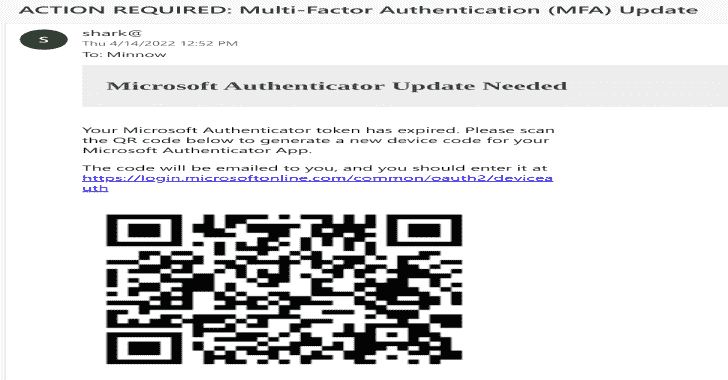
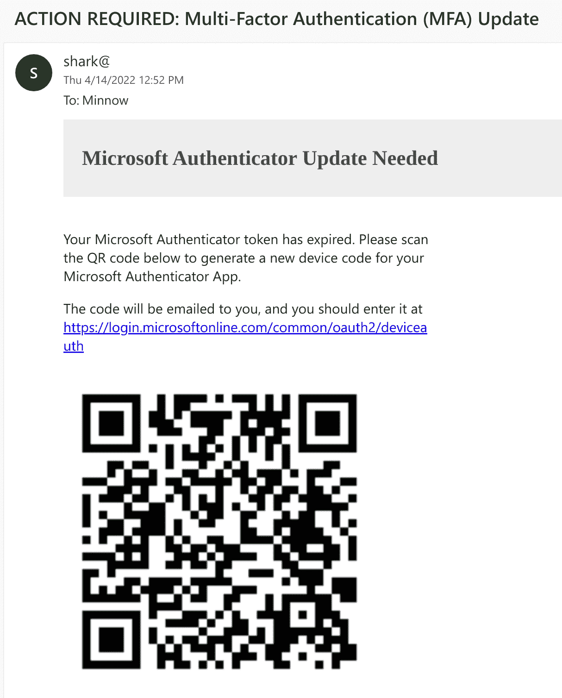
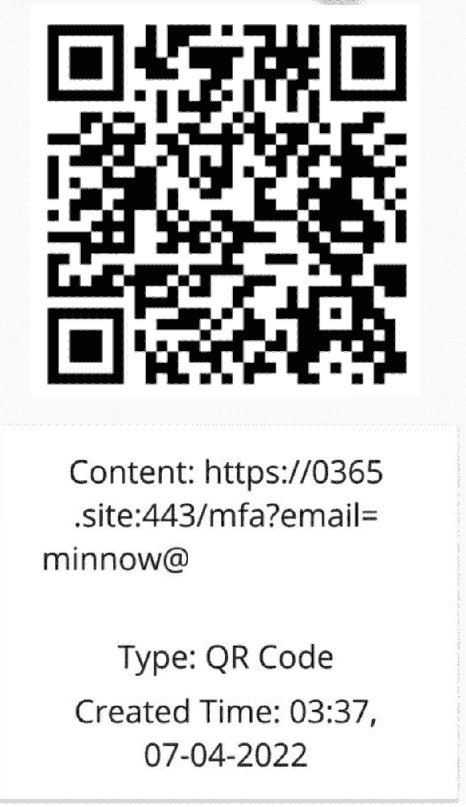
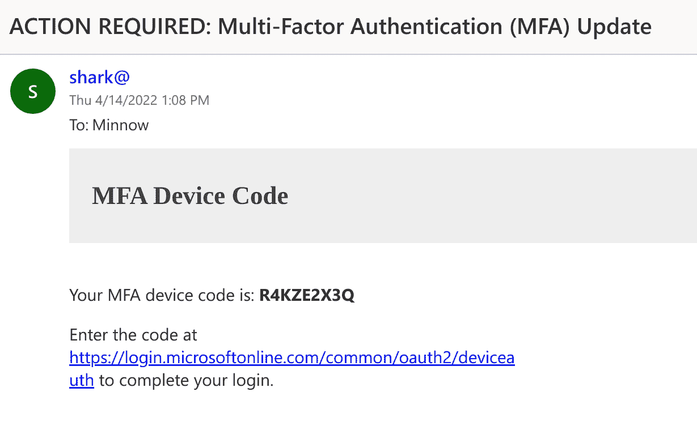
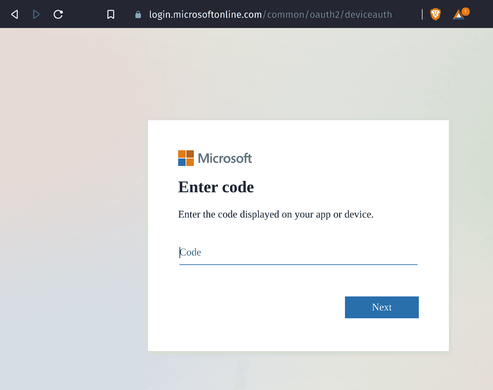
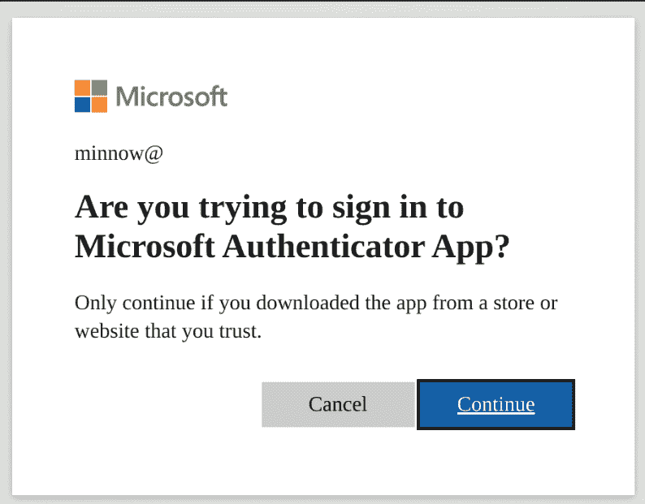

# Squarephish : OAuth 设备代码认证流程和 QR 代码

> 原文：<https://kalilinuxtutorials.com/squarephish/>

[](https://blogger.googleusercontent.com/img/b/R29vZ2xl/AVvXsEjG76JziogystcM2wkwwIQoZSBMw_1uEF8RubZGjhC8xzgzgA0HwLEa-wqc6nw0GUS57WQohTp7laotrYpeEUygOHPRQlcmoFGyhFc5ao7nx1g-wAAIhpEuZeuL0gF1qeLEMYgb7AzXEHgMmwOVqj-ZBEoPIDswKrMngr5bVa5GPjbwfG2c8OqTffUV/s728/SquarePhish1(1).png)

**SquarePhish** 是一种高级网络钓鱼工具，它使用 OAuth 设备代码认证流程和 QR 码相结合的技术。

有关使用 OAuth 设备代码流进行网络钓鱼攻击的更多详细信息，请参见[网络钓鱼套装](https://github.com/secureworks/PhishInSuits)。

```
 **_____                            _____  _     _     _     
  / ____|                          |  __ \| |   (_)   | |    
 | (___   __ _ _   _  __ _ _ __ ___| |__) | |__  _ ___| |__  
  \___ \ / _` | | | |/ _` | '__/ _ \  ___/| '_ \| / __| '_ \ 
  ____) | (_| | |_| | (_| | | |  __/ |    | | | | \__ \ | | |
 |_____/ \__, |\__,_|\__,_|_|  \___|_|    |_| |_|_|___/_| |_|
            | |                                              
            |_|                                            
                     _________
                    |         | /(
                    | O       |/ (
                    |>        |\ (  v0.1.0
                    |_________| \(

usage: squish.py [-h] {email,server} ...

SquarePhish -- v0.1.0

optional arguments:
  -h, --help      show this help message and exit

modules:
  {email,server}
    email         send a malicious QR Code email to a provided victim
    server        host a malicious server QR Codes generated via the 'email' module will 
                  point to that will activate the malicious OAuth Device Code flow
```

## 攻击步骤

攻击者可以使用 SquarePhish 的`email`模块向受害者发送恶意的二维码电子邮件。默认借口是受害者需要更新他们的 Microsoft MFA 身份验证才能继续使用移动电子邮件。当前使用的客户端 ID 是 Microsoft Authenticator 应用程序。

通过首先发送一个 QR 码，攻击者可以避免过早地启动仅持续 15 分钟的 OAuth 设备码流。



然后，受害者将使用他们的移动设备扫描电子邮件正文中的二维码。二维码会将受害者引导至攻击者控制的服务器(运行 SquarePhish 的`server`模块)，URL 参数设置为他们的电子邮件地址。



当受害者访问恶意 SquarePhish 服务器时，会触发一个后台进程，启动 OAuth 设备代码身份验证流程，并通过电子邮件向受害者发送一个生成的设备代码，然后要求受害者输入合法的 Microsoft 设备代码网站(这将启动 OAuth 设备代码流程 15 分钟计时器)。



SquarePhish 服务器将继续在后台轮询身份验证。

```
[2022-04-08 14:31:51,962] [info] [minnow@square.phish] Polling for user authentication...
[2022-04-08 14:31:57,185] [info] [minnow@square.phish] Polling for user authentication...
[2022-04-08 14:32:02,372] [info] [minnow@square.phish] Polling for user authentication...
[2022-04-08 14:32:07,516] [info] [minnow@square.phish] Polling for user authentication...
[2022-04-08 14:32:12,847] [info] [minnow@square.phish] Polling for user authentication...
[2022-04-08 14:32:17,993] [info] [minnow@square.phish] Polling for user authentication...
[2022-04-08 14:32:23,169] [info] [minnow@square.phish] Polling for user authentication...
[2022-04-08 14:32:28,492] [info] [minnow@square.phish] Polling for user authentication...
```

然后，受害者将通过电子邮件中提供的链接或通过移动设备上访问 SquarePhish URL 的重定向来访问 Microsoft 设备代码身份验证站点。



受害者随后将输入提供的设备代码，并被提示同意。



在受害者进行身份验证并同意后，身份验证令牌将保存在本地，并将通过请求应用程序的定义范围为攻击者提供访问权限。

```
[2022-04-08 14:32:28,796] [info] [minnow@square.phish] Token info saved to minnow@square.phish.tokeninfo.json
```

当前范围定义:

```
"scope": ".default offline_access profile openid"
```

## 用法

！重要提示:在使用任一模块之前，请更新标有`Required`的 [settings.config](https://github.com/secureworks/squarephish/blob/main/settings.config) 文件中的所需信息。

## 邮件模块

向目标受害者发送生成的二维码，该二维码将触发 OAuth 设备代码流。

```
usage: squish.py email [-h] [-c CONFIG] [--debug] [-e EMAIL]

optional arguments:
  -h, --help            show this help message and exit

  -c CONFIG, --config CONFIG
                        squarephish config file [Default: settings.config]

  --debug               enable server debugging

  -e EMAIL, --email EMAIL
                        victim email address to send initial QR code email to
```

## 服务器模块

托管一个服务器，生成的 QR 码将指向该服务器，当请求时，该服务器将触发 OAuth 设备代码流。

```
usage: squish.py server [-h] [-c CONFIG] [--debug]

optional arguments:
  -h, --help            show this help message and exit

  -c CONFIG, --config CONFIG
                        squarephish config file [Default: settings.config]

  --debug               enable server debugging
```

## 配置

所有适用于执行的设置都可以通过 [settings.config](https://github.com/secureworks/squarephish/blob/main/settings.config) 文件找到并修改。有几条必需信息没有缺省值，必须由用户填写:SMTP_EMAIL、SMTP_PASSWORD 和 SQUAREPHISH_SERVER(仅在执行 EMAIL 模块时)。所有配置选项都通过行内注释记录在设置文件中。

**注意**:配置中“电子邮件”部分的`SQUAREPHISH_`值应该与运行 SquarePhish 服务器时设置的值相匹配。

```
[DEFAULT]
SMTP_PORT            = 465                                                                      # SMTP port, defaulted to 465
SMTP_SERVER          = "smtp.gmail.com"                                                         # SMTP server, defaulted to GMail
SMTP_PROTO           = "ssl"                                                                    # SMTP protocol: {ssl, tls, None (leave empty)}
SMTP_EMAIL           = ""                                                                       # Provide authenticating email address here
SMTP_PASSWORD        = ""                                                                       # Provide authenticating password here

[EMAIL]
SQUAREPHISH_SERVER   = ""                                                                       # Required: Provide IP address/domain name of hosted SquarePhish server
SQUAREPHISH_PORT     = 8443                                                                     # Hosted SquarePhish server port, defaulted to 8443 (this should match the below server value)
SQUAREPHISH_ENDPOINT = "/mfa"                                                                   # Hosted SquarePhish endpoint to trigger OAuth Device Code flow, defaulted to an MFA pretext (this should match the below server value)
FROM_EMAIL           = "admin@square.phish"                                                     # Default FROM address when sending an email
SUBJECT              = "ACTION REQUIRED: Multi-Factor Authentication (MFA) Update"              # Default SUBJECT when sending an email, defauled to an MFA pretext
EMAIL_TEMPLATE       = "pretexts/mfa/qrcode_email.html"                                         # Email body template for QR code email to victim

[SERVER]
PORT                 = 8443
FROM_EMAIL           = "admin@square.phish"                                                     # Default FROM address when sending an email
SUBJECT              = "ACTION REQUIRED: Multi-Factor Authentication (MFA) Update"              # Default SUBJECT when sending an email, defauled to an MFA pretext
CLIENT_ID            = "4813382a-8fa7-425e-ab75-3b753aab3abb"                                   # Authenticating client ID, defaulted to Microsoft Authenticator App
ENDPOINT             = "/mfa"                                                                   # Hosted endpoint to trigger OAuth Device Code flow, defaulted to an MFA pretext
CERT_CRT             = ""                                                                       # Server SSL certificate .crt file
CERT_KEY             = ""                                                                       # Server SSL certificate .key file
EMAIL_TEMPLATE       = "pretexts/mfa/devicecode_email.html"                                     # Email body template for device code email to victim
PERMISSION_SCOPE     = ".default offline_access profile openid"                                 # OAuth permission scope - https://docs.microsoft.com/en-us/azure/active-directory/develop/v2-permissions-and-consent
```

## 习俗借口

目前，预定义的借口可以在[借口](https://github.com/secureworks/squarephish/blob/main/pretexts)文件夹中找到。

要编写自定义借口，请通过[借口/iphone/](https://github.com/secureworks/squarephish/blob/main/pretexts/iphone) 文件夹使用现有模板。初始 QR 码电子邮件和后续设备代码电子邮件都需要电子邮件模板。

**重要的**:当编写一个定制的借口时，注意在两个借口模板中`%s`的存在。这是为了让 SquarePhish 在生成电子邮件时填充正确的数据(QR 码数据和/或设备代码值)。

## 退出

在 [utils.py](https://github.com/secureworks/squarephish/blob/main/squarephish/utils.py#L28) 文件中定义了几个 HTTP 响应头。这些标头被定义为覆盖任何现有的 Flask 响应标头值，并提供来自服务器的更“合法”的响应。这些报头值可以被修改、删除和/或可以包括额外的报头以获得更好的 OPSEC。

```
{
    "vary": "Accept-Encoding",
    "server": "Microsoft-IIS/10.0",
    "tls_version": "tls1.3",
    "content-type": "text/html; charset=utf-8",
    "x-appversion": "1.0.8125.42964",
    "x-frame-options": "SAMEORIGIN",
    "x-ua-compatible": "IE=Edge;chrome=1",
    "x-xss-protection": "1; mode=block",
    "x-content-type-options": "nosniff",
    "strict-transport-security": "max-age=31536000",
}
```

[Click Here To Dow](https://github.com/secureworks/squarephish)