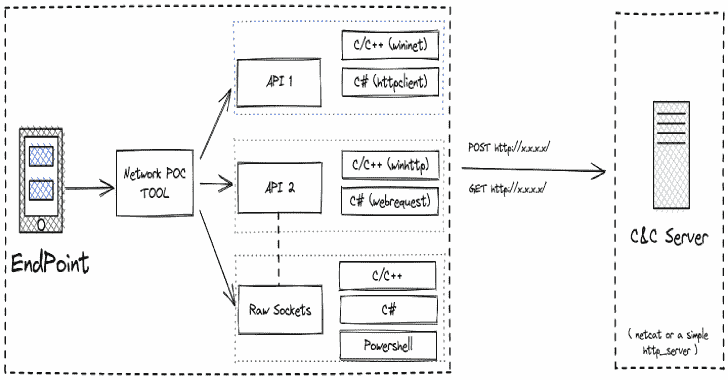

# NetLlix:模拟和测试不同网络协议上的数据泄漏的工具

> 原文：<https://kalilinuxtutorials.com/netllix/>

.png)

NetLlix 是一个项目，旨在模拟和测试不同网络协议上的数据渗透。仿真是在不使用本地 API 的情况下执行的。这将帮助蓝队编写关联规则，以检测任何类型的 C2 通信或数据泄漏。

目前，该项目可以使用下面提到的编程/脚本语言帮助生成 HTTP/HTTPS 流量(GET 和 POST ):

*   CNet/WebClient:在 CLang 中开发，使用众所周知的 WIN32 API(WININET & WINHTTP)和原始套接字编程来生成网络流量。
*   HashNet/WebClient:生成网络流量的 C#二进制文件。NET 类，如 HttpClient、WebRequest 和 raw sockets。
*   PowerNet/WebClient:使用套接字编程生成网络流量的 PowerShell 脚本。

## 使用

从 realease 下载最新的 ZIP 文件。

## 运行服务器

*   使用 SSl: `**python3 HTTP-S-EXFIL.py ssl**`
*   不带 SSL: `**python3 HTTP-S-EXFIL.py**`

## 运行客户端

*   CNet-`**CNet.exe <Server-IP-ADDRESS>**`–选择任何选项
*   has hnet-`**ChashNet.exe <Server-IP-ADDRESS>**`–选择任何选项
*   powernet—`**.\PowerHttp.ps1 -ip <Server-IP-ADDRESS> -port <80/443> -method <GET/POST>**`

[Click Here To Download](https://github.com/advanced-threat-research/NetLlix)