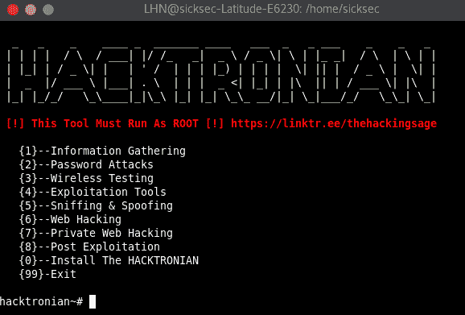

# hacking sage/Hacktronian——Linux 和 Android 的测试工具

> 原文：<https://kalilinuxtutorials.com/hacktronian-tool/>

Hacktronian 是一个用于信息收集的免费开源工具。它用于对网站和网络应用程序进行大量的数据入侵和渗透测试。

Hacktronian 有不同的模块，如信息收集和密码攻击。Hacktronian 是不同黑客工具/模块的完整包，例如 Setoolkit、Nmap、主机到 IP 转换、WAScan 模块、CMS 扫描器模块和用于跨站点脚本的 XSStrike 模块。

## **黑客特龙工具菜单**

*   情报收集
*   密码攻击
*   无线测试
*   开发工具
*   嗅探和欺骗
*   网络黑客
*   私人网络黑客
*   后期开发

## **安装哈克顿工具:**

### Linux 中的安装:

该工具必须以 ROOT 用户身份运行！！！

`git clone https://github.com/thehackingsage/hacktronian.git`

`cd hacktronian`

`chmod +x install.sh`

`./install.sh`

好了..您可以通过键入 **hacktronian** 来执行该工具

### 安卓系统中的安装:

开放式〔t0〕术语〔t1〕

`pkg install git`

`pkg install python`

`git clone https://github.com/thehackingsage/hacktronian.git`

`cd hacktronian`

`chmod +x hacktronian.py`

`python2 hacktronian.py`

## 视频教程:

[https://www.youtube.com/embed/1LJlyQAQby4?feature=oembed](https://www.youtube.com/embed/1LJlyQAQby4?feature=oembed)

## 许可证:

许可

使用该工具，您可以从扫描过程开始，一直持续到后期利用。该工具可以在 GitHub 上找到[。](https://github.com/thehackingsage/hacktronian)