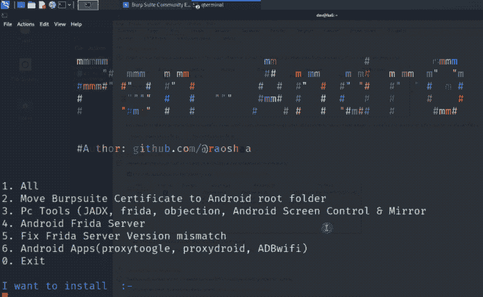
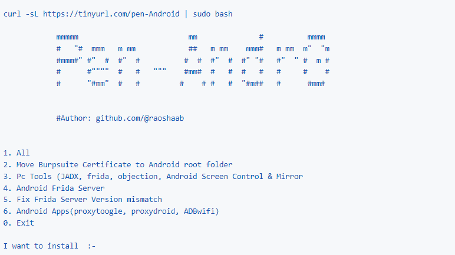
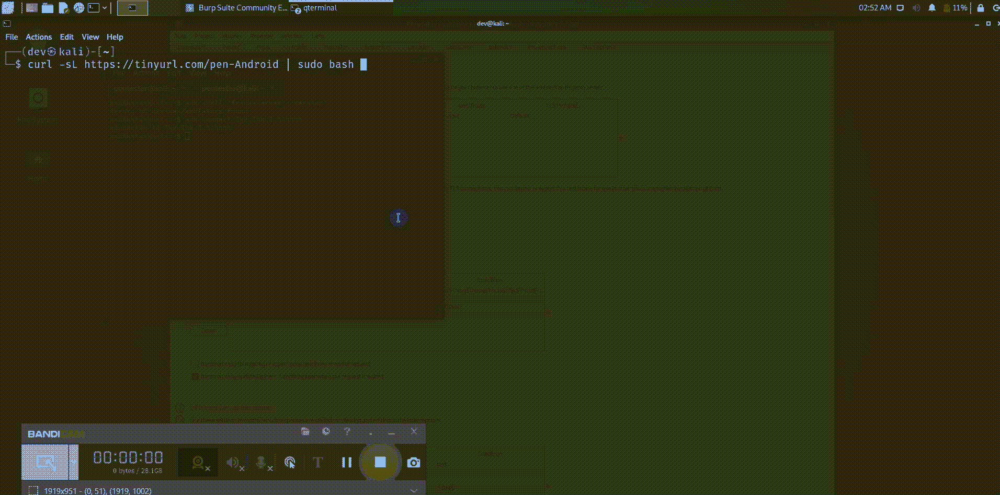

# pen Andro——一个自动化的 Android 渗透测试工具

> 原文：<https://kalilinuxtutorials.com/pen-andro/>

[](https://kalilinuxtutorials.com/wp-content/uploads/2022/12/animation.gif)

## **简介**

Pen-Andro 脚本将自动执行安装 Android Pentesting 所需的所有工具和任务的过程，即移动 [Burpsuite](https://kalilinuxtutorials.com/burpsuite/) 证书，安装 Adb frida 服务器，apk，如 proxy toggle、proxydroid、adbwifi。

## **用途**

1.  开放终端
2.  在命令下运行

```
curl -sL https://tinyurl.com/pen-Android | sudo bash 
```

## **筑基**

*   在 127.0.0.1:8080 运行的 Burpsuite 代理
*   通过 adb 连接的根 Android 设备(只能连接一台设备)
*   Magisk 应用程序(它将使安装变得容易)

1.  对于 Android 虚拟设备-[GitHub](https://github.com/newbit1/rootAVD)
2.  对于 Genymotion 模拟器[博客链接](https://support.genymotion.com/hc/en-us/articles/360011385178-How-to-install-Xposed-or-Magisk-Edxposed-with-Genymotion-Device-image-PaaS-)

## **我要安装:-**

https://tinyurl.com/pen-Android | sudo bash



**Pen andro**

## **Pen Andro Demo**

[](https://github.com/raoshaab/Pen-Andro/blob/main/assets/screen.gif)

## **笔和功能**

### **安卓应用**

*   代理机器人

*   亚行 wifi

*   代理切换

### **Pc 工具**

*   弗里达，反对&弗里达-安卓服务器

*   jDax-gui

*   scrcopy

*   Burpsuite 证书安装

## **Pen Andro FAQs :**

*   Burpsuite 错误:-检查 Burpsuite 的代理选项卡，将代理设置为 127.0.0.1，端口为 8080
*   Root 访问错误:-检查您的设备是否是 root 用户(如果没有确认，请检查
*   流量未拦截:-安装证书后重新启动设备
*   连接了一个或多个设备:-检查`adb devices`或尝试`adb kill-server`(移除离线设备)

#### **安全网络网关–网络过滤规则、活动跟踪&恶意软件防护—[下载免费电子书](https://www.perimeter81.com/whitepapers/swg-web-filtering-ebook?a_aid=2428&a_bid=89a6d601&chan=code5)**