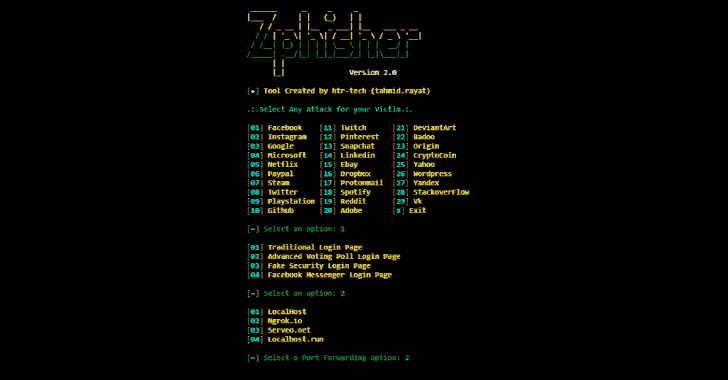
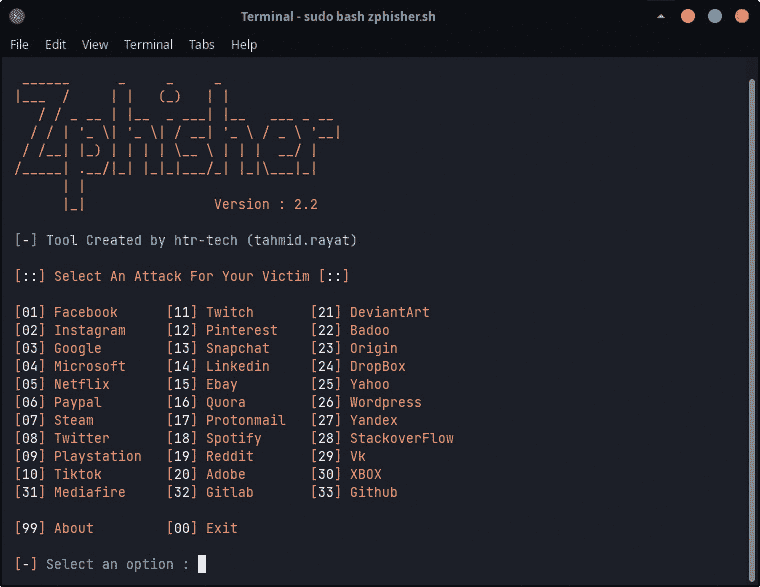

# ZPhisher:Pentesters 的自动钓鱼工具

> 原文：<https://kalilinuxtutorials.com/zphisher/>

[](https://1.bp.blogspot.com/--Ta-KPNodAA/Xn8DlMpJyiI/AAAAAAAAFsQ/1uCZds3DlZ0AwdQLRTd0fO-J0NCWrfuLQCLcBGAsYHQ/s1600/Zphier.png)

ZPhisher

Zphisher 是 Shellphish 的升级版。主要源代码来自 Shellphish。但是我没有完全复制它。我已经升级了&，清除了不必要的文件。它有 37 个钓鱼网页模板；包括脸书，Twitter & Paypal。它也有 4 个端口转发工具。

## **安装**

apt 更新
apt 安装 git php openssh curl -y
git 克隆 https://github.com/htr-tech/zphisher
CD zphisher
chmod+x zphisher . sh
bash zphisher . sh

**或；使用单一命令**

apt 更新&& apt 安装 git php curl openssh -y && git 克隆 https://github.com/htr-tech/zphisher & & CD ZP hiser & & chmod+x ZP hiser . sh & & bash ZP hiser . sh

**又读-[insta save:Python 脚本从 Instagram](https://kalilinuxtutorials.com/instasave/) 下载图片、视频&个人资料图片**

## **安装(term)**

您可以使用 tur-repo 在 Termux 中轻松安装 zphisher

```
$ pkg install tur-repo
$ pkg install zphisher
$ zphisher
```

## **安装通过”。deb”文件**

*   从 [**最新发布**](https://github.com/htr-tech/zphisher/releases/latest) 下载`.deb`文件
*   如果你正在使用 ***termux*** 然后下载`*_termux.deb`
*   通过执行`apt install <your path to deb file>` 或`$ dpkg -i <your path to deb file> $ apt install -f`安装`.deb`文件

## **运行在码头上**

*   Docker 镜像:
    *   **DockerHub** : `docker pull htrtech/zphisher`
    *   **GHCR** : `docker pull ghcr.io/htr-tech/zphisher:latest`
*   通过使用包装器脚本[**run-docker . sh**](https://raw.githubusercontent.com/htr-tech/zphisher/master/run-docker.sh)
*   临时容器`docker run --rm -ti htrtech/zphisher`
    *   记得挂载`auth`目录。



## **特性**

*   最新登录页面！
*   新的 Instagram 自动关注者页面！
*   修复了所有类型的错误！
*   对初学者有用！

您可以在 **[GitHub](https://github.com/htr-tech/zphisher)** 上访问 Zphisher 工具。