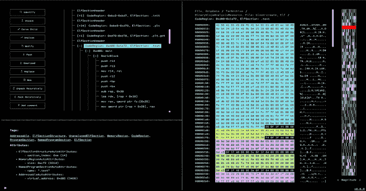

# OFRAK:解包、修改和重新打包二进制文件

> 原文：<https://kalilinuxtutorials.com/ofrak/>

.png)

**OFRAK** (开放固件逆向分析 Konsole)是一个二进制分析修改平台。OFRAK 结合了以下能力:

*   **识别**和**解包**多种二进制格式
*   **使用经过现场测试的逆向工程工具分析**解包的二进制文件
*   用强大的补丁策略修改和**重新打包**二进制文件

OFRAK 支持用户空间可执行文件之外的一系列嵌入式固件文件格式，包括:

*   压缩文件系统
*   压缩和校验和固件
*   引导装载程序
*   rtos/oskernel

OFRAK 为用户配备了:

*   一个**图形用户界面(GUI)** 用于二进制文件的交互式探索和可视化
*   一个用于可读和可复制脚本的 **Python API** ,可以应用于整个二进制文件类，而不仅仅是一个特定的二进制文件
*   许多文件格式的递归**识别、解包和重新打包**，从 ELF 可执行文件到文件系统归档，再到压缩和校验和固件格式
*   与强大的分析后端 (angr、Binary Ninja、Ghidra、IDA Pro)的内置、可扩展**集成**
*   **设计的可扩展性**通过通用接口轻松编写附加的 OFRAK 组件，并增加对新文件格式或二进制补丁操作的支持

更多详情见[ofrak.com](https://ofrak.com)。

## GUI 前端

基于 web 的 GUI 视图提供了一个可导航的资源树。对于选定的资源，它还提供:元数据，十六进制或文本导航，以及一个小地图边栏，用于通过熵，字节类或数量级快速导航。GUI 还允许通常通过 Python API 可用的操作，如注释、解包、分析、修改和打包资源。

## 入门指南

**OFRAK 使用吉特 LFS。这意味着您必须在克隆存储库之前安装 Git LFS！**按照[这里的说明](https://git-lfs.github.com/)安装 Git LFS。如果您在安装 Git LFS 之前不小心克隆了存储库，请将`cd`放入存储库并运行`git lfs pull`。

关于如何安装 OFRAK 的详细说明，请参见 [`docs/environment-setup`](https://ofrak.com/docs/environment-setup.html) 。

## 文档

OFRAK 有通用文档和 API 文档。两者都可以在 ofrak.com/docs 观看。

如果您希望对文档进行更改或自行提供，请按照 [`docs/README.md`](https://github.com/redballoonsecurity/ofrak/blob/master/docs/README.md) 中的说明进行操作。

[Click Here To Download](https://github.com/redballoonsecurity/ofrak)