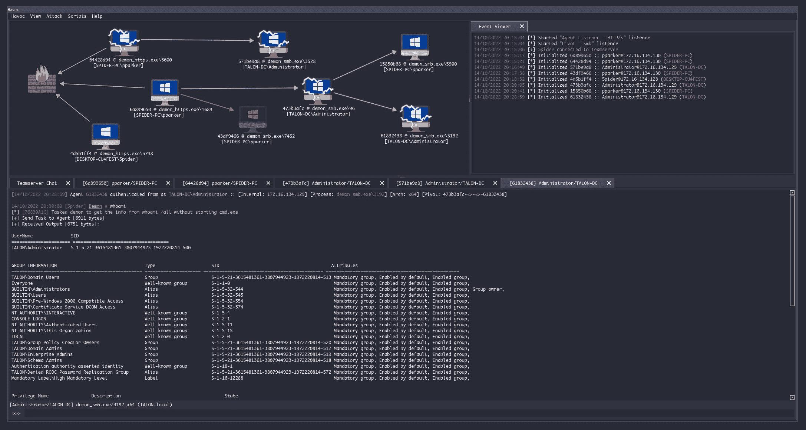
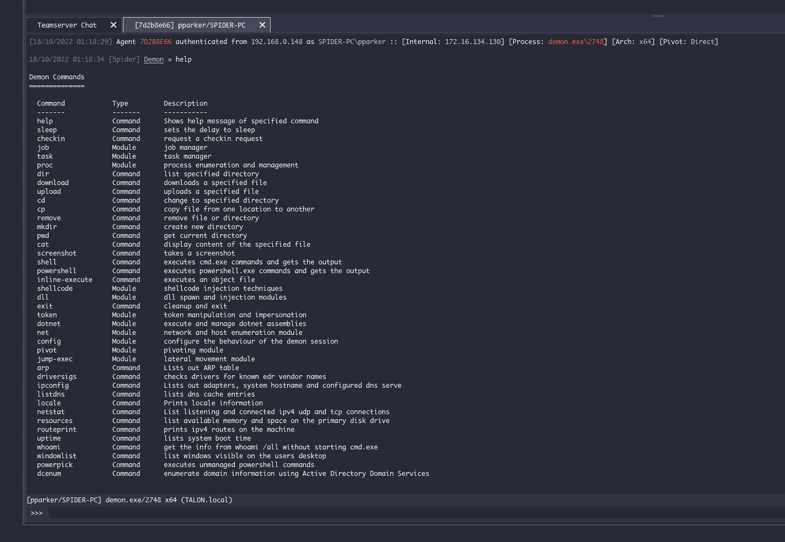

# 浩劫:现代和可塑性后开发指挥和控制框架

> 原文：<https://kalilinuxtutorials.com/havoc/>

.png)

**浩劫**是一个现代的可延展的后开发指挥控制框架，由 [@C5pider](https://twitter.com/C5pider) 创建。

⚠️Havoc 处于早期释放状态。随着框架的成熟，可能会对 APIs 核心结构做出突破性的改变。

### 支持

考虑在 [Patreon](https://www.patreon.com/5pider) / [Github 赞助商](https://github.com/sponsors/Cracked5pider)上支持 C5pider。将来还会为支持者提供额外的功能，比如自定义代理/插件/命令等。

### 快速启动

请参见 [Wiki](https://github.com/HavocFramework/Havoc/wiki) 获取完整文档。

浩劫在 Debian 10/11，Ubuntu 20.04/22.04 和 Kali Linux 上运行良好。建议尽可能使用最新版本以避免问题。你需要一个现代版的 Qt 和 Python 3.10.x 来避免构建问题。

有关说明，请参见 Wiki 中的[安装](https://github.com/HavocFramework/Havoc/wiki#installation)指南。如果您遇到问题，请查看[已知问题](https://github.com/HavocFramework/Havoc/wiki#known-issues)页面以及打开/关闭的[问题](https://github.com/HavocFramework/Havoc/issues)列表。

### 特性

#### 客户

**用 C++和 Qt 写的跨平台 UI**

*   基于[德古拉](https://draculatheme.com/)的现代黑暗主题

#### Teamserver

**用戈兰语写的**

*   多光盘播放器
*   有效负载生成(exe/shellcode/dll)
*   HTTP/HTTPS 侦听器
*   可定制的 C2 个人资料
*   外部 C2

#### 恶魔

**用 C 和 ASM 写的浩劫旗舰代理**

*   通过 [Ekko](https://github.com/Cracked5pider/Ekko) 或[树叶](https://github.com/SecIdiot/FOLIAGE)进行睡眠混淆
*   x64 回邮地址欺骗
*   Nt * APIs 的间接系统调用
*   中小企业支持
*   代币金库
*   各种内置的开发后命令

[Click Here To Download](https://github.com/HavocFramework/Havoc)