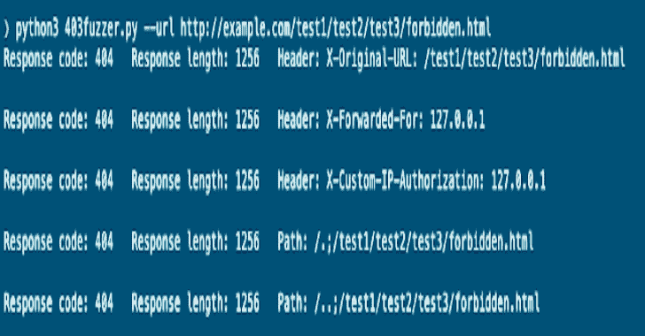
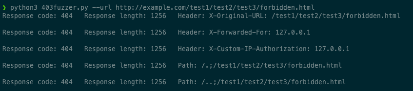

# 403 模糊器:模糊 403/401 使用旁路端点

> 原文：<https://kalilinuxtutorials.com/403fuzzer/>

[](https://1.bp.blogspot.com/-z7JdeSORdvQ/YMTCrRm8FZI/AAAAAAAAJfk/Nr3m9kd-YcwI1kCuPePcKpepUO2NdK9LwCLcBGAsYHQ/s728/403Fuzzer%25281%2529.png)

403Fuzzer 将使用几个标题检查端点，如`**X-Forwarded-For**`

它还将应用不同的有效负载，通常用于目录遍历、路径规范化等。到路径上的每个端点。

**如`/%2e/test/test2` `/test/%2e/test2` `/test;/test2/`**

**用途**

**用法:403fuzzer.py [-h] [-u URL] [-m {GET，POST，PUT，PATCH }][-d DATA _ PARAMS][-c COOKIES][-H HEADER][-p PROXY][-HC HC][-HL HL][-SF][–SAVE][-sh][-su]
使用此脚本模糊返回 401/403
的端点可选参数:
-h，–help 显示此帮助消息并退出
-c COOKIES，–COOKIES COOKIES
指定在请求中使用的 cookie。(例如–cookies“cookie 1 = blah；cookie2=blah")
-H HEADER，–HEADER HEADER
向您的请求添加标头(例如–HEADER " Accept:application/JSON "–HEADER " Host:example . com "
-p PROXY，–PROXY PROXY
指定用于请求的代理(例如 http://127 . 0 . 0 . 1:8080)
-HC HC 隐藏输出的响应代码，用单个或逗号分隔
-hl HL 隐藏响应长度**

**基本示例**

```
python3 403fuzzer.py -u http://example.com/test1/test2/test3/forbidden.html
```



**指定在请求中使用的 cookie**

(减去 cookie 头名称)示例

**–cookies " cookie 1 = blah "
-c " cookie 1 = blah；**

**指定要发送的方法/动词和主体数据**

**403 fuzzer . py-u https://example.com-m POST-d " param 1 = blah&param 2 = blah 2 "
403 fuzzer . py-u https://example.com-m PUT-d " param 1 = blah&param 2 = blah 2 "**

**指定用于每个请求的自定义标题**

也许你需要添加某种类型的认证头，如 **`Authorization: bearer <token>`** 为你想要添加的每个额外的头指定`-H "header: value"`:

**403 fuzzer . py-u https://example.com-H " Some-Header:blah "-H "授权:不记名 1234567"**

**指定要使用的代理**

有用的，如果你想通过打嗝代理

403 fuzzer . py-u https://example.com-代理 http://127.0.0.1:8080

**跳过发送报头有效载荷或 url 有效载荷**

# **跳过发送头有效载荷
403 fuzzer . py-u https://example.com-sh
403 fuzzer . py-u https://example.com–跳过头
#跳过发送路径规范化有效载荷
403 fuzzer . py-u https://example.com-苏
403 fuzzer . py-u https://example.com–跳过 URL**

**隐藏响应代码/长度**

提供不带空格的逗号分隔列表。示例:

# **隐藏响应代码
403 fuzzer . py-u https://example.com-HC 403，404，400
#隐藏响应长度 638
403 fuzzer . py-u https://example.com-HL 638**

**智能滤镜功能**

基于响应代码和长度。如果它看到 8 次或更多的响应，它会自动静音。重复在代码中是可变的，直到我添加一个选项在 flag 中指定它注意:不能与`-hc`或`-hl`同时使用(还不能)。

**#开启智能滤镜
403 fuzzer . py-u https://example.com–智能**

**保存匹配响应代码的请求**

将保存到一个名为 saved.txt 的文件中，以便以后检查

# **保存响应代码与 200
403 fuzzer . py-u https://example.com 匹配的请求–保存 200**

[**Download**](https://github.com/intrudir/403fuzzer)