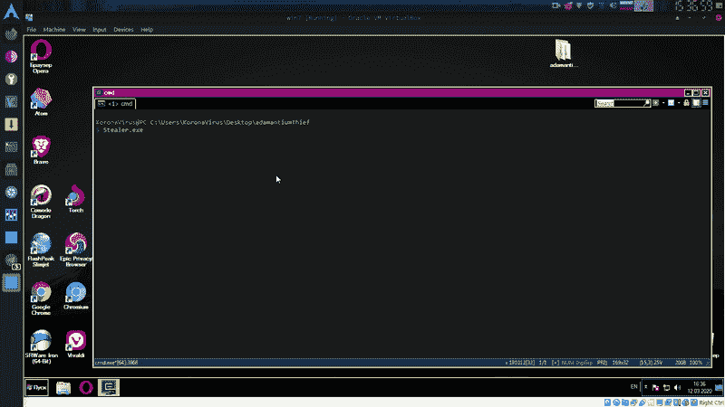
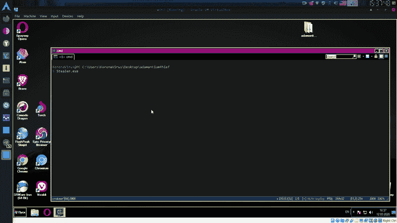
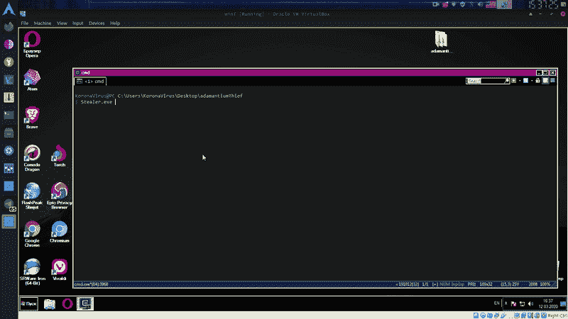
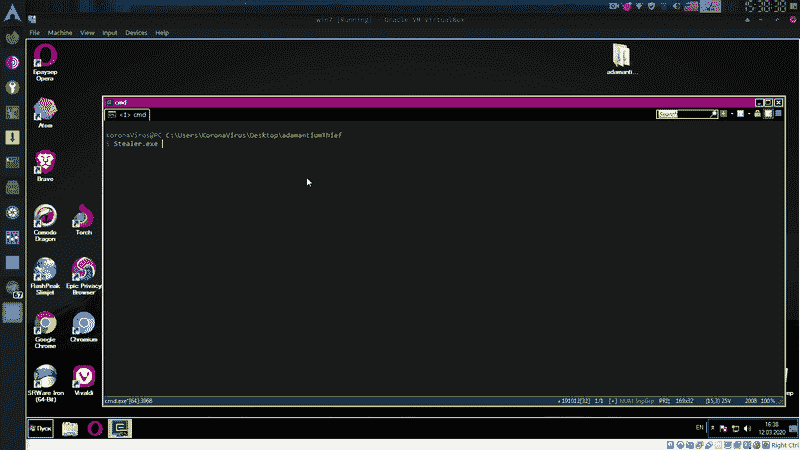
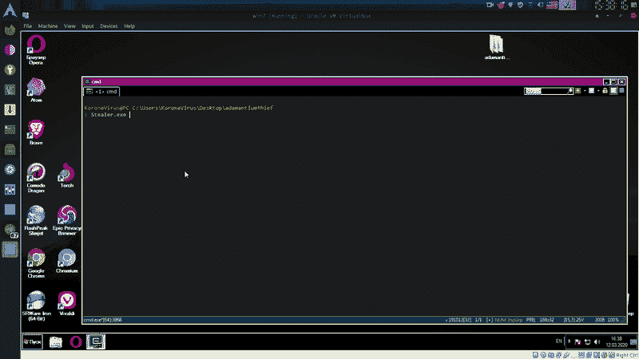

# 解密基于 Chromium 的浏览器密码和信用卡

> 原文：<https://kalilinuxtutorials.com/adamantium-thief/>

是一个用来解密基于 chromium 的浏览器密码、cookies、信用卡、历史记录、书签的工具，支持版本> 80。

**例题**

*   **从浏览器获取密码:**

**Stealer.exe 密码**

*   **从浏览器获取信用卡:**

**Stealer.exe 信用卡 _ 信用卡**

*   **从浏览器获取历史:**

**Stealer.exe 历史**

**也可理解为-[DNS probe:允许您执行多个 DNS 查询的工具](https://kalilinuxtutorials.com/dnsprobe/)**

*   **从浏览器获取书签:**

**Stealer.exe 书签**

*   **从浏览器获取 cookie:**

**Stealer.exe 饼干**

**浏览器列表**

*   谷歌浏览器
*   歌剧
*   铬
*   勇敢的浏览器
*   Epic 隐私浏览器
*   阿美高
*   Vivaldi
*   眼眶
*   原子
*   Kometa
*   方便的龙
*   火炬
*   Slimjet
*   360 浏览器
*   傲游 3
*   k 瓜
*   苏联人造地球卫星
*   镍铬耐热合金
*   coccoccoco 浏览器
*   巨蜥
*   Chromodo
*   Yandex(旧)

[**Download**](https://github.com/LimerBoy/Adamantium-Thief)