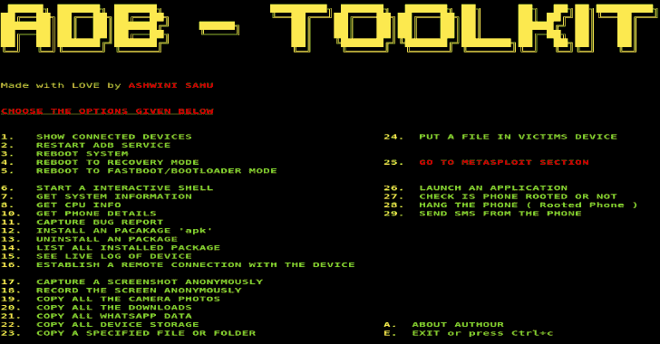
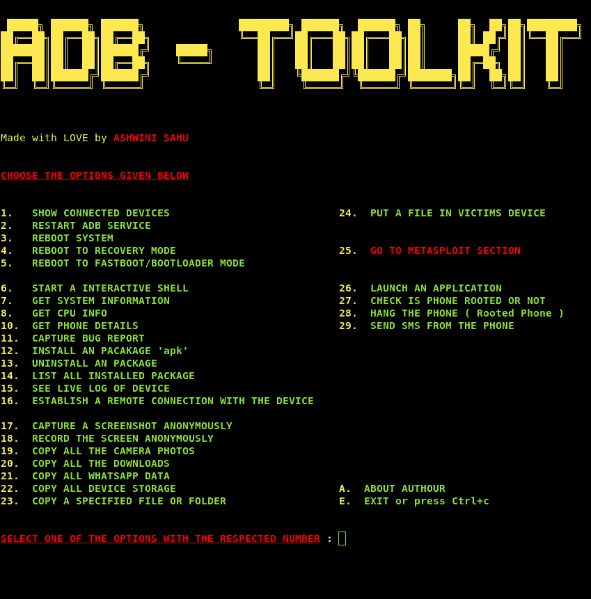
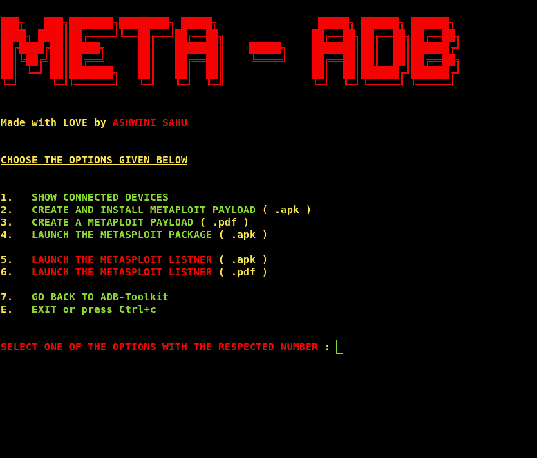
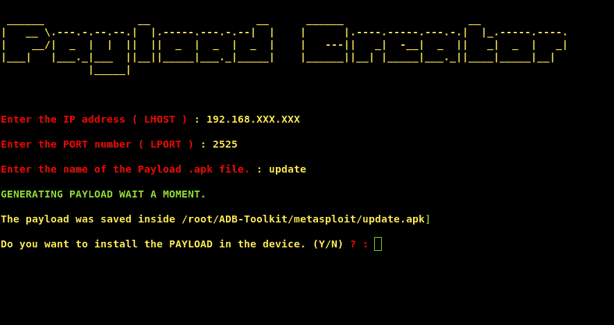
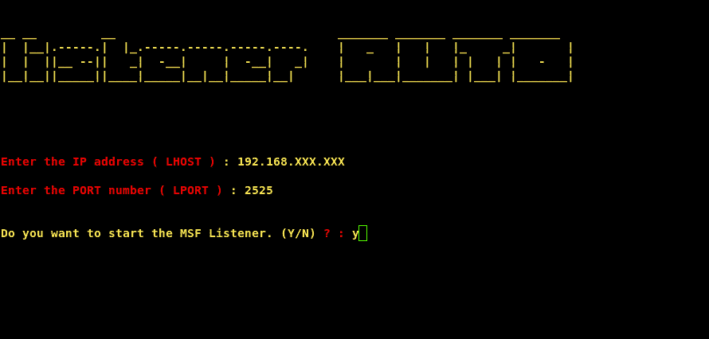

# ADB-Toolkit:攻击 Android 设备的工具

> 原文：<https://kalilinuxtutorials.com/adb-toolkit/>

ADB-Toolkit 是一个有 28 个选项的 BASH 脚本和一个有 6 个选项的 METASPLOIT 部分，用于在 Android 设备中进行简单的渗透测试。

你可以用这个脚本做很多事情，测试你的 android 设备是否安全。这个脚本是在 ADB (Android Debug Bridge)的帮助下制作的，这是一个用于开发人员调试 Android 设备的工具，但正如我们所知，每件事情都有好的一面和坏的一面，我不是告诉你做坏事，而是不要做非法的事情，否则 FBI 会找到你😂😂。

注意:我不对你用这个工具对任何人做的任何事情负责，这不属于我的责任范围。

**METASPLOIT 部分:-😎**本部分包含与 metasploit 有效负载相关的脚本，您可以创建有效负载，安装并启动它，甚至无需接触手机，您知道 Metasploit 的强大功能。

**变更日志**

**Changelog v2.32**

添加了版本检查代码
修正了
Wiki 中的大错误

**Changelog V2.3**

增加了多设备支持，现在是 3 个
增加了对 Arch、Fedora、Centos 的支持
在脚本开始时增加了重启或不重启 ADB 服务器的选项
增加了执行特定选项时清除屏幕的选项
修复退出选项(不工作)
简化了远程连接建立
修复了 100 个错误
指定了提取数据的目录
使脚本可从 shell 中的任何位置执行(已修复)

**Changelog V2.1**

**添加了 Metasploit 部分

添加了脚本开始时是否重启 ADB 服务器的选项

添加了 7 个选项:-**
-复制所有设备存储
-复制指定文件或文件夹
-将文件放入受害者设备
-启动应用程序
-检查手机是否有根
-挂断手机(有根的手机)
-从手机发送短信

**修复了远程连接无法建立的问题**

**先决条件**

在使用这个工具之前，你必须从 Android 设置的开发者设置中启用 Usb 调试，然后你就可以开始了。

前往设置
前往关于设备/平板电脑
点击构建号 7 次
将出现开发者选项
前往开发者选项
搜索 USB 调试&通过 Usb 安装
打开这些设置

**安装**

伙计们，我建议请重新安装工具包或 git 拉它的每一个新版本

git 克隆 https://github.com/ASHWIN990/ADB-Toolkit.git
CD ADB-Toolkit
sudo chmod+x install . sh
sudo。/install.sh -i "或" sudo bash install.sh -i

**用途**

须藤。/ADB-Toolkit.sh

或者您可以在 shell 中的任何地方执行

sudo bash ADB-toolkit . sh

或者您也可以执行

sudo adb-toolkit

**截图**

*   **Metasploit 部分截图**

[**Download**](https://github.com/ASHWIN990/ADB-Toolkit)