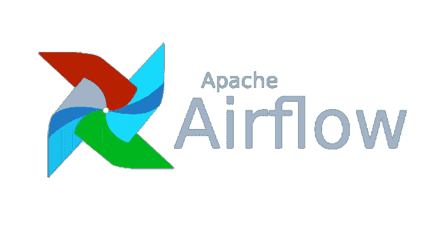

# Airflowscan:增加 Apache 气流安全性的清单和工具

> 原文：<https://kalilinuxtutorials.com/airflowscan-checklist-security-apache-airflow/>

**Airflowscan** 是一个用于提高 Apache 气流安全性的清单和工具。这个项目的目的是提供工具来提高阿帕奇气流装置的安全性。该项目提供以下工具:

*   具有强化设置的配置文件
*   强化默认安装的安全清单
*   静态分析工具，用于检查气流配置文件的不安全设置。
*   静态分析工具用于验证的 JSON 模式文档

静态分析工具可以检查气流配置文件中与安全性相关的设置。该工具将配置文件转换为 JSON，然后使用 JSON 模式进行验证。

**要求**

Python 3 是必需的，你可以在 **requirements.txt** 文件中找到所有必需的模块。仅在 Python 3.7 上测试过，但应该可以在其他 3.x 版本上运行。目前没有计划支持 2.x。

**也可阅读-[采样器:Shell 命令执行的工具，可视化&报警](https://kalilinuxtutorials.com/sampler-shell-commands-execution-visualization-alerting/)**

**安装**

您可以通过 PIP 进行安装，如下所示:

**pip 安装气流扫描
气流扫描**

要手动下载并运行，请执行以下操作:

git 克隆 https://github.com/nightwatchcybersecurity/airflowscan.git
CD 气流扫描
pip-r requirements . txt
python-m 气流扫描. cli

**如何使用**

要扫描配置文件，请执行以下命令:

**气流扫描 scan some_airflow.cfg**

**免责声明**

这个项目不隶属于阿帕奇基金会和气流项目，也没有得到他们的支持。

[**Download**](https://github.com/nightwatchcybersecurity/airflowscan)