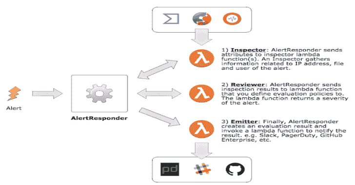
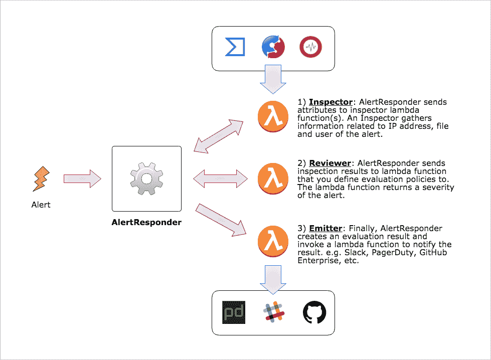
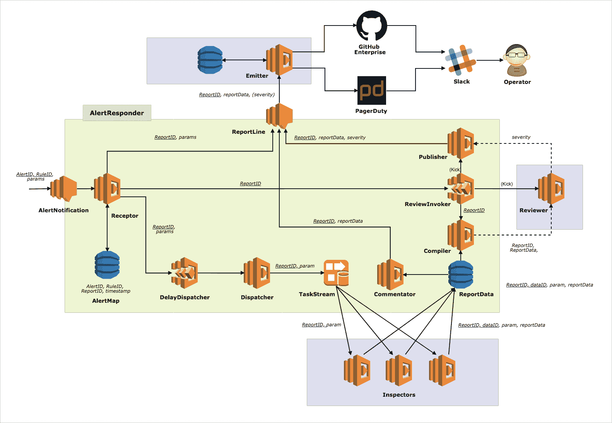

# AlertResponder:基于 AWS 无服务器应用模型的自动安全警报响应框架

> 原文：<https://kalilinuxtutorials.com/alertresponder/>

**AlertResponder** 是由 AWS Server less 应用模型提供的自动安全警报响应框架。这是一个自动响应安全警报的无服务器框架。

**概述**

AlertResponder 从安全角度接收到一个有关事件的警报，并自动响应该警报。AlertResponder 有 3 个自动响应部分。

*   **检查员**调查出现在警报中的实体，包括 IP 地址、域名和存储结果:信誉、恶意活动历史、关联的云实例等。

    已经提供了以下组件来与您的 AlertResponder 环境集成。您也可以创建自己的检查员来检查日志，存储到原始日志存储或日志搜索系统。
    *   病毒总量检测器

*   **审查者**收到警报以及检查员的结果，并评估警报的严重性。

    审查者应由贵组织的每个安全操作员/管理员编写，因为安全策略因组织而异。

*   **发送者**最终收到带有审核者严重性评估结果的警报。之后，发射器发送外部集成系统。如 PagerDuty、Slack、Github Enterprise 等。自动隔离也可以通过 AWS Lambda 功能进行配置。
    *   新闻记者

**也可以理解为-[grouper 2:查找 ad 组策略中的漏洞](https://kalilinuxtutorials.com/grouper2/)**

**概念**

*   基于拉动的相关性分析
*   警报聚合
*   可插拔检查器和发射器

**入门**

请根据您的环境替换以下变量:

*   `**$REGION**`:用你的 AWS 地区代替。(例如 AP-东北-1)
*   `**$STACK_NAME**`:替换为云形成堆栈名称

**$ curl-o alert _ responder . yml https://S3-$ region . Amazon AWS . com/cfn-assets。$ REGION/alert responder/templates/latest . yml**

**$ AWS cloud formation deploy–template-file alert _ responder . yml–STACK-NAME $ STACK _ NAME–capabilities CAPABILITY _ IAM**

**发展**

**架构概述**:

**先决条件**

*   awscli >= 1.16.20
*   Go >= 1.11
*   GNU 自动制造> = 1.16.1

**部署和测试**

**部署自己的警报堆栈**

准备一个参数文件，如`config.json`，运行 make 命令。

**$ cat CONFIG . JSON
{
" stack name ":" your-alert-responder-name "、
" test stack name ":" your-test-stack-name "、
" codes 3 bucket ":" your-some-bucket "、
" codes 3 prefix ":" for-example-functions "、

"InspectionDelay": "1 "、
"ReviewDelay": "10"
}** 

**部署测试堆栈**

部署 AlertResponder 后，移动到`tester`目录下，部署一个栈进行测试。

**$ CD tester/
$ make AR _ CONFIG =../config.json 部署**

你可以看到部署后在`tester`目录下由脚本创建的`param.json`。

**$ cat params . JSON
{
" account id ":" 214219211678 "，
"Region": "ap-northeast-1 "，
" Inspector ":" slam-alert-responder-test-functions-Inspector-1 obgu 89 CT 1 P4 b "，
" Reporter ":" slam-alert-responder-test-functions-Reporter-1 ndhu 0 VDI 8 opa "【t6}**

然后，回到 git 存储库的顶层目录，您就可以运行集成测试了。

**$ go test-v
= = = RUN testinvokebysens
—PASS:testinvokebysens(3.39s)
(snip)
PASS
ok github.com/m-mizutani/AlertResponder 20.110s**

[**Download**](https://github.com/m-mizutani/AlertResponder)