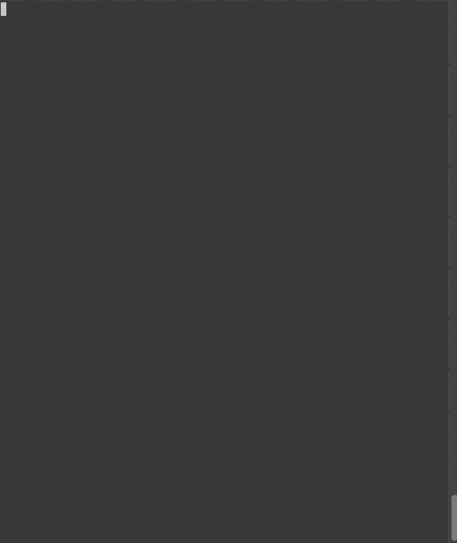

# Amass:深入的 DNS 枚举和网络映射

> 原文：<https://kalilinuxtutorials.com/amass-dns-enumeration-network-mapping/>

OWASP Amass 工具套件通过抓取数据源、递归强制、抓取 web 档案、置换/更改名称和反向 DNS 扫描来获取子域名。

此外，它使用在解析期间获得的 IP 地址来发现关联的网络块和 ASN。所有的信息都被用来构建目标网络的地图。

**使用的信息收集技术:**

*   **DNS:** 基本枚举、暴力破解(根据请求)、反向 DNS 扫描、子域名变更/置换、区域迁移(根据请求)
*   **抓取:** Ask、百度、Bing、CommonCrawl、DNSDumpster、DNSTable、Dogpile、Exalead、FindSubdomains、Google、IPv4Info、Netcraft、PTRArchive、谜语、SiteDossier、Yahoo
*   **证书:**主动拉取(根据请求)、Censys、CertDB、CertSpotter、Crtsh、Entrust
*   **API:**alien vault、BinaryEdge、BufferOver、CIRCL、DNSDB、HackerTarget、PassiveTotal、Robtex、SecurityTrails、Shodan、ThreatCrowd、Twitter、Umbrella、URLScan、VirusTotal
*   **网络存档:** ArchiveIt，ArchiveToday，Arquivo，LoCArchive，OpenUKArchive，UKGovArchive，Wayback

**另请阅读-[SSHD 毒药:获取基于 SSHD 认证的 Pam 信用的工具](https://kalilinuxtutorials.com/sshd-poison/)**

**安装**

**使用 Docker**

*   建立 [Docker](https://docs.docker.com/) 形象:

**sudo 坞站建设-t amass https://github . com/owasp/amass . git**

*   运行 Docker 映像:

**sudo docker run amass–被动式 example.com**

git 存储库中维护的单词列表可以在 docker 容器的`**/wordlists/**`中找到。例如，使用`**all.txt**`:

**sudo docker run amass-w/word lists/all . txt-d example.com**

**来源**

如果你喜欢从最新版本的源代码中构建自己的二进制文件，确保你有一个正确配置的 **Go > = 1.10** 环境。关于如何做到这一点的更多信息可以在 golang 网站上找到[。](https://golang.org/doc/install)然后，采取以下步骤:

*   下载 OWASP:

**去 github.com/OWASP/Amass/…吧**

*   如果您希望从源代码中重建二进制文件:

**CD＄GOPATH/src/github . com/OWASP/Amass
开始安装。/……**

此时，二进制文件应该在 *$GOPATH/bin* 中。

*   在以下目录中可以找到几个单词表:

**ls＄GOPATH/src/github . com/OWASP/Amass/word lists/**

由 Amass 项目维护的 **包**

**家酿(macOS)**

 **对于 **Mac** 上的**自制软件**，以下两个命令将把它安装到您的 macOS 环境中:

brew tap caf fix/amass
brew install amass

**Snapcraft**

如果您的操作环境支持 [Snap](https://docs.snapcraft.io/core/install) ，您可以[点击此处安装](https://snapcraft.io/amass)，或者从命令行执行以下操作:

**sudo snap install amass**

在 **Kali** 上，按照以下步骤安装 Snap 并使用 AppArmor(用于自动加载):

**sudo 安装快照
sudo 系统启动快照
sudo 系统启动快照
sudo 系统启动快照
sudo 系统启动快照**

将 Snap bin 目录添加到您的路径:

**导出路径=$PATH:/snap/bin**

定期执行以下命令来更新所有快照软件包:

**sudo 快照刷新**

**由第三方维护的包**

**FreeBSD**

**CD/usr/ports/DNS/amass/&&make install clean
pkg install amass**

**Nix 或 NixOS**

<nixpkgs>—ia amass

**Pentoo Linux**

**sudo emerge net-analyzer/mass**

定期执行以下命令来更新所有软件包:

**sudo pentoo-updater**

[**Download**](https://github.com/OWASP/Amass)**