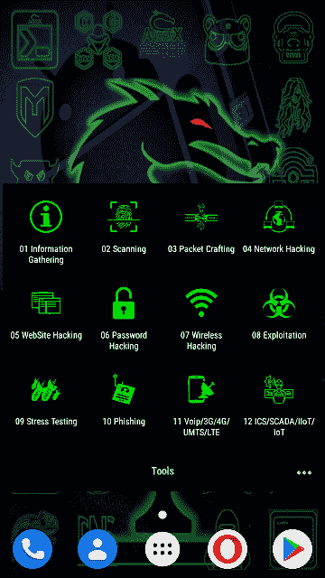
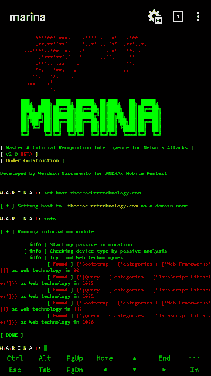
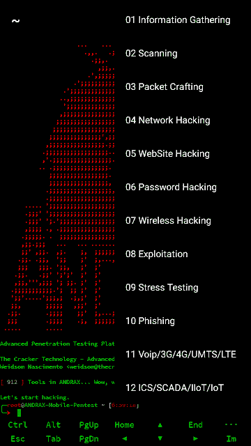
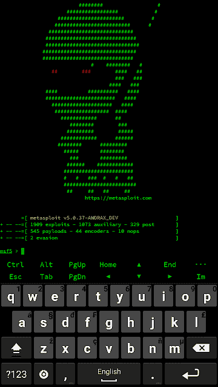
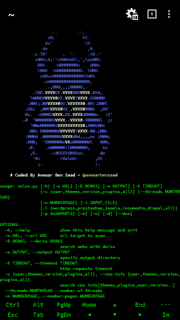

# 安卓系统上的 NH-黑仔渗透测试

> 原文：<https://kalilinuxtutorials.com/andrax/>

**ANDRAX** 是一个专门为 [Android](https://www.kitploit.com/search/label/Android) 智能手机开发的[渗透测试](https://www.kitploit.com/search/label/Penetration%20Testing)平台，它能够在 Android 上本地运行，因此它的行为就像一个普通的 Linux 发行版，但比普通发行版更强大！

该工具的开发始于 2016 年 8 月 9 日(DD/MM/YYYY ),仅面向巴西人，并于 2018 年 5 月 10 日(DD/MM/YYYY)全面重新定义和重新加载，面向国际公众开放。

它使所有 Android 设备都能以 root 权限启用，一个好的解锁 rom 成为高级渗透测试的利器。

**安卓为什么这么强大？**

很简单，每个人都有一部智能手机，并且无时无刻不在用它！我们可以很容易地伪装在每个人中间，大多数 Android 智能手机的处理器架构是 ARM，这是一种现代而强大的架构，非常优于其他架构，通过触摸屏，我们可以非常灵活地运行工具，并利用 Android 的图形界面，我们可以使用我们的智能手机进入几乎任何地方。

从技术角度来说，ANDRAX 和 [NetHunter](https://en.wikipedia.org/wiki/NetHunter) 永远不应该被比较，ANDRAX 是 Android 智能手机的渗透测试平台，NetHunter 只是一个与 chroot 一起运行的 Debian 仿真器。

Termux 不是我们的敌人，Termux 是一个允许使用在 Android 上本地运行的 Debian 环境安装许多 Linux 包的应用程序。ANDRAX 和 Termux 有类似的开发，ANDRAX 和 Termux 共享很多 libs 和 GNU/Linux 资源。

但是 Termux 不是一个渗透测试平台，它是一个在 Debian 环境中引入基本工具的软件。渗透测试不是基本的东西！而是先进的技术，包括先进的工具和先进的环境来进行良好的测试！

因此，您可以在 Termux 中手动安装许多工具，但是要对它们进行优化和配置以发挥渗透测试 100%的潜力是极其困难的。

Termux 在没有 root 权限的情况下运行，这使得使用高级工具非常困难。它提倡使用 900 多种高级工具进行黑客攻击、破解和渗透测试。

**也可阅读-[S3 bucket list:Firefox 插件，列出了在请求中发现的亚马逊 S3 存储桶](https://kalilinuxtutorials.com/s3bucketlist/)**

**截图**

[**Download**](https://andrax.thecrackertechnology.com/download)