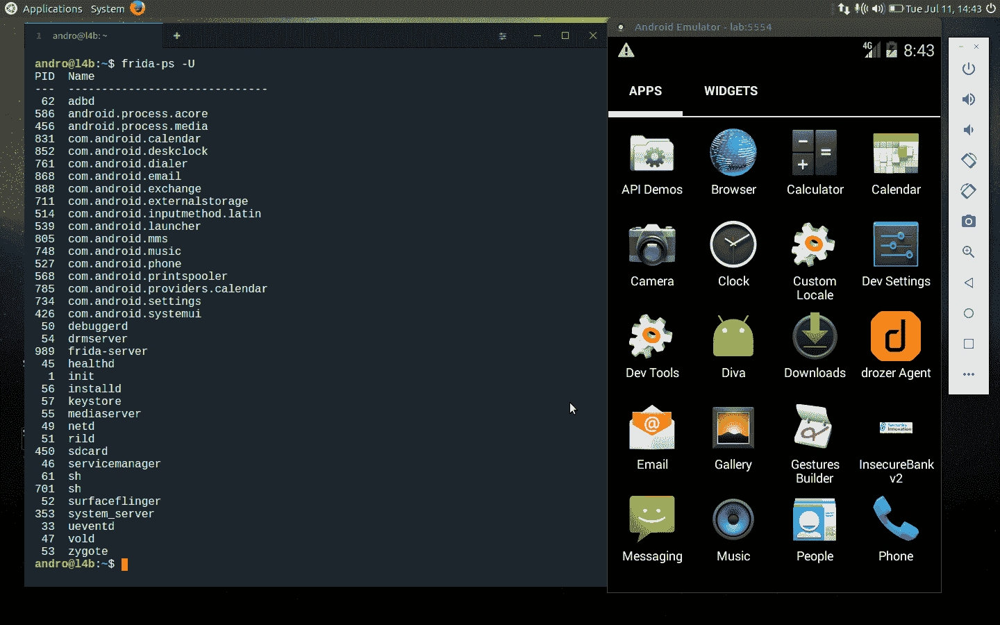
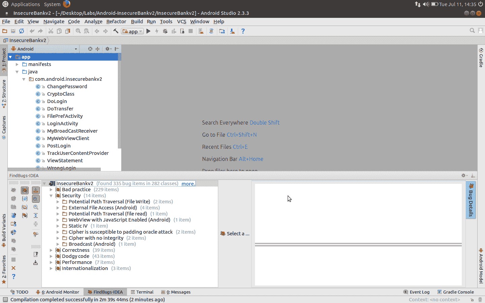
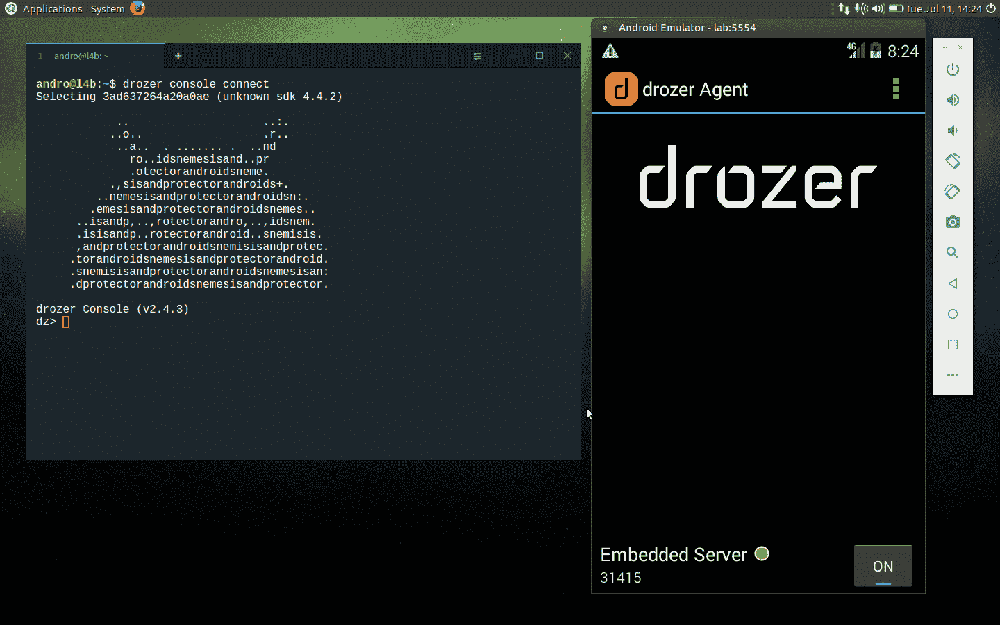
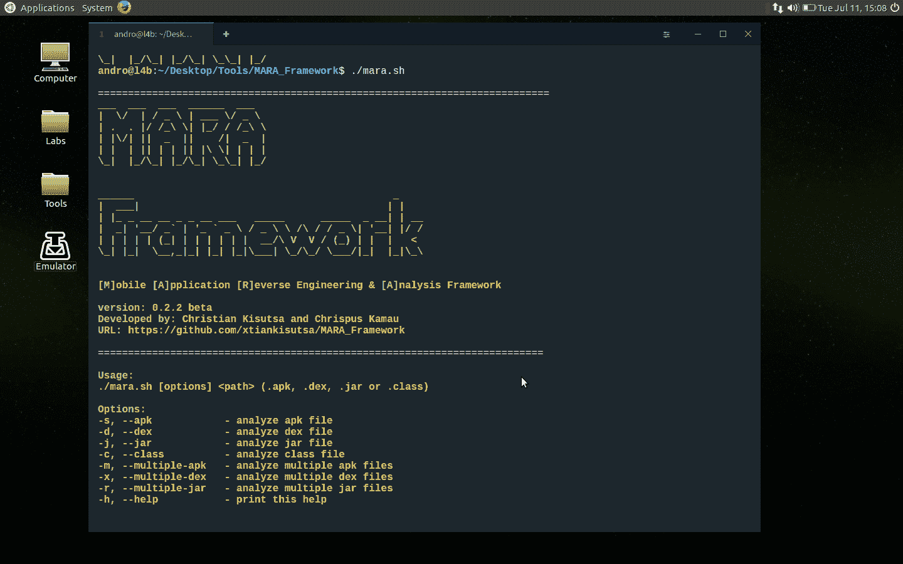

# androl4b–Android 安全虚拟机

> 原文：<https://kalilinuxtutorials.com/androl4b-2/>

AndroL4b 是一个基于 ubuntu 的 android 安全虚拟机，它整合了来自各种安全书呆子和研究人员的最新框架、教程和实验室，用于逆向工程和恶意软件分析。

## **Androl4b v . 3 的变化？**

*   工具已更新
*   添加了新工具和实验室
*   升级至 Ubuntu mate 17.04
*   一些清理工作

**也读作 [洋葱 nmap 扫描隐藏洋葱服务](http://kalilinuxtutorials.com/onion-nmap-scan-hidden-services/)**

## **例如**

## **工具**

*   [radar 2](https://github.com/radare/radare2)类 Unix 的逆向工程框架和命令行工具。
*   [Frida](https://www.frida.re) 注入 JavaScript，探索 Windows、macOS、Linux、iOS、Android、QNX 上的原生应用。
*   [ByteCodeViewer](https://github.com/konloch/bytecode-viewer) 安卓 APK 逆向工程套件(反编译、编辑器、调试器)。
*   [移动安全框架(MobSF)](https://github.com/ajinabraham/Mobile-Security-Framework-MobSF) (Android/iOS)自动化 Pentesting 框架(在这个 VM 中只是静态分析)。
*   Android 应用的安全评估框架。
*   [APKtool](https://github.com/iBotPeaches/Apktool) 逆向工程 Android Apks。
*   [AndroidStudio](http://developer.android.com/tools/studio/index.html) 用于 Android 应用开发的 IDE。
*   [BurpSuite](https://portswigger.net/burp) 评估应用安全。
*   [Wireshark](https://www.wireshark.org) 网络协议分析器。
*   [MARA](https://github.com/xtiankisutsa/MARA_Framework) 移动应用逆向工程与分析框架。
*   [FindBugs-IDEA](http://findbugs.sourceforge.net/) 静态字节码分析寻找 Java 代码中的 bug。
*   [Android bugs 框架](https://github.com/AndroBugs/AndroBugs_Framework) Android 漏洞扫描器，帮助开发者或黑客发现 Android 应用中潜在的安全漏洞。
*   用于查找几个与安全相关的 Android 应用程序漏洞的 Qark 工具。

