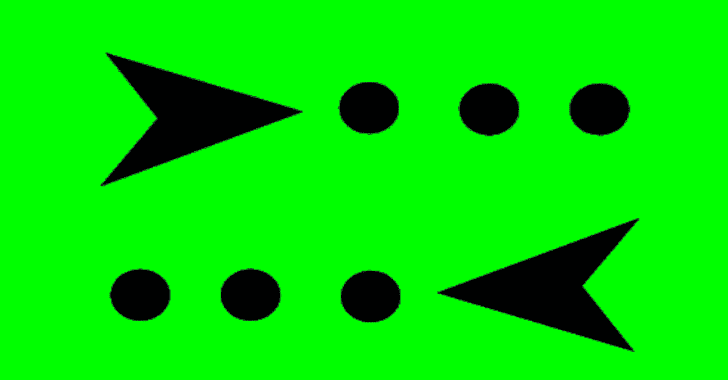

# 反作弊:测试任何反作弊的框架

> 原文：<https://kalilinuxtutorials.com/anticheat/>

AntiCheat 是一个测试市场上任何反作弊软件的框架。这可以作为模板或代码库来测试任何反作弊和学习的方式。

逆转欺诈和欺骗的入门水平相当高，因此，我将发布我在研究过程中开发的所有代码。主要的想法是帮助人们并激励他们进入这个非常有趣的话题，这方面有很多值得研究的地方。

**用途**

大多数设置可以通过使用 config.ini 文件来完成，但是，一些模块可能需要对代码进行特殊设置，这取决于您的意图。

记得在 CheatHelper/CheatHelper.cpp(变量配置文件)中更改 config.ini 文件的位置

**也可阅读-[Lsassy:从 Lsass Remotel](https://kalilinuxtutorials.com/lsassy-extract-credentials-lsass-remotel/) 中提取凭证 **

**模块(未来会有更多)**

*   作弊器
*   驾驶员禁用器
*   司机助手
*   驾驶员测试仪
*   HandleElevationDriver
*   HandleHijackingDLL
*   HandleHijackingMaster
*   卢舒克
*   StealthHijackingNormalDLL
*   stealthghijackingnormalmaster

**关于本项目**

所有这些代码都是在 Recon 2019 和 BlackHat Europe 2019 上展示的研究成果:“揭开反作弊的地下世界”

链接:

*   首次发布信息:
    *   [https://recon.cx/2019/montreal/](https://recon.cx/2019/montreal/)
    *   [https://cfp.recon.cx/reconmtl2019/talk/MRJ3CN/](https://cfp.recon.cx/reconmtl2019/talk/MRJ3CN/)
*   第二次发布:
    *   [https://www . black hat . com/eu-19/briefings/schedule/index . html #揭开反作弊的地下世界-17359](https://www.blackhat.com/eu-19/briefings/schedule/index.html#unveiling-the-underground-world-of-anti-cheats-17359)

[**Download**](https://github.com/niemand-sec/AntiCheat-Testing-Framework)