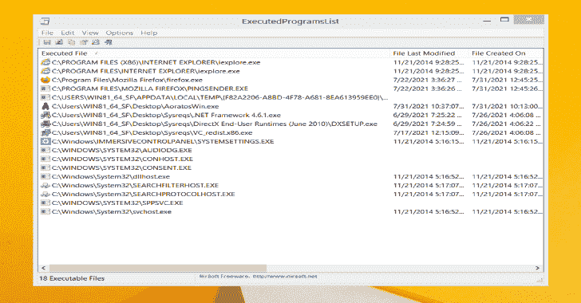
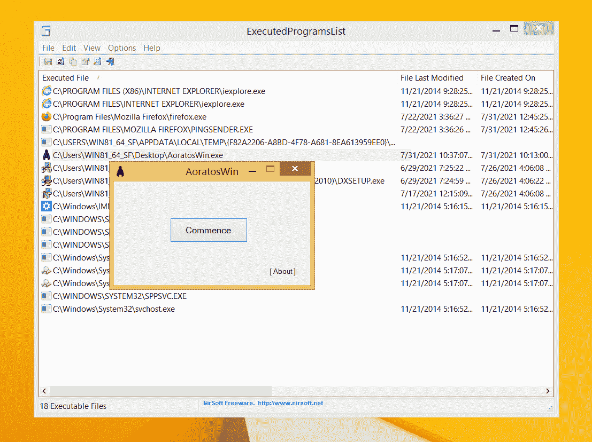
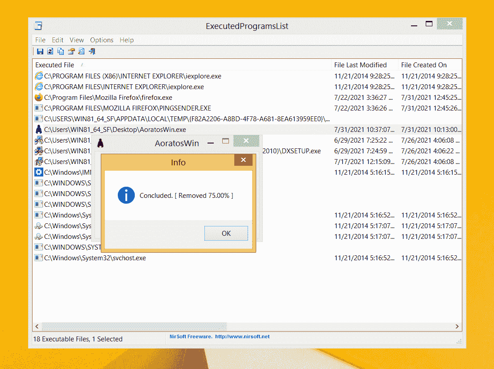
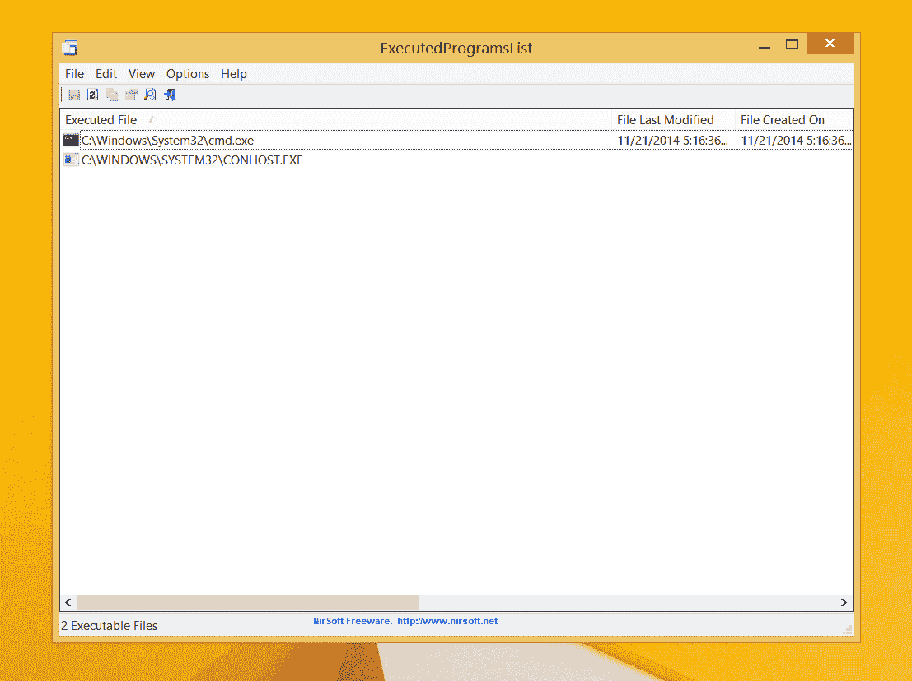

# AoratosWin:一个在 Windows 操作系统上删除已执行应用程序痕迹的工具

> 原文：<https://kalilinuxtutorials.com/aoratoswin/>

**AoratosWin** 是一款清除 Windows 操作系统上已执行应用程序痕迹的工具，使用 Nirsoft 的 ExecutedProgramList 等工具可以轻松列出这些痕迹。

## 支持的操作系统(测试于)

*   Windows 7 (x86、x64)
*   Windows 8 (x86、x64)
*   Windows 8.1 (x86、x64)
*   Windows 10 (x86、x64)
*   Windows 11 (x64)

## 最低系统要求:

*   。NET 框架 4.0

## 免责声明

与此工具相关的任何行动和/或活动完全由您负责。

[Click Here To Download](https://github.com/PinoyWH1Z/AoratosWin)