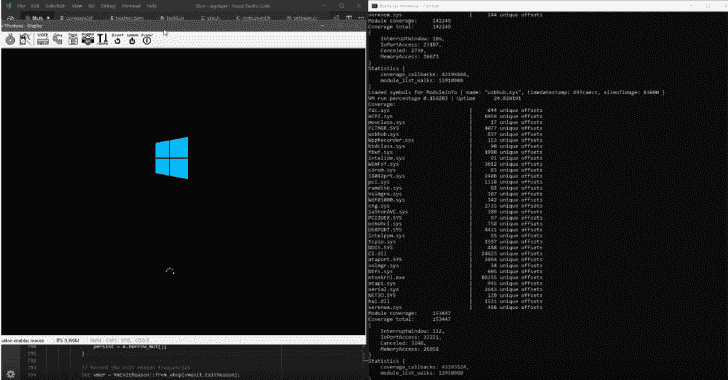
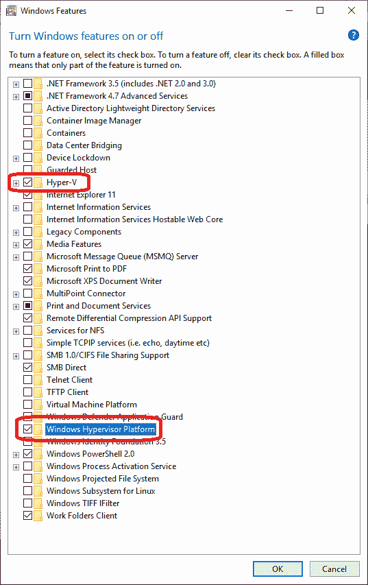
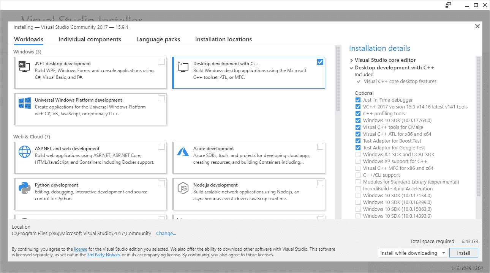
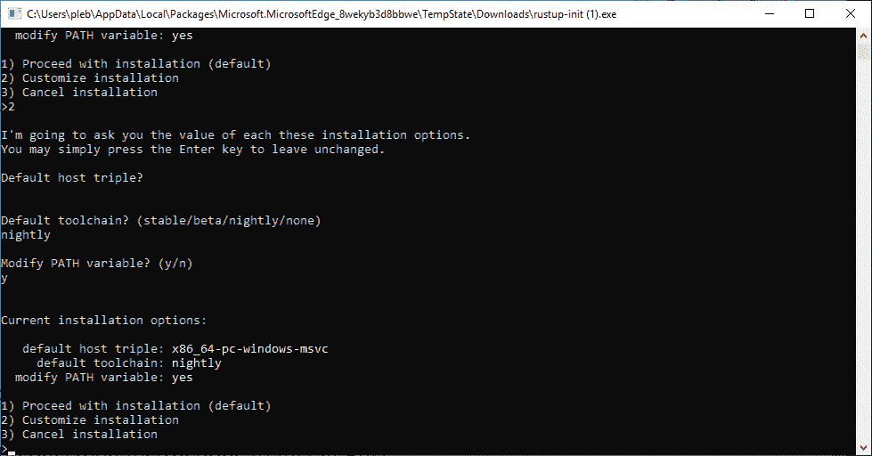
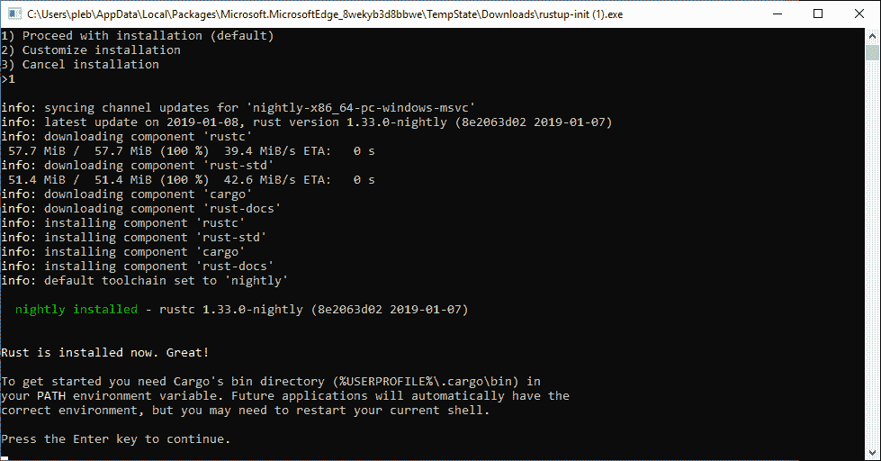

# Applepie:一个用 WHVP &博奇斯构建的模糊化管理程序

> 原文：<https://kalilinuxtutorials.com/applepie-hypervisor-fuzzing-whvp-bochs/>

你好！欢迎来到苹果派！这是一个为模糊化、内省和查找 bug 而设计的工具！这是一个使用 Windows 虚拟机管理程序平台 API 的虚拟机管理程序，该 API 出现在 Windows 的最新版本中(具体来说，这是在 Windows 10 17763 上开发和测试的)。Bochs 用于提供深度自省和设备仿真。

Windows 虚拟机管理程序平台 API (WHVP)是一个用于访问 Hyper-V 虚拟机管理程序功能的 API 集。这个 API 使我们可以轻松地在用户空间中实现虚拟机，而不需要任何特殊的驱动程序或权限。

这是干什么用的？

这是一个为安全研究中的模糊和内省而设计的工具。通过使用管理程序，常见的模糊化技术可以应用于任何目标、内核或用户。这种环境允许在不需要目标来源的情况下对整个系统进行模糊处理。

在管理程序级别，可以收集代码覆盖率，如果需要，可以使用 Bochs 仿真在仿真环境中提供任意的自省。这个覆盖率信息可以用来计算模糊案例的有效性。

引起报道增加的模糊案例可以被保存，因为它是一个有趣的案例。这个输入可以在以后使用，建立在新的损坏之上。

快照模糊化是这个工具的主要用途。您可以在某个状态下拍摄系统的快照，然后保存下来。然后可以加载这个快照进行模糊化，在这里注入一个模糊案例，然后继续。

因为虚拟机可以很便宜地重置，所以虚拟机可以经常重置。如果 Word 需要 5 秒钟才能启动，但是您可以在它读取您的文件时对其进行快照，那么您可以将模糊情况减少到只与输入相关的情况。

这允许一个非常紧密的模糊循环，而不需要访问源代码。由于虚拟机是完全独立的系统，因此许多虚拟机可以并行运行，以便扩展到所有内核。

目前，该工具仅支持收集代码覆盖率、Windows 的动态符号下载以及 Windows 目标的符号/模块解析。添加模糊支持将很快。

**也可阅读-[true gaze:专注于源代码外安全问题的 Android/iOS 应用静态分析工具](https://kalilinuxtutorials.com/truegaze-tool-android-ios-security-issues/)**

**开发周期**

鉴于我已经在这里写了几乎所有的功能(覆盖，模糊，快速重置等)。我希望这个项目应该很快就准备好，除非我分心😀

我的目标是在一月底进行报道(完成！)、反馈、模块列表(完成！)、进程列表、快速重置和符号支持(完成！).这将使它成为一个非常强大的引信。

**OS 支持**

主要支持的目标是现代 Windows 10。Windows 目标可以从符号存储区下载符号。这允许开箱即用的 Windows 目标中的符号覆盖。然而，代码是以一种 Linux enlightenment 可以很容易添加的方式编写的。

在没有任何启发的情况下，任何启动的操作系统仍然可以被模糊化，并且可以收集基本的覆盖范围。

在报告操作系统支持问题之前，请通过尝试使用不带虚拟机管理程序的标准预建 Bochs 来引导您的目标，验证问题是否出在虚拟机管理程序/Bochs 更改中。Bochs 并不常用，甚至在引导 Linux 这样的普通事情上也经常会出现致命的错误。特别是随着操作系统中的 Spectre/Meltdown 缓解对 CPUID/MSR 用法的快速内部更改。

**问题**

有关问题列表，请参见 Github 上的问题页面。我已经播了一些了。有些问题需要在模糊开发开始之前快速解决。

**大楼**

**建立先决条件**

要建立这个你需要一些东西:

*   最近更新的 MSVC 编译器(Visual Studio 2017)
*   夜间锈病([https://rustup.rs/](https://rustup.rs/)，必须是夜间的)
*   Python(我用了 3 个，但是 2 个也可以)
*   安装了 autoconf 和 GNU make 包的 64 位 cygwin
*   安装了 Hyper-V 和最新版本的 Windows 10

**【msvc】**

安装 Visual Studio 2017 并确保它已更新。我们在这里使用了一些前沿的 API、头文件和库。

我用的是`cl.exe`版本:`Microsoft (R) C/C++ Optimizing Compiler Version 19.16.27025.1 for x64`和 SDK 版本`10.0.17763.0`

**每夜锈病**

通过[https://rustup.rs/](https://rustup.rs/)安装铁锈。我用了`rustc 1.32.0-nightly (b3af09205 2018-12-04)`

确保安装`x86_64-pc-windows-msvc`工具链，因为该项目仅支持 64 位。

确保`cargo`在你的道路上。这应该是默认设置。

**Python**

去抓取 python[https://www.python.org/](https://www.python.org/)，并确保它在您的路径中，以便`python`可以被调用。

**小天鹅**

专门给`C:\cygwin64`安装 64 位 Cygwin([https://www.cygwin.com/setup-x86_64.exe](https://www.cygwin.com/setup-x86_64.exe))。安装 Cygwin 时，确保安装了`autoconf`和`make`包。

**超五**

进入“打开或关闭 Windows 功能”并勾选“Hyper-V”和“Windows 虚拟机管理程序平台”旁边的复选框。这当然要求你的电脑支持 Hyper-V。

**循序渐进的构建过程**

本安装过程指南已在以下方面得到验证:

全新安装 Windows 10，Build 17763
rustc 1 . 33 . 0-nightly(8e 2063d 02 2019-01-07)
微软(R) C/C++优化编译器版本 19 . 16 . 27025 . 1 for x64
Visual Studio 社区 2017 版本 15 . 9 . 4
apple pie commit`f84c084feb487e2e7f31f9052a4ab0addd2c4cf9`
Python 3 . 7 . 2 x64
git 版本 2.20.1.windows

*   确保 Windows 10 完全是最新的
    *   我们在 WHVP 上使用了一些前沿功能，并且只测试了最新的 Windows 10
*   在“打开或关闭 Windows 功能”中
    *   勾选“Hyper-V”
    *   勾选“Windows 虚拟机管理程序平台”
    *   单击“确定”安装并重新启动

*   安装 VS 社区 2017 并更新
    *   用 C++进行桌面开发

*   为 x86_64-pc-windows-msvc 每夜安装 Rust

*   Install Git
    *   配置 git 按原样签出，提交 unix 风格
    *   如果 git 在结帐时转换。/configure 脚本将因 CRLF 行结尾而对 Bochs 失败
    *   这是 core.autocrlf=input
    *   您还可以使用“按原样签出”、“按原样提交”
    *   这是 core.autocrlf=false
*   通过 setup-x86_64.exe 安装 Cygwin x64
    *   安装到“C:\cygwin64”
    *   安装 autoconf 包(`autoconf`包)
    *   安装 GNU make ( `make`包)
*   安装 Python
    *   我安装了 Python 3 x64 并添加到 PATH
    *   Python 2 和 32 位版本应该没问题，我们只是在构建脚本中使用 Python
*   打开“VS 2017 的 x64 原生工具命令提示符”
*   通过`git clone https://github.com/gamozolabs/applepie`结账苹果馅饼
*   cd 成苹果派
*   运行`python build.py`
    *   这将首先检查一些基本的系统要求
    *   它将构建 Rust bochservisor DLL
    *   然后，它将通过 autoconf 配置 Bochs
    *   然后它会用来自 Cygwin 的 GNU make 构建 Bochs

这个初始构建过程可能需要大约 2 分钟，在现代机器上可能需要 20-30 秒。

**其实建筑**

从这个项目的根目录运行`python build.py`就可以了。它应该检查环境的健全性，一切都应该“正常工作”。

**清扫**

运行`python build.py clean`清理 Bochs 和 Rust 二进制文件。

运行`python build.py deepclean`来完全删除所有 Bochs 和 Rust 二进制文件，它也删除 Bochs 的所有配置。如果您以某种方式重新配置 Bochs，请使用此选项。

**用法**

阅读 Bochs 配置，了解如何设置您的环境。我们有一些需求，比如`sync=none`、`ips=1000000`，目前只支持单处理器。这些都是在代码内部强制执行的，以确保您不会搬起石头砸自己的脚。

使用附带的`bochservisor_test\bochsrc.bxrc`和`bochservisor_test_real\bochsrc.bxrc`配置作为示例。`bochservisor_test_real`可能是您应该参考的最新配置。

**覆盖范围**

Windows 目标有模块列表提示，它允许我们查看我们正在运行的上下文中所有模块的列表。这样我们就可以把指令地址转换成模块+偏移量。该模块+偏移有助于在 ASLR 状态改变的模糊情况之间保持覆盖信息。它还允许在像 IDA 这样的工具中对模块进行着色，以便直观地看到哪些代码被点击了。

对于 Windows 目标，将使用您的`_NT_SYMBOL_PATH`和`symchk`从符号存储中动态下载符号。没有`symchk`在这条路上，它将无声无息地失败。通过符号，可以保存一个人类可读的覆盖范围版本以供查看。此外，通过私有符号，覆盖率可以被转换为 source:line，这样源代码就可以被着色。

**测试**

好吧，没有真正的测试，但有`bochservisor_test`这是一个微小的操作系统，它只是验证一切都与虚拟机管理程序启动。

然后是`bochservisor_test_real`,这是我在 Windows/Linux 上使用的配置。这可能是更新最频繁的一个。

**建筑**

**基础知识**

该代码库向 Bochs 引入了少量代码，以允许模块化访问 CPU 上下文、客户物理到其后备存储器，以及步进设备和 CPU 状态。

你想看的主要代码在`bochservisor` Rust 项目的`lib.rs`里。

**CPU 循环**

在 Bochs 的主 CPU 循环中，我们用`LoadLibrary()`来加载`bochservisor` DLL。该 DLL 导出一个例程，该例程是将被调用的 Rust CPU 循环。

Bochs 将传递一个结构给这个`bochs_cpu_loop`例程，该例程将包含函数指针，以从 Bochs 获取信息，并在其中步进设备和 CPU 状态。

**MMIO / I/O**

当 MMIO 或 I/O 发生时，虚拟机管理程序将因内存故障或 I/O 指令故障而退出。虽然 WHVP 确实提供了一个仿真 API，但是它真的很缺乏，也不充分。

相反，我们使用已经存在的 Bochs 并逐步执行一些指令。通过保持 hypervisor CPU 状态与 Bochs 同步，我们可以随时在 hypervisor 和仿真之间动态切换(或者至少我们应该能够做到)。

这意味着完整的虚拟机管理程序状态总是与 Bochs 同步，因此 Bochs 快照之类的东西应该正常工作，并且可以在没有虚拟机管理程序的情况下启动(可能除了一些需要存储在快照信息中的 CPUID 状态)。

当 MMIO 或 I/O 发生时，我们在仿真下运行一定数量的指令，而不仅仅是仿真一条指令。由于进入和退出虚拟机管理程序的 API 成本，以及类似的 MMIO 操作可能紧挨着其他操作发生，我们遵循一些指令。这允许使用减少 API 的开销，并减少 VMEXIT 频率。这是一个可调的数字，但是代码库中的内容可能是有原因的。

**中断**

我们处理中断的方式非常有趣。我们在 Bochs 仿真本身中处理所有的*中断，而不是调度中断交付给系统管理程序。像完全发生在管理程序内部的异常这样的事情当然不是由 Bochs 处理的。*

这也为我们提供了 WHVP 不支持的功能，比如 SMIs(用于 SMM)。Bochs 的 BIOS 默认使用 SMM，如果没有 SMI 支持，需要构建一个定制的 BIOS。我在我的第一次迭代中这样做了…不推荐。

**未来**

这个项目是为 fuzzing 设计的，但是它太新了(只有几天)，它没有这些功能。

首先要做的是:

**评估线程**

我们可以让 Bochs 设备在一个线程中实时循环运行，另一个线程运行 hypervisor。异步事件将通过 IPC 进行通信，并允许在客户机中执行时更新设备。

目前，所有事情都发生在一个线程中，这意味着虚拟机管理程序必须间隔一段时间退出，以确保我们可以步进设备。就好像我们写了自己的调度程序。

这可能会快一点，但也增加了复杂性和潜在的竞争问题。很难说这是否会发生。

**代码覆盖率**

我不确定我将使用哪种方法来收集代码覆盖率，但至少会有一些选择。从精确到快速等。所有这些覆盖机制都是系统级的，不需要源或目标符号。

**客悟**

解析操作系统结构以获得基本信息，如进程列表、模块列表等。然后，这将用于查询 pdb 以获取符号信息。

**撞车报道**

以某种有意义的方式报告崩溃。理想情况下，小型转储会很好，因为它们可以在 WinDbg 中加载和处理。这可能相当容易，因为 DMP 只是我们已经拥有的物理内存和处理器上下文。

**崩溃去重/根源导致**

我找到了一些有趣的技术，可以从根本上解决历史上成功的 bug。我打算把这些带过来。

**快速复位**

通过跟踪脏页并仅恢复修改过的内容，我们应该能够非常快速地重置虚拟机。这使我们能够在系统目标的所有核心上以最大速度模糊。这类似于我在 falkervisor 中所做的，所以它已经被考虑和设计好了。只需要移植到这里。

**小波域模式**

MMIO 或 I/O 发生时取消执行的极快模糊化。这使得所有的 CPU 时间都花在虚拟机管理程序上，没有仿真时间。这有一个缺点，就是在模糊的情况下不支持磁盘 I/O 之类的东西，但这很好。

**哲学**

这个项目的一些核心概念是对 Bochs 绝对最小的修改。这使我们能够保持此回购的 Bochs 部分是最新的。

目标是将尽可能多的代码移入 Rust 和 dll，使系统更加模块化和安全。这将有望减少虚拟机管理程序本身出现愚蠢的损坏错误的机会，从而导致无效的模糊结果。

目前，hypervisor 是一个 DLL，可以在不改变 Bochs 的情况下换出(除非 FFI API 改变)。

对 Bochs 本身的进一步更改必须清楚地记录下来，我将很快为此制作一个文档来跟踪对 Bochs 的更改，这些更改必须通过 Bochs 更新进行移植和重新评估。

**最近的功能演示**

[https://www.youtube.com/embed/qErEb5h9CwA?feature=oembed&enablejsapi=1](https://www.youtube.com/embed/qErEb5h9CwA?feature=oembed&enablejsapi=1)

**二元覆盖示例**

[https://www.youtube.com/embed/S1D433EwktE?feature=oembed&enablejsapi=1](https://www.youtube.com/embed/S1D433EwktE?feature=oembed&enablejsapi=1)

[**Download**](https://github.com/gamozolabs/applepie)