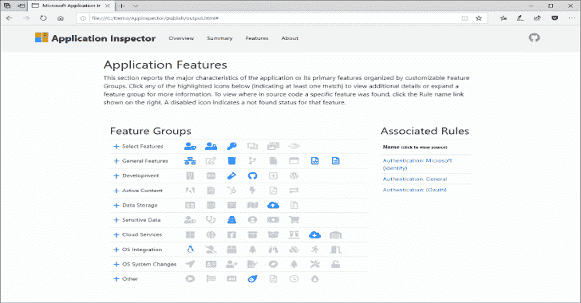

# Application Inspector:一个源代码分析器，用于显示感兴趣的特性

> 原文：<https://kalilinuxtutorials.com/application-inspector/>

Microsoft Application Inspector 是一款软件源代码分析工具，可帮助识别和展现众所周知的特性和其他有趣的源代码特征，以帮助确定**软件是什么**或**它是做什么的**。它在 [ZDNet](https://www.zdnet.com/article/microsoft-application-inspector-is-now-open-source-so-use-it-to-test-code-security/) 、 [SecurityWeek](https://www.securityweek.com/microsoft-introduces-free-source-code-analyzer) 、 [CSOOnline](https://www.csoonline.com/article/3514732/microsoft-s-offers-application-inspector-to-probe-untrusted-open-source-code.html) 、[Linux.com/news](https://www.linux.com/news/microsoft-application-inspector-is-now-open-source-so-use-it-to-test-code-security/)、 [HelpNetSecurity](https://www.helpnetsecurity.com/2020/01/17/microsoft-application-inspector/) 、Twitter 等网站上受到关注，并在[Microsoft.com](https://www.microsoft.com/security/blog/2020/01/16/introducing-microsoft-application-inspector/)上首次亮相。

Application Inspector 不同于传统的静态分析工具，它不试图识别“好”或“坏”的模式；它只是报告根据一组超过 400 个特征检测规则模式发现的内容，包括影响安全性的特征，如加密技术的使用等。通过直接检查源代码，而不是依赖有限的文档或建议，这对于减少确定开放源代码或其他组件的工作所需的时间非常有帮助。

该工具支持扫描各种编程语言，包括 C、C++、C#、Java、JavaScript、HTML、Python、Objective-C、Go、Ruby、PowerShell 和 [more](https://github.com/microsoft/ApplicationInspector/wiki/2.1-Field:-applies_to-(languages-support)) ，并包括 HTML、JSON 和文本输出格式，默认为类似于此处所示的 HTML 报告。

它包括一个可过滤的信心指标，以帮助最大限度地减少误报匹配，以及可定制的默认规则和条件匹配逻辑。

请务必查看我们的项目 wiki 页面以获得更多帮助[https://Github.com/Microsoft/ApplicationInspector/wiki](https://Github.com/Microsoft/ApplicationInspector/wiki)获得**插图**以及其他信息和帮助。

**也读作-[赫谢尔:多平台反向外壳生成器](https://kalilinuxtutorials.com/hershell-multiplatform-reverse-shell-generator/)**

**目标**

Application Inspector 有助于**更好地通知您**选择最佳组件来满足您的需求，减少未知因素的影响，使您的应用程序受攻击面更小。它可以帮助您避免包含具有您不想要的意外特性的组件。

应用程序检查员可以帮助**识别功能差异**或组件版本之间的变化，这对于检测后门的注入至关重要。

它可以用来**自动检测感兴趣的特性**,以识别作为构建管道的一部分需要额外审查的组件，或者创建关于所有企业应用程序的元数据存储库。

基本上，我们创建了 Application Inspector 来帮助我们**根据特定功能识别有风险的第三方软件组件**，但该工具在许多非安全环境中也很有用。

Application Inspector v1.0 现在处于普通用户发布状态。您的反馈对我们很重要。如果你有兴趣投稿，请查看 CONTRIBUTING.md。

**投稿**

我们有一个强大的默认的特征检测规则的基础。但是还有许多特征识别模式有待定义，我们邀请您**提交您想看到的想法**或者尝试定义一些。这是一个真正影响开源生态系统的机会，有助于提供每个人都可以使用的工具。更多信息参见维基的[规则](https://github.com/microsoft/applicationinspector/wiki)部分。

**获取应用检查器**

要使用 Application Inspector，请下载相关的二进制文件(平台特定的或多平台的。净核心释放)。如果您使用。NET 核心版本，你将需要有。安装了 NET Core 3.0 或更高版本。参见 [JustRunIt.md](https://github.com/microsoft/ApplicationInspector/blob/master/JustRunIt.md) 或 [Build.md](https://github.com/microsoft/ApplicationInspector/blob/master/BUILD.md) 文件获取帮助。

参考项目 wiki 获取更多关于规则、标签和更多用于识别特性的背景知识可能是有价值的。标签被用作系统的等级命名法，例如密码术。协议。TLS 来更容易地表示功能。

**用途**

应用程序检查器是一个命令行工具。在 Windows、Linux 或 MacOS 中从命令行运行它。

dot net AppInspector.dll 或者在 *Windows* 上干脆 AppInspector.exe
微软应用检查器 1.0.25
应用检查器 1 . 0 . 25
微软公司。版权所有

错误:
未选择动词。

-分析检查源目录/文件/压缩文件(。tgz|zip)对照定义的特征
-tagdiff 比较两个源路径之间的唯一标签值
-tagtest 测试源中是否存在较小的标签集或自定义标签(比较或验证模式)
-exporttags 导出默认的唯一规则标签，以查看可以检测到的功能
-verifyrules 验证规则语法是否有效
-帮助显示特定命令的更多信息
-版本显示版本信息

**例子:**

**命令帮助**

用法:点网 AppInspector.dll[参数][选项]

点网 AppInspector.dll-可用命令描述
点网 AppInspector.dll<command></command>-给定命令的选项描述

**分析命令**

**用法:dot net AppInspector.dll 分析【参数】【选项】

参数:**
-s，–source-path 必选。要检查的源代码的路径(必需)
-o，–output-file-Path 输出文件的路径。忽略自动创建 output.html 的-f html 选项
-f，–Output-file-format 输出格式[html|json|text]。Default = html
-e，–文本格式匹配文本格式说明符
-r，–Custom-rules-path 自定义规则路径
-t，–tag-Output-only 输出仅包含已识别的标记。Default = false
-i，–Ignore-default-rules 忽略与应用程序捆绑的默认规则。Default = false
-d，–allow-dup-tags 只输出非唯一的标签匹配。Default = false
-c，–confidence-filters 输出仅与置信度[高|中|低]匹配。Default = high，medium
-k，–file-path-exclusions 排除源文件[none|]。默认=样本、实例、测试、文档。vs，。git
-x，–Console-verbosity 控制台详细程度[高|中|低|无]。默认值= medium
-l，–Log-file-path 日志文件路径。默认值为/log.txt
-v，–日志文件级别日志文件级别[调试|信息|警告|错误|致命|关闭]。默认=错误

**扫描项目目录，输出发送到“output.html”(默认行为包括启动默认浏览器到该文件)**

点网 AppInspector.dll 分析-s /home/user/myproject

**添加自定义规则(可多次指定)**

点网 AppInspector.dll 分析-s/home/user/my project-r/my/rules/directory-r/my/other/rules

**写入 JSON 格式**

点网 AppInspector.dll 分析-s /home/user/myproject -f json

**Tagdiff 命令**

用于分析和报告两个项目或项目版本(如 v1、v2)之间的标签(功能)差异，以查看发生了哪些变化

**用法:dotnet AppInspector.dll tag diff【参数】【选项】

参数:**
–src 1 必选。要比较的源 1(需要)
–需要 src2。要比较的源 2(必需的
-t，–测试类型要运行的测试类型[相等|不相等])。Default = equality
-r，–Custom-rules-path 自定义规则路径
-i，–Ignore-default-rules 忽略与应用程序捆绑的默认规则。Default = false
-o，–输出文件路径输出文件的路径
-x，–控制台详细度控制台详细度[高|中|低]。Default = medium
-l，–Log-file-path 日志文件路径
-v，–Log-file-level 日志文件级别[error|trace|debug|info]。默认=错误

**查看两个项目标签特性差异的最简单方法**

点网 AppInspector.dll 标签差异–src 1/home/user/project 1–src 2/home/user/project 2

**基本用途**

点网 AppInspector.dll tag diff–src 1/home/user/project 1–src 2/home/user/project 2-t 等式

**基本用途**

点网 AppInspector.dll tag diff–src 1/home/user/project 1–src 2/home/user/project 2-t 不等式

**标签测试命令**

用于验证(通过/失败)项目中是否存在一组指定的规则标签，例如，用户只想知道密码是否如预期的那样存在或个人数据是否如预期的那样存在，并获得简单的是/否结果，而不是完整的分析报告。

注意:用户应该使用 *custom-rules-path* 选项，而不是默认规则集，因为任何源包都不可能包含所有的默认规则。相反，根据需要创建一个自定义路径和规则集，或者使用 custom-rules-path 指定一个路径，仅指向缺省规则集中所需的规则。
否则，在大多数情况下，测试源代码中存在的所有默认规则可能会产生错误或失败的结果。

**用法:dotnet AppInspector.dll tagtest[Arguments][options**

**参数:**
-s，–source-path 必选。要测试的源(必需)
-t，–执行[rulespresent|rulesnotpresent]的测试类型测试。Default = rulespresent
-r，–Custom-rules-path 自定义规则路径
-i，–Ignore-default-rules 忽略与应用程序捆绑的默认规则。Default = true
-o，–输出文件路径输出文件的路径
-x，–控制台详细度控制台详细度[高|中|低]。默认值= medium
-l，–日志文件路径日志文件路径
-v，–日志文件级别日志文件级别

**查看一组规则是否全部出现在一个项目中的最简单用法**

点网 AppInspector.dll 标记测试-s/home/user/project 1-r/home/user/my rules . JSON

**基本用途**

点网 AppInspector.dll 标记测试-s/home/user/project 1-r/home/user/my rules . JSON-t rules present

**基本用途**

**点网 AppInspector.dll tag test-s/home/user/project 1-r/home/user/my rules . JSON-t rules not present**

**导出标签命令**

简单导出标记的规则集模式，这些标记表示支持检测哪些功能

**用法:dot net AppInspector.dll export tags[参数][选项]**

**参数:**
-r，–Custom-rules-path 自定义规则路径
-i，–Ignore-default-rules 忽略与应用程序捆绑的默认规则。Default = false
-o，–输出文件路径输出文件的路径
-x，–控制台详细度控制台详细度[高|中|低]。默认=中等

**将默认规则标签导出到控制台**

AppInspector.dll 出口标签

**使用输出文件**

点网 AppInspector.dll export tags-o/home/user/my project/export AGS . txt

**带有自定义规则和输出文件**

点网 AppInspector.dll export tags-r/home/user/my project/custom rules-o/hom/user/my project/export AGS . txt

**验证命令**

验证规则集对于导入和分析是兼容且无错误的

**用法:dot net AppInspector.dll verify rules【参数】

参数:**
-r，–Custom-rules-path 自定义规则路径
-i，–Ignore-default-rules 忽略与应用捆绑的默认规则。Default = false
-o，–输出文件路径输出文件的路径
-x，–控制台详细度控制台详细度[高|中|低]。默认=中等。

**简化案例以验证默认规则**

AppInspector.dll 验证规则

**仅使用自定义规则**

点网 AppInspector.dll 验证规则-r/home/user/my project/custom rules-I

**构建指令**

从源代码构建需要。网芯 3.0。标准的点网构建命令可以从根源文件夹中运行。

**依赖于框架的**

**dotnet build -c 发布**

**平台定向便携**

**点网发布-c 发布-r win-x86
点网发布-c 发布-r linux-x64
点网发布-c 发布-r osx-x64**

[**Download**](https://github.com/microsoft/ApplicationInspector)