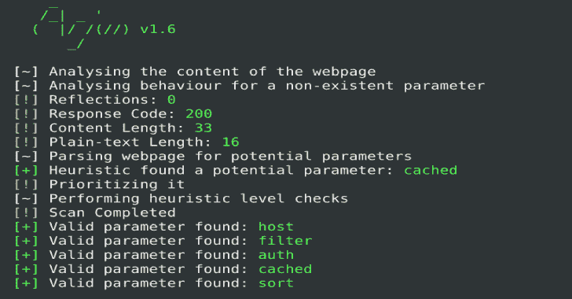

# Arjun : HTTP 参数发现套件

> 原文：<https://kalilinuxtutorials.com/arjun-http-parameter-discovery-suite/>

**Arjun** 是一个使用参数(或查询)接受用户输入的 web 应用程序，考虑下面的例子。

[http://api.example.com/v1/userinfo?id=751634589](http://api.example.com/v1/userinfo?id=751634589)

这个 URL 似乎加载了特定用户 id 的用户信息，但是如果存在一个名为 admin 的参数，该参数设置为 True 时会使端点提供关于用户的更多信息呢？Arjun 就是这样做的，它用一个包含 25，980 个参数名的巨大默认字典来查找有效的 HTTP 参数。

最精彩的部分？在向目标发出 50-60 个请求的同时，遍历这个庞大的列表只需要不到 30 秒。

**也可阅读-[Uac-A-Mola:安全研究人员调查新 Uac 绕过](https://kalilinuxtutorials.com/uac-a-mola-tool-for-security-researchers-to-investigate-new-uac-bypasses/)T3 的工具**

**阿琼是如何工作的？**

**第一步**

发出对 URL 的请求，并存储响应长度、纯文本长度和响应代码，以便在后面的步骤中进行比较。
如果在响应中发现任何 HTML 表单，Arjun 将从中提取字段名称，并将其添加到参数名称列表中，以便进一步检查。

**第二步**

对 URL 进行第二次请求，但这一次，随机生成的参数(预期不存在)被添加到请求中，以确定 web 应用程序对不存在的参数的行为。
反射次数、响应长度、纯文本长度和响应代码被存储，以便在后续步骤中进行比较。
还将这些特征与第一个请求特征进行比较，以确定应该忽略哪些更改来避免误报。

**第三步**

加载 25，980 个参数名称列表的巨大列表，并将其分成 25 个不同的部分。一个零件的所有参数名称在一个带有随机生成值的请求中发送，因此总共发出 25 个请求。
将这些请求的响应与之前的数据进行比较，拒绝响应中没有任何变化的部分。

**第四步**

引起响应偏差的每个部分被分成两个部分，并对每个部分提出请求。不引起任何变化的部分再次被拒绝，引起变化的部分被进一步分成两部分。这个过程一直持续到每个部分只剩下一个参数或没有参数。空的部分显然被拒绝，单个参数名被标记为有效。

**注意:**反射是单独跟踪的，这意味着如果发现某个参数值被反射，Arjun 会立即将其拾取并标记为潜在有效。

**特性**

*   多线程
*   彻底检测
*   自动速率限制处理
*   典型的扫描需要 30 秒
*   `GET/POST/JSON`支持的方法
*   25，980 个参数名称的庞大列表

[**Download**](https://github.com/s0md3v/Arjun)