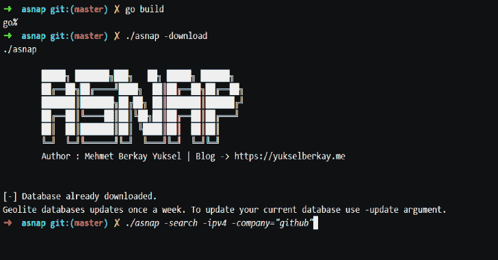

# Asnap:简化侦察阶段的工具

> 原文：<https://kalilinuxtutorials.com/asnap/>

Asnap 旨在通过提供定期更新的关于哪些公司拥有哪些 ipv4 或 ipv6 地址的数据，并允许用户自动进行初始端口和服务扫描，来简化重新定位阶段。

**安装**

*   **预编译二进制文件**

如果您已经在$PATH 环境变量中安装并配置了 Go，只需运行:

**去 github.com/paradoxxer/asnap 吧**

如果要使用预编译二进制，还需要下载“move.sh”和“nmap.sh”文件，并与 asnap 放在同一个目录下。

要下载 asnap 搜索的数据库，您需要提供一个密钥。要获得免费密钥，请在此注册->[https://www.maxmind.com/en/geolite2/signup](https://www.maxmind.com/en/geolite2/signup)注册后导航- >服务- >我的许可证密钥并创建新密钥。然后在与 asnap 相同的目录中创建“asnap_conf.txt ”,并将您的密钥粘贴到“asnap_conf.txt”的第一行:

**echo ' insert key '>asnap _ conf . txt**

为了能够使用端口扫描功能，您需要在计算机上安装 nmap:

***基于 Debian 的发行版:**
sudo apt 安装 nmap

*** MAC OS**
brew 安装 nmap

***基于 Arch 的发行版**
sudo pacman -S nmap

**打造自己(推荐)**

下载源代码:

**git 克隆 git @ github . com:paradox xer/asnap . git**

在这里安装 golang->[https://golang.org/doc/install](https://golang.org/doc/install)或者你可以安装 go，如果它在你的软件包管理器中可用的话:

**须藤适装高冈**

下载源代码后，浏览项目目录并运行:

**去建造**

这将产生一个二进制快照。构建完成后，在与 asnap 相同的目录下创建 asnap_conf.txt，将您的密钥插入第一行，就可以开始了。

**echo ' insert key '>asnap _ conf . txt**

用法和示例

的用法。/asnap:
-下载下载数据库第一次使用。
-更新更新下载的数据库。(Geolite 数据库每周更新一次。).
——搜索指定搜索。-ipv4 指定要搜索的 ipv4 数据库。
-ipv6 指定要搜索的 ipv6 数据库。
-按公司名称搜索公司。
-按 as 号搜索 asn。
-outfile 指定输出文本的名称。默认情况下，输出文件被命名为:MM-DD-YYYY _ out . txt
-in file Use specified。txt 文件作为输入。Asnap 将迭代每一行，将它们视为公司名称，并使用给定输入搜索指定数据库。
-nmap 将找到的 ip 地址传递给 nmap。

示例:
"$asnap -download" - >用给定的键，第一次下载数据库。" $asnap -update" - >更新数据库。
" $ asnap-Search-ipv4-company = " example " "->按公司名称搜索 ipv4 数据库" example "
" $ asnap-Search-IPv6-ASN 13337 "->按 as 号" 13337 "
" $ asnap-Search-IP v4-company = " github "-outfile/path/to/output/file "->按公司名称" test "搜索 IP v4 数据库，并将输出保存到指定路径。
" $ asnap-search-ipv4-infile/path/to/input/file . txt-nmap "->给出一个公司名称列表作为输入，在 ip v4 数据库中搜索，并将找到的 IP 地址传递给 nmap 进行端口扫描。

**用例**

虽然您可以手动使用 asnap，但是您可以使用 cron 作业来自动化整个过程(参见->[https://en.wikipedia.org/wiki/Cron](https://en.wikipedia.org/wiki/Cron))。例如，在您提供了一个带有-infile 参数的输入文件后，您所要做的就是检查输出文件，并根据您的需要定期修改输入文件。默认情况下，输出文件命名为:“MM-DD-YYYY_out.txt”。

[**Download**](https://github.com/paradoxxer/asnap/)